# Лабораторная работа - Внедрение маршрутизации между виртуальными локальными сетями 
 ## Топология
 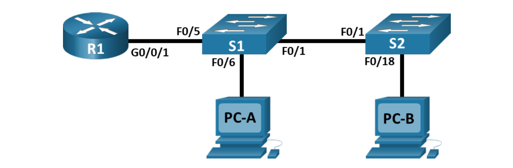
 ## Таблица адресации
 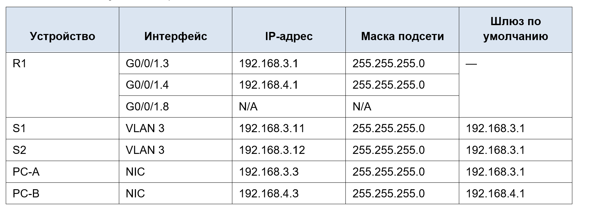
 ## Таблица VLAN
 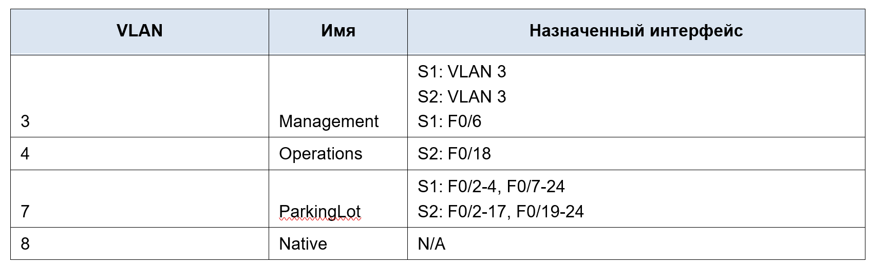
 ### Общие сведения/сценарий
 В целях повышения производительности сети большие широковещательные домены 2-го уровня делят на домены меньшего размера. Для этого современные коммутаторы используют виртуальные локальные сети (VLAN). VLAN также можно использовать в качестве меры безопасности, отделяя конфиденциальный трафик данных от остальной части сети. Сети VLAN облегчают процесс проектирования сети, обеспечивающей помощь в достижении целей организации. Для связи между VLAN требуется устройство, работающее на уровне 3 модели OSI. Добавление маршрутизации между VLAN позволяет организации разделять и разделять широковещательные домены, одновременно позволяя им обмениваться данными друг с другом.
Транковые каналы сети VLAN используются для распространения сетей VLAN по различным устройствам. Транковые каналы разрешают передачу трафика из множества сетей VLAN через один канал, не нанося вред идентификации и сегментации сети VLAN. Особый вид маршрутизации между VLAN, называемый «Router-on-a-Stick», использует магистраль от маршрутизатора к коммутатору, чтобы все VLAN могли переходить к маршрутизатору.
В этой лабораторной работе вы создадите VLAN на обоих коммутаторах в топологии, назначите VLAN для коммутации портов доступа, убедитесь, что VLAN работают должным образом, создадите транки VLAN между двумя коммутаторами и между S1 и R1, и настройте маршрутизацию между VLAN на R1 для разрешения связи между хостами в разных VLAN независимо от подсети, в которой находится хост.
**Примечание**: Маршрутизаторы, используемые в практических лабораторных работах CCNA, - это Cisco 4221 с Cisco IOS XE Release 16.9.4 (образ universalk9). В лабораторных работах используются коммутаторы Cisco Catalyst 2960 с Cisco IOS версии 15.2(2) (образ lanbasek9). Можно использовать другие маршрутизаторы, коммутаторы и версии Cisco IOS. В зависимости от модели устройства и версии Cisco IOS доступные команды и результаты их выполнения могут отличаться от тех, которые показаны в лабораторных работах. Правильные идентификаторы интерфейса см. в сводной таблице по интерфейсам маршрутизаторов в конце лабораторной работы.
**Примечание**. Убедитесь, что у всех маршрутизаторов и коммутаторов была удалена начальная конфигурация. Если вы не уверены в этом, обратитесь к инструктору.


### Задачи
**Часть 1. Создание сети и настройка основных параметров устройства**
**Часть 2. Создание сетей VLAN и назначение портов коммутатора**
**Часть 3. Настройка транка 802.1Q между коммутаторами.**
**Часть 4. Настройка маршрутизации между сетями VLAN**
**Часть 5. Проверка, что маршрутизация между VLAN работает** 

### Необходимые ресурсы
  •	1 Маршрутизатор (Cisco 4221 с универсальным образом Cisco IOS XE версии 16.9.4 или аналогичным)
  
  •  2 коммутатора (Cisco 2960 с операционной системой Cisco IOS 15.2(2) (образ lanbasek9) или аналогичная модель)
  
  •  2 ПК (ОС Windows с программой эмуляции терминалов, такой как Tera Term)
  
  •	  Консольные кабели для настройки устройств Cisco IOS через консольные порты.
  
  •	  Кабели Ethernet, расположенные в соответствии с топологией

### Step 1: Создайте сеть согласно топологии.
Подключите устройства, как показано в топологии, и подсоедините необходимые кабели.

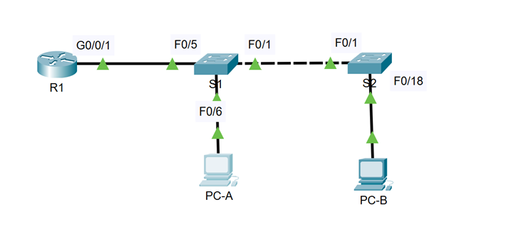

### Step 2: Настройте базовые параметры для маршрутизатора.
a.	Подключитесь к маршрутизатору с помощью консоли и активируйте привилегированный режим EXEC.

`Router>en`

b.	Войдите в режим конфигурации.

`Router#conf t`

с. Назначение маршрутизатору имя устройства:

`Router(config)#hostname R1`

d. Отключите поиск DNS, чтобы предотвратить попытки маршрутизатора неверно преобразовывать введенные команды таким образом, как будто они являются именами узлов.

`R1(config)#no ip domain-lookup`

e. Назначьте **class** в качестве зашифрованного пароля привилегированного режима EXEC.

`R1(config)#enable secret class`

f. Назначьте **cisco** в качестве пароля консоли и включите вход в систему по паролю.

```
R1(config)#line console 0
R1(config-line)#password cisco
R1(config-line)#login
R1(config-line)#end
```
g. Установите **cisco** в качестве пароля виртуального терминала и активируйте вход.
```
R1(config)#line vty 0 4
R1(config-line)#password cisco
```
h. Зашифруйте открытые пароли.

`R1(config)#service password-encryption`

i. Создайте баннер с предупреждением о запрете несанкционированного доступа к устройству.
```
R1(config)#banner motd # WARNING! Unauthorized access to this device is prohibited. All activities may be monitored and reported to the security authorities. #
```
j. Сохраните текущую конфигурацию в файл загрузочной конфигурации.

`R1#wr`

k. Настройте на маршрутизаторе время.

`R1#clock set 16:05:00 10 Oct 2024`

### Step 3: Настройте базовые параметры каждого коммутатора.
Step 3.1 Настройте базовые параметры коммутатора S1.

a.	Присвойте коммутатору имя устройства.

`Switch(config)#hostname S1`

b.	Отключите поиск DNS, чтобы предотвратить попытки маршрутизатора неверно преобразовывать введенные команды таким образом, как будто они являются именами узлов.

`S1(config)#no ip domain-lookup`

c.	Назначьте **class** в качестве зашифрованного пароля привилегированного режима EXEC.

`S1(config)#enable secret class`

d.	Назначьте **cisco** в качестве пароля консоли и включите вход в систему по паролю.
```
S1(config)#line console 0
S1(config-line)#password cisco
S1(config-line)#login
S1(config-line)#end
```
e.	Установите **cisco** в качестве пароля виртуального терминала и активируйте вход.
```
S1(config)#line vty 0 4
S1(config-line)#password cisco
S1(config-line)#exit
```
f.	Зашифруйте открытые пароли.

`S1(config)#service password-encryption`

g.	Создайте баннер с предупреждением о запрете несанкционированного доступа к устройству.
```
S1(config)#banner motd # WARNING! Unauthorized access to this device is prohibited. All activities may be monitored and reported to the security authorities. #
```
h.	Настройте на коммутаторах время.

`S1#clock set 16:05:00 10 Oct 2024`

i.	Сохранение текущей конфигурации в качестве начальной.

`S1#wr`

Step 3.2 Настройте базовые параметры коммутатора S2

a.	Присвойте коммутатору имя устройства.

`Switch(config)#hostname S2`

b.	Отключите поиск DNS, чтобы предотвратить попытки маршрутизатора неверно преобразовывать введенные команды таким образом, как будто они являются именами узлов.

`S2(config)#no ip domain-lookup`

c.	Назначьте **class** в качестве зашифрованного пароля привилегированного режима EXEC.

`S2(config)#enable secret class`

d.	Назначьте **cisco** в качестве пароля консоли и включите вход в систему по паролю.
```
S2(config)#line console 0
S2(config-line)#password cisco
S2(config-line)#login
S2(config-line)#end
```
e.	Установите **cisco** в качестве пароля виртуального терминала и активируйте вход.
```
S2(config)#line vty 0 4
S2(config-line)#password cisco
S2(config-line)#exit
```
f.	Зашифруйте открытые пароли.

`S2(config)#service password-encryption`

g.	Создайте баннер с предупреждением о запрете несанкционированного доступа к устройству.
```
S2(config)#banner motd # WARNING! Unauthorized access to this device is prohibited. All activities may be monitored and reported to the security authorities. #
```
h.	Настройте на коммутаторах время.

`S2#clock set 16:05:00 10 Oct 2024`

i.	Сохранение текущей конфигурации в качестве начальной.

`S1#wr`

### Step 4: Настройте узлы ПК.
Адреса ПК можно посмотреть в таблице адресации.

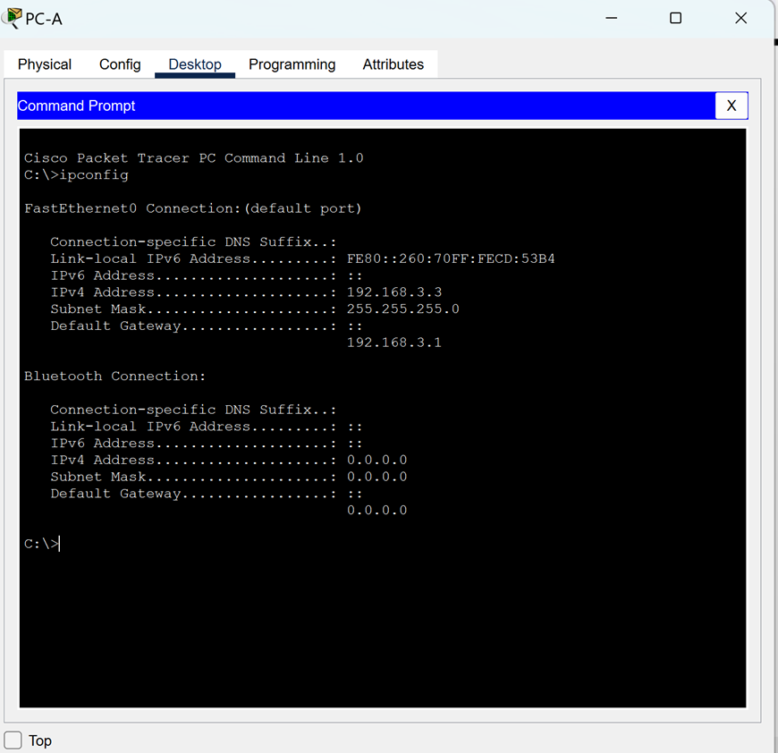

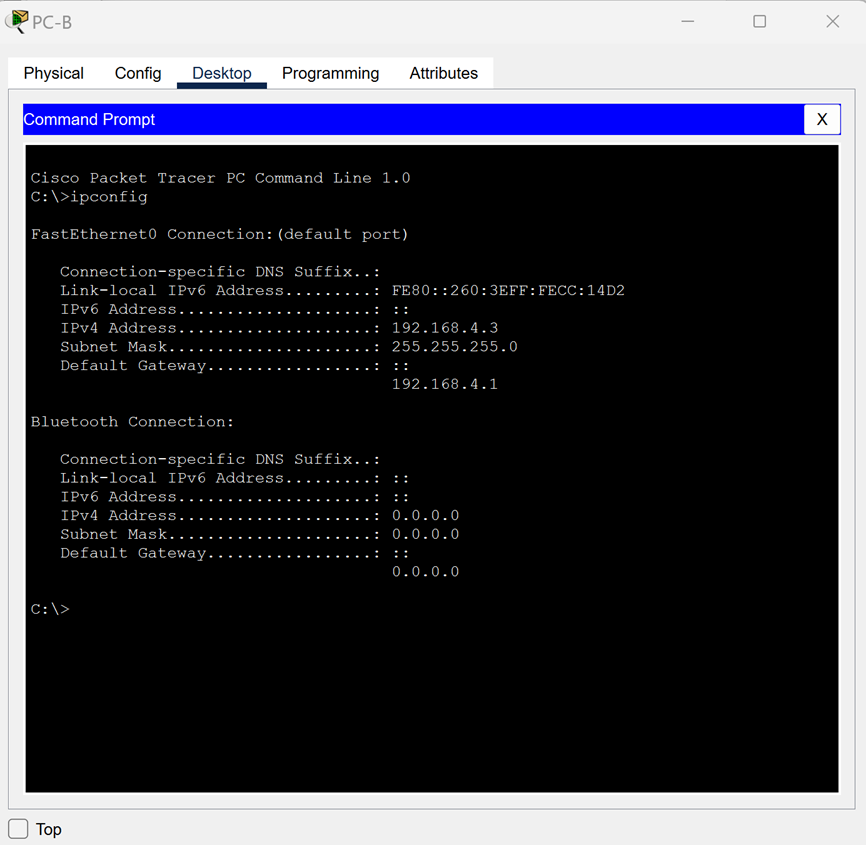

## Part 2: Создание сетей VLAN и назначение портов коммутатора
Во второй части вы создадите VLAN, как указано в таблице выше, на обоих коммутаторах. Затем вы назначите VLAN соответствующему интерфейсу и проверите настройки конфигурации. Выполните следующие задачи на каждом коммутаторе.

### Step 1: Создайте сети VLAN на коммутаторах.
a.	Создайте и назовите необходимые VLAN на каждом коммутаторе из таблицы выше.

Для S1:
```
S1(config)#vlan 3
S1(config-vlan)#name Management
S1(config)#vlan 4
S1(config-vlan)#name Operations
S1(config)#vlan 7
S1(config-vlan)#name ParkingLot
S1(config-vlan)#vlan 8
S1(config-vlan)#name Native
S1(config-vlan)#exit
```
Для S2:
```
S2(config)#vlan 3 
S2(config-vlan)#name Management
S2(config)#vlan 4
S2(config-vlan)#name Operations
S2(config-vlan)#vlan 7
S2(config-vlan)#name ParkingLot
S2(config-vlan)#vlan 8 
S2(config-vlan)#name Native
S2(config-vlan)#exit
```
b.	Настройте интерфейс управления и шлюз по умолчанию на каждом коммутаторе, используя информацию об IP-адресе в таблице адресации. 
```
S1(config)#interface vlan 3
S1(config-if)#ip address 192.168.3.11 255.255.255.0
S1(config-if)#exit
S1(config)#ip default-gateway 192.168.3.1
```
Для S2:
```
S2(config)#interface vlan 3
S2(config-if)#ip address 192.168.3.12 255.255.255.0
S1(config-if)#exit
S1(config)#ip default-gateway 192.168.3.1
```
c.	Назначьте все неиспользуемые порты коммутатора VLAN Parking_Lot, настройте их для статического режима доступа и административно деактивируйте их.
**Примечание**. Команда interface range полезна для выполнения этой задачи с минимальным количеством команд.
```
S1(config)#interface range f0/2-4, f0/7-24
S1(config-if-range)#switchport mode access
S1(config-if-range)#switchport access vlan 7
S1(config-if-range)#shut
S1(config-if-range)#exit
```
Для S2:
```
S2(config)#interface range f0/2-17, f0/19-24
S2(config-if-range)#switchport mode access
S2(config-if-range)#switchport access vlan 7
S2(config-if-range)#shut
S2(config-if-range)#exit
```
### Step 2: Назначьте сети VLAN соответствующим интерфейсам коммутатора.
a.	Назначьте используемые порты соответствующей VLAN (указанной в таблице VLAN выше) и настройте их для режима статического доступа.
```
S1(config)#interface f0/6
S1(config-if)#switchport mode access
S1(config-if)#switchport access vlan 3
S1(config-if)#exit
```
Для S2:
```
S2(config)#interface f0/18
S2(config-if)#switchport mode access
S2(config-if)#switchport access vlan 4
S2(config-if)#exit
```
b.	Убедитесь, что VLAN назначены на правильные интерфейсы.

`S1(config)#do show vlan brief`

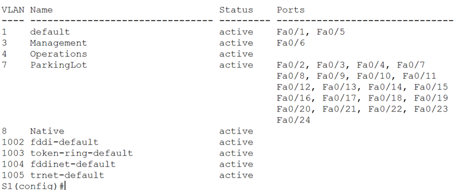

`S2(config)#do show vlan brief`

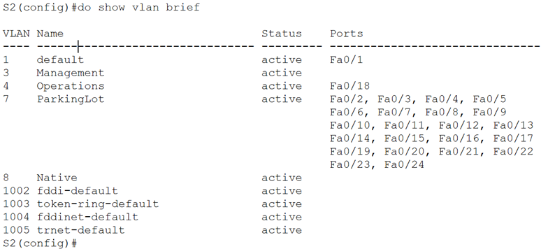

## Part 3: Конфигурация магистрального канала стандарта 802.1Q между коммутаторами
В части 3 вы вручную настроите интерфейс F0/1 как транк.
### Step 1: Вручную настройте магистральный интерфейс F0/1 на коммутаторах S1 и S2.
a.	Настройка статического транкинга на интерфейсе F0/1 для обоих коммутаторов.
```
S1(config)#int f0/1
S1(config-if)#switchport mode trunk
```
```
S2(config)#interface f0/1
S2(config-if)#switchport mode trunk
```
b.	Как часть конфигурации, установите Native VLAN на 8 на обоих коммутаторах. Вы можете временно увидеть сообщения об ошибках, пока два интерфейса настроены для разных Native VLAN.

`S1(config-if)#switchport trunk native vlan 8`

`S2(config-if)#switchport trunk native vlan 8`

c.	В качестве другой части конфигурации транка укажите, что только VLAN 3, 4 и 8  разрешено пропускать через транк.

```
S1(config-if)#switchport trunk allowed vlan 3,4,8
S1(config-if)#exit
```
```
S2(config-if)#switchport trunk allowed vlan 3,4,8
S2(config-if)#exit
```
d.	Проверьте транки, native VLAN и разрешенные VLAN через транк.

`S1(config)#do show interfaces trunk`

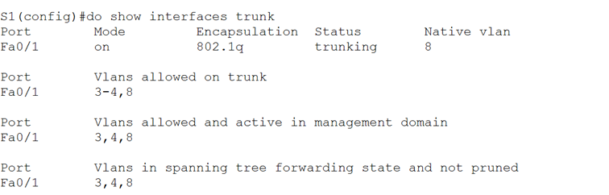

### Step 2: Вручную настройте магистральный интерфейс F0/5 на коммутаторе S1.
a.	Настройте интерфейс S1 F0/5 с теми же параметрами транка, что и F0/1. Это транк до маршрутизатора.
```
S1(config)#int f0/5
S1(config-if)#switchport mode trunk
S1(config-if)#switchport trunk native vlan 8
S1(config-if)#switchport trunk allowed vlan 3,4,8
S1(config-if)#exit
```
b.	Сохраните текущую конфигурацию в файл загрузочной конфигурации.

`S1(config)#do wr`

`S2(config-if)#do wr`

c.	Проверьте  командой **show interfaces trunk**, чтобы проверить транк.


*__Вопрос:__*
Почему F0/5 не отображается в списке транков?

*__Ответ:__* Потому что G0/0/1 порт R1 административно выключен. 

## Part 4: Настройка маршрутизации между сетями VLAN
a.	При необходимости активируйте интерфейс G0/0/1 на маршрутизаторе.
```
R1(config)#int g0/0/1
R1(config-if)#no shut
```
b.	Настройте подинтерфейсы для каждой VLAN, как указано в таблице IP-адресации. Все подинтерфейсы используют инкапсуляцию 802.1Q. Убедитесь, что подинтерфейсу для native VLAN не назначен IP-адрес. Включите описание для каждого вспомогательного интерфейса.
```
R1(config)#interface g0/0/1.3
R1(config-subif)#encapsulation dot1Q 3
R1(config-subif)#ip address 192.168.3.1 255.255.255.0
R1(config-subif)#description Management
R1(config-subif)#exit
R1(config)#interface g0/0/1.4
R1(config-subif)#encapsulation dot1Q 4
R1(config-subif)#ip address 192.168.4.1 255.255.255.0
R1(config-subif)#description Operations
R1(config)#int g0/0/1.8
R1(config-subif)#encapsulation dot1Q 8 native
R1(config-subif)#description Native
R1(config-subif)#exit
```
c.	Используй **show ip interface brief** команду, чтобы проверить, что вспомогательные интерфейсы работают.

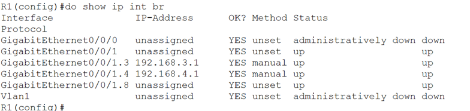

## Part 5: Проверьте, работает ли маршрутизация между VLAN
### Step 1: Выполните следующие тесты с PC-A. Все должно быть успешно.
**Примечание**. Возможно, вам придется отключить брандмауэр ПК для работы ping
a.	Отправьте эхо-запрос с PC-A на шлюз по умолчанию.

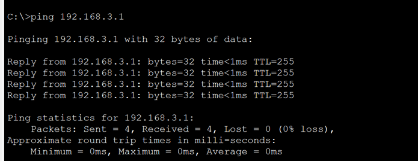

b.	Отправьте эхо-запрос с PC-A на PC-B.

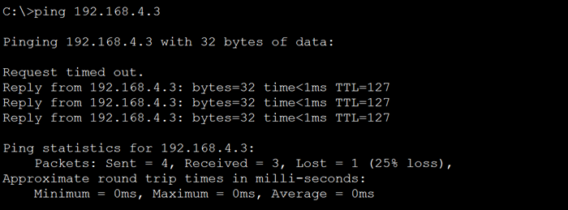

c.	Отправьте команду ping с компьютера PC-A на коммутатор S2.

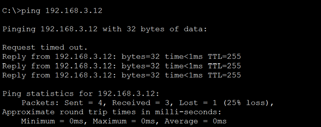

### Step 2: Пройдите следующий тест с PC-B
В окне командной строки на PC-B выполните команду **tracert** на адрес PC-A.


*__Вопрос:__*
Какие промежуточные IP-адреса отображаются в результатах?

*__Ответ:__* Это вспомогательный интерфейс R1 G0/0/1.4 c IP адресом 192.168.4.1.


