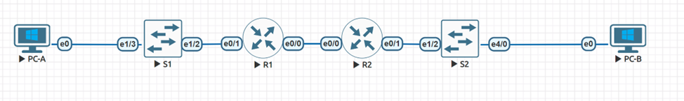
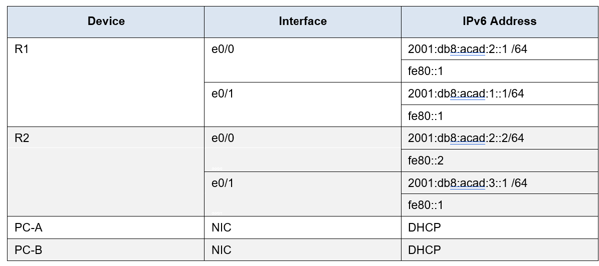
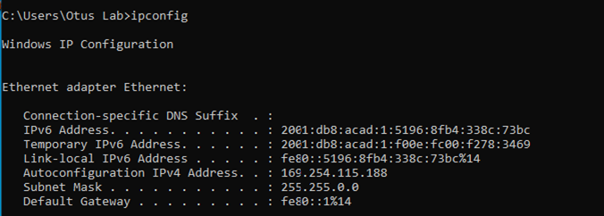
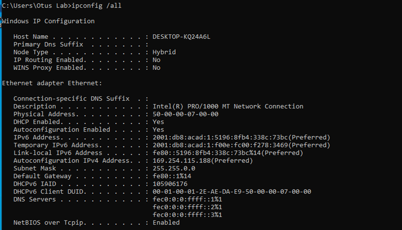
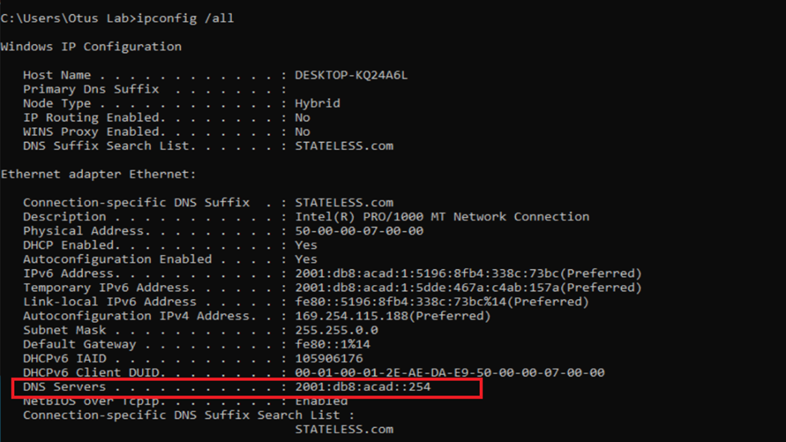
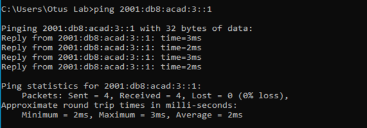
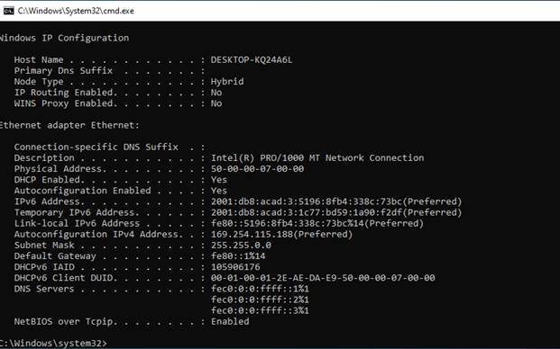
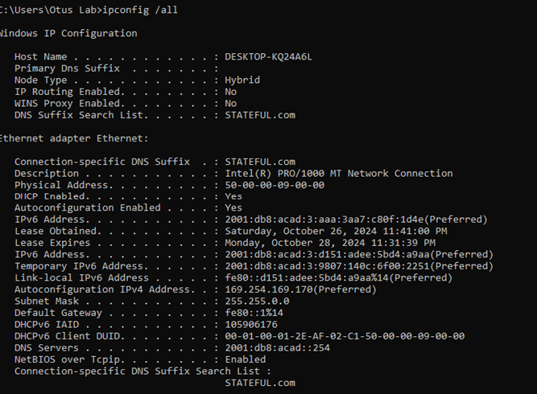
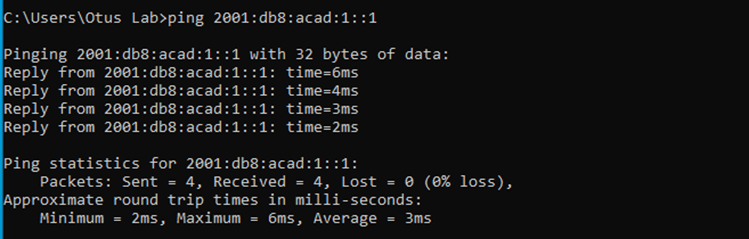

# Lab - Configure DHCPv6
## Topology

## Addressing Table

## Objectives
  **Part 1: Build the Network and Configure Basic Device Settings**

  **Part 2: Verify SLAAC address assignment from R1**

  **Part 3: Configure and verify a Stateless DHCPv6 Server on R1**

  **Part 4: Configure and verify a Stateful DHCPv6 Server on R1**

  **Part 5: Configure and verify a DHCPv6 Relay on R2**

## Background / Scenario

The dynamic assignment of IPv6 global unicast addresses (GUA) can be configured the following three ways:

  •	Stateless Address Auoconfiguration (SLACC)

  •	Stateless Dynamic Host Configuration Protocol for IPv6 (DHCPv6)

  •	Stateful DHCPv6

When using SLACC to assign IPv6 addresses to hosts a DHCPv6 server is not used. Because a DHCPv6 server is not used when implementing SLACC, hosts are unable to receive additional critical network information, including a domain name server (DNS) address as well as a domain name.

When using Stateless DHCPv6 to assign IPv6 addresses to host, a DHCPv6 server is used to assign the additional critical network information, however the IPv6 address is assigned using SLACC.
When implementing Stateful DHCPv6, a DHCPv6 server assigns all network information, including the IPv6 address.

The determination of how hosts obtain they dynamic IPv6 addressing is dependent on flag setting contain within the router advertisement (RA) messages.

In this scenario, the company has grown in size, and the network administrators can no longer assign IP addresses to devices manually. Your job is to configure the R2 router to assign IPv6 addresses on two different subnets connected to router R1.

**Note**: In this lab Template Cisco IOL Image L2-ADVENTERPRISEK9-M-15.2-20150703.bin is used for S1 and S2 switches and Template Cisco IOL L3-ADVENTERPRISEK9-M-15.4-2T.bin is used for R1 and R2 routers. 2 PC with Windows 10 are used.

**Note**: Ensure that the routers and switches have been erased and have no startup configurations. If you are unsure contact your instructor.

## Required Resources

  •	2 Routers (Cisco 4221 with Cisco IOS XE Release 16.9.4 universal image or comparable)

  •	2 Switches (Cisco 2960 with Cisco IOS Release 15.2(2) lanbasek9 image or comparable) - Optional

  •	2 PCs (Windows with a terminal emulation program, such as Tera Term)

  •	Console cables to configure the Cisco IOS devices via the console ports

  •	Ethernet cables as shown in the topology

  ### Instructions
## Part 1: Build the Network and Configure Basic Device Settings
In Part 1, you will set up the network topology and configure basic settings on the PC hosts and switches.

### Step 1: Cable the network as shown in the topology.
Attach the devices as shown in the topology diagram, and cable as necessary.


### Step 2: Configure basic settings for each switch. (Optional)
Open configuration window
a.	Assign a device name to the switch.

b.	Disable DNS lookup to prevent the router from attempting to translate incorrectly entered commands as though they were host names.

c.	Assign **class** as the privileged EXEC encrypted password.

d.	Assign **cisco** as the console password and enable login.

e.	Assign **cisco** as the VTY password and enable login.

f.	Encrypt the plaintext passwords.

g.	Create a banner that warns anyone accessing the device that unauthorized access is prohibited.

h.	Shutdown all unused ports

i.	Save the running configuration to the startup configuration file.

```
Switch(config)#hostname S1
S1(config)#no ip domain-lookup
S1(config)#enable secret class
S1(config)#line console 0
S1(config-line)#password cisco
S1(config-line)#login
S1(config-line)#exit
S1(config)#line vty 0 4
S1(config-line)#password cisco
S1(config-line)#exit
S1(config)#service password-encryption
S1(config)#banner motd # WARNING! Unauthorized access to this device is prohibited. All activities may be monitored and reported to the security authorities. #
S1(config)# interface range e0/0-3, e1/0-1, e2/0-3, e3/0-3, e4/0-3
S1(config-if-range)#shut
S1(config-if-range)#exit
S1(config)#do wr
```

```
Switch(config)#hostname S2
S2(config)#no ip domain-lookup
S2(config)#enable secret class
S2(config)#line console 0
S2(config-line)#password cisco
S2(config-line)#login
S2(config-line)#exit
S2(config)#line vty 0 4
S2(config-line)#password cisco
S2(config-line)#exit
S2(config)#service password-encryption
S2(config)#banner motd # WARNING! Unauthorized access to this device is prohibited. All activities may be monitored and reported to the security authorities. #
S2(config)#interface range e0/0-3, e1/0-1, e1/3, e2/0-3, e3/0-3, e4/1-3
S2(config-if-range)#shut
S2(config-if-range)#exit
S2(config)#do wr
```

### Step 3: Configure basic settings for each router.
Open configuration window
a.	Assign a device name to the router.
b.	Disable DNS lookup to prevent the router from attempting to translate incorrectly entered commands as though they were host names.
c.	Assign **class** as the privileged EXEC encrypted password.
d.	Assign **cisco** as the console password and enable login.
e.	Assign **cisco** as the VTY password and enable login.
f.	Encrypt the plaintext passwords.
g.	Create a banner that warns anyone accessing the device that unauthorized access is prohibited.
h.	Enable IPv6 Routing
i.	Save the running configuration to the startup configuration file.

```
Router(config)#hostname R1
R1(config)#no ip domain-lookup
R1(config)#enable secret class
R1(config)#line console 0
R1(config-line)#password cisco
R1(config-line)#login
R1(config-line)#exit
R1(config)#line vty 0 4
R1(config-line)#password cisco
R1(config-line)#exit
R1(config)#service password-encryption
R1(config)#banner motd # WARNING! Unauthorized access to this device is prohibited. All activities may be monitored and reported to the security authorities. #
R1(config)#ipv6 unicast-routing 
R1(config)#do wr
```

```
Router(config)#hostname R2
R2(config)#no ip domain-lookup
R2(config)#enable secret class
R2(config)#line console 0
R2(config-line)#password cisco
R2(config-line)#login
R2(config-line)#exit
R2(config)#line vty 0 4
R2(config-line)#password cisco
R2(config-line)#exit
R2(config)#service password-encryption
R2(config)#banner motd # WARNING! Unauthorized access to this device is prohibited. All activities may be monitored and reported to the security authorities. #
R2(config)#ipv6 unicast-routing 
R2(config)#do wr
```

### Step 4: Configure interfaces and routing for both routers.
a.	Configure the e0/0 and e0/1 interfaces on R1 and R2 with the IPv6 addresses specified in the table above.

```
R1(config)#int e0/0
R1(config-if)#ipv6 address 2001:db8:acad:2::1/64
R1(config-if)#ipv6 address fe80::1 link-local
R1(config-if)#no shut
R1(config-if)#exit
R1(config)#interface e0/1
R1(config-if)#ipv6 address 2001:db8:acad:1::1/64
R1(config-if)#ipv6 address fe80::1 link-local 
R1(config-if)#no shut
R1(config-if)#exit
```

```
R2(config)#interface e0/0
R2(config-if)#ipv6 address 2001:db8:acad:2::2/64
R2(config-if)#ipv6 address fe80::2 link-local
R2(config-if)#no shut
R2(config-if)#exit
R2(config)#interface e0/1
R2(config-if)#ipv6 address 2001:db8:acad:3::1/64
R2(config-if)#ipv6 address fe80::1 link-local 
R2(config-if)#no shut
R2(config-if)#exit
```

b.	Configure a default route on each router pointed to the IP address of e0/0 on the other router.

`R1(config)#ipv6 route ::/0 2001:db8:acad:2::2`

`R2(config)#ipv6 route ::/0 2001:db8:acad:2::1`

c.	Verify routing is working by pinging R2’s e0/1 address from R1


d.	Save the running configuration to the startup configuration file.

`R1#wr`

`R2#wr`

### Part 2: Verify SLAAC Address Assignment from R1
In Part 2, you will verify that Host PC-A receives an IPv6 address using the SLAAC method.

Power PC-A up and ensure that the NIC is configured for IPv6 automatic configuration.

After a few moments, the results of the command **ipconfig** should show that PC-A has assigned itself an address from the 2001:db8:acad:1::/64 network.



*__Question:__*
Where did the host-id portion of the address come from?

*__Answer:__*
It is generated randomly by Windows 10 host machine.

## Part 3: Configure and Verify a DHCPv6 server on R1
In Part 3, you will configure and verify a stateless DHCP server on R1. The objective is to provide PC-A with DNS server and Domain information.

### Step 1: Examine the configuration of PC-A in more detail.
a.	Issue the command ipconfig /all on PC-A and take a look at the output.



b.	Notice that there is no Primary DNS suffix. 

### Step 2: Configure R1 to provide stateless DHCPv6 for PC-A.
a.	Create an IPv6 DHCP pool on R1 named R1-STATELESS. As a part of that pool, assign the DNS server address as 2001:db8:acad::1 and the domain name as stateless.com.

```
R1(config)# ipv6 dhcp pool R1-STATELESS
R1(config-dhcp)# dns-server 2001:db8:acad::254
R1(config-dhcp)# domain-name STATELESS.com
```

b.	Configure the e0/1 interface on R1 to provide the OTHER config flag to the R1 LAN, and specify the DHCP pool you just created as the DHCP resource for this interface.

```
R1(config)# interface e0/1
R1(config-if)# ipv6 nd other-config-flag
R1(config-if)# ipv6 dhcp server R1-STATELESS
```

c.	Save the running configuration to the startup configuration file.

`R1(config-if)#do wr`

d.	Restart PC-A.
Ok
e.	Examine the output of ipconfig /all and notice the changes.



*The DNS server has appeared with the IPv6 address.*

f.	Test connectivity by pinging R2’s e0/1 interface IP address.



## Part 4: Configure a stateful DHCPv6 server on R1
In Part 4, you will configure R1 to respond to DHCPv6 requests from the LAN on R2.

a.	Create a DHCPv6 pool on R1 for the 2001:db8:acad:3:aaaa::/80 network. This will provide addresses to the LAN connected to interface e0/1 on R2. As a part of the pool, set the DNS server to 2001:db8:acad::254, and set the domain name to STATEFUL.com.

```
R1(config)# ipv6 dhcp pool R2-STATEFUL
R1(config-dhcp)# address prefix 2001:db8:acad:3:aaa::/80
R1(config-dhcp)# dns-server 2001:db8:acad::254
R1(config-dhcp)# domain-name STATEFUL.com
```

b.	Assign the DHCPv6 pool you just created to interface e0/0 on R1.

```
R1(config)# interface e0/0
R1(config-if)# ipv6 dhcp server R2-STATEFUL
```

## Part 5: Configure and verify DHCPv6 relay on R2.
In Part 5, you will configure and verify DHCPv6 relay on R2, allowing PC-B to receive an IPv6 Address.

### Step 1: Power on PC-B and examine the SLAAC address that it generates.



Notice in the output that the prefix used is 2001:db8:acad:3::

### Step 2: Configure R2 as a DHCP relay agent for the LAN on e0/1.
a.	Configure the **ipv6 dhcp relay** command on R2 interface e0/1, specifying the destination address of the e0/0 interface on R1. Also configure the **managed-config-flag** command.

```
R2(config)# interface e0/1
R2(config-if)# ipv6 nd managed-config-flag
R2(config-if)# ipv6 dhcp relay destination 2001:db8:acad:2::1 e0/0
```

### Step 3: Attempt to acquire an IPv6 address from DHCPv6 on PC-B.
a.	Restart PC-B.

Ok

b.	Open a command prompt on PC-B and issue the command **ipconfig /all** and examine the output to see the results of the DHCPv6 relay operation.



c.	Test connectivity by pinging R1’s e0/1 interface IP address.




