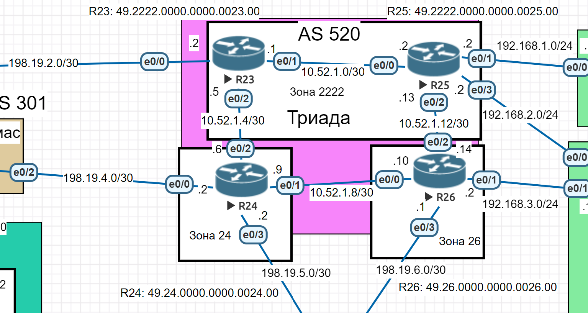
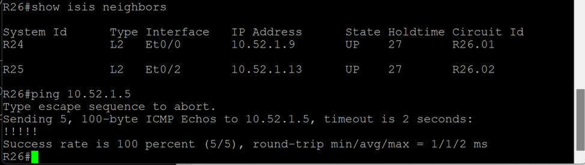
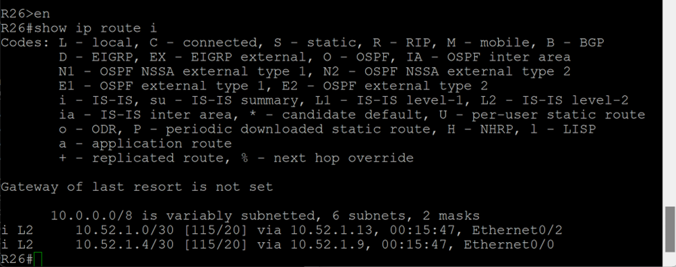

# Лабораторная работа. IS-IS

## Цель:
Настроить IS-IS офисе Триада

Описание/Пошаговая инструкция выполнения домашнего задания:
 1. Настроите IS-IS в ISP Триада.
 2. R23 и R25 находятся в зоне 2222.
 3. R24 находится в зоне 24.
 4. R26 находится в зоне 26.
Настройка осуществляется одновременно для IPv4 и IPv6.

## Топология


## Выполнение

Все маршрутизаторы R23-26 по умолчанию, при настройке, становятся L1-2 маршрутизаторами.

NET адреса: 

R23: 49.2222.0000.0000.0023.00

R24: 49.24.0000.0000.0024.00

R25: 49.2222.0000.0000.0025.00

R26: 49.26.0000.0000.0026.00

Где 49 - приватный тип адреса, 2222 - номер зоны (R23,R25), 0023 - ID (R23), 00 - селектор.

Выполним настройку на всех маршрутизаторах:
```
R23(config)#router isis
R23(config-router)#net 49.2222.0000.0000.0023.00
R23(config)#interface range e0/1-2
R23(config-if-range)#ip router isis
```
```
R24(config)#router isis
R24(config-router)#net 49.24.0000.0000.0024.00
R24(config)#interface range e0/1-2
R24(config-if-range)#ip router isis
```
```
R25(config)#router isis
R25(config-router)#net 49.2222.0000.0000.0025.00
R25(config)#interface range e0/0,e0/2
R25(config-if-range)#ip router isis
```
```
R26(config)#router isis
R26(config-router)#net 49.26.0000.0000.0026.00
R26(config)#interface range e0/0,e0/2
R26(config-if-range)#ip router isis
```

Проверка: 


R23 e0/2 - пингуется.


Маршруты есть.