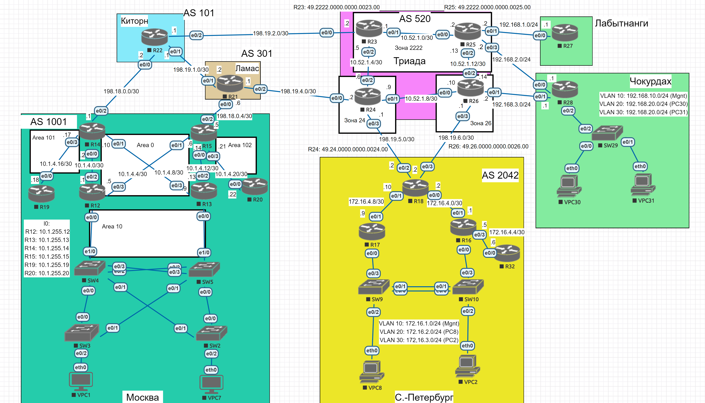
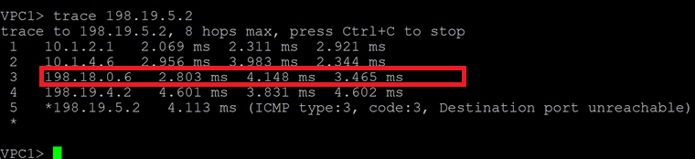
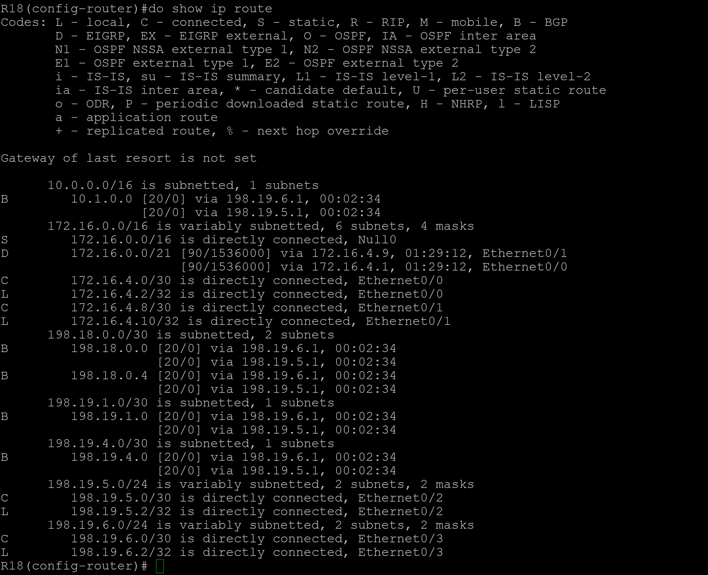
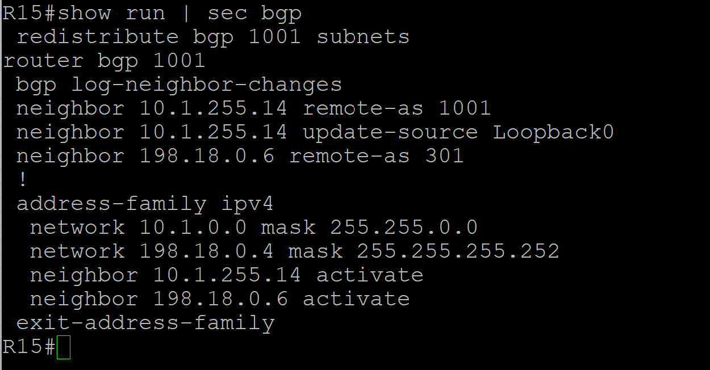
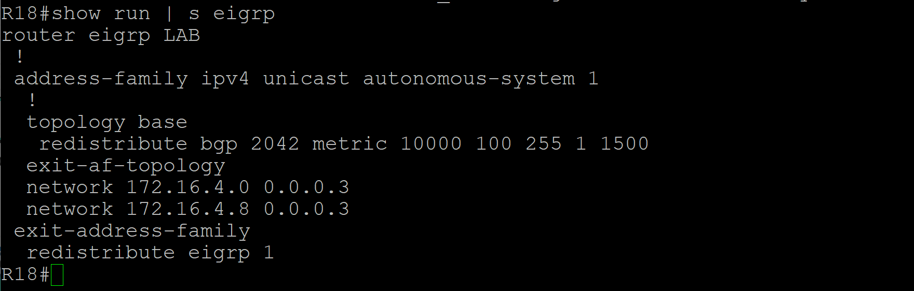
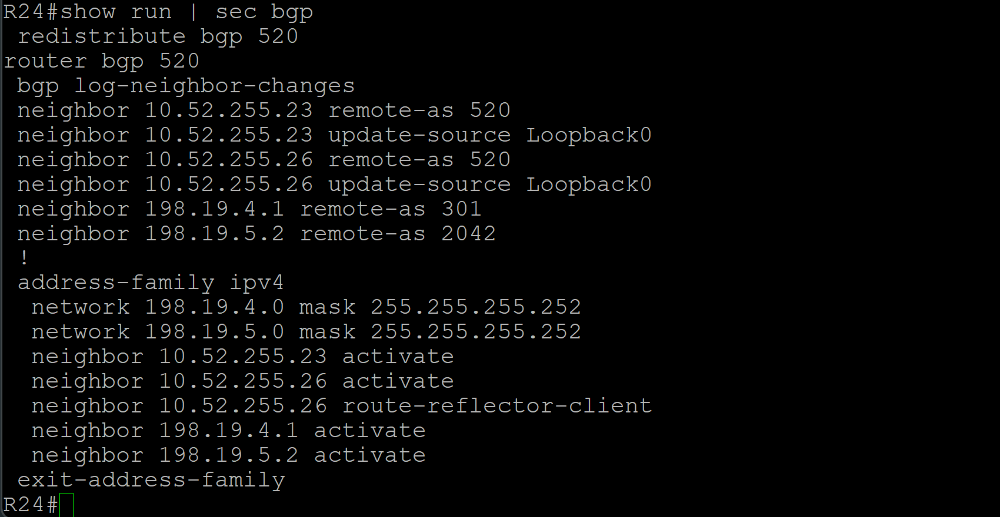
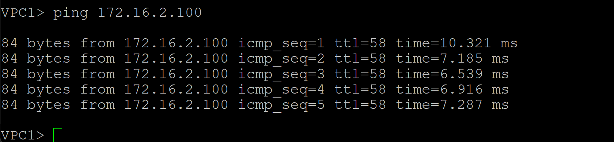

# Лабораторная работа. iBGP

## Цель:
Настроить iBGP в офисе Москва
Настроить iBGP в сети провайдера Триада
Организовать полную IP связанность всех сетей

Описание/Пошаговая инструкция выполнения домашнего задания:

 1. Настроите iBGP в офисом Москва между маршрутизаторами R14 и R15.
 2. Настроите iBGP в провайдере Триада, с использованием RR.
 3. Настройте офиса Москва так, чтобы приоритетным провайдером стал Ламас.
 4. Настройте офиса С.-Петербург так, чтобы трафик до любого офиса распределялся по двум линкам одновременно.
 5. Все сети в лабораторной работе должны иметь IP связность.
 6. План работы и изменения зафиксированы в документации.

 ## Топология

 

 ## Выполнение


 1. Настроим iBGP в офисе Москва:

 Проанонсируем loopback-адреса через ospf и построим по ним соседства по iBGP между R14 и R15:

```
R14(config)#router ospf 1
R14(config-router)#network 10.1.255.0 0.0.0.255 area 0
R14(config-router)#end
```

```
R15(config)#router ospf 1
R15(config-router)#network 10.1.255.0 0.0.0.255 area 0
R15(config-router)#end
```

Настроим iBGP соседство:

```
R14(config)#router bgp 1001
R14(config-router)#neighbor 10.1.255.15 remote-as 1001
R14(config-router)#neighbor 10.1.255.15 update-source l0
R14(config-router)#address-family ipv4 unicast
R14(config-router-af)#neighbor 10.1.255.15 activate
R14(config-router)#
*Jan 24 17:55:37.932: %BGP-5-ADJCHANGE: neighbor 10.1.255.15 Up
```
```
R15(config)#router bgp 1001
R15(config-router)#neighbor 10.1.255.14 remote-as 1001
R15(config-router)#neighbor 10.1.255.14 update-source l
*Jan 24 17:55:37.933: %BGP-5-ADJCHANGE: neighbor 10.1.255.14 Up
R15(config-router)#neighbor 10.1.255.14 update-source l0
R15(config-router)#address-family ipv4 unicast
R15(config-router-af)#neighbor 10.1.255.14 activate
```

 2) Настроим iBGP в Триада с использованием RR:

Выберем R23 и R24 как RR, настроим iBGP соседства:

```
R23#show run | sec bgp
router bgp 520
 bgp log-neighbor-changes
 neighbor 10.52.255.24 remote-as 520
 neighbor 10.52.255.24 update-source Loopback0
 neighbor 10.52.255.25 remote-as 520
 neighbor 10.52.255.25 update-source Loopback0
 !
 address-family ipv4
  neighbor 10.52.255.24 activate
  neighbor 10.52.255.25 activate
  neighbor 10.52.255.25 route-reflector-client
 exit-address-family
R23#
```
```
R24#show run | s bgp
 redistribute bgp 520
router bgp 520
 bgp log-neighbor-changes
 neighbor 10.52.255.23 remote-as 520
 neighbor 10.52.255.23 update-source Loopback0
 neighbor 10.52.255.26 remote-as 520
 neighbor 10.52.255.26 update-source Loopback0
 neighbor 198.19.4.1 remote-as 301
 neighbor 198.19.5.2 remote-as 2042
 !
 address-family ipv4
  network 198.19.4.0 mask 255.255.255.252
  network 198.19.5.0 mask 255.255.255.252
  neighbor 10.52.255.23 activate
  neighbor 10.52.255.26 activate
  neighbor 10.52.255.26 route-reflector-client
  neighbor 198.19.4.1 activate
  neighbor 198.19.5.2 activate
 exit-address-family
```

```
R26#show run | sec bgp
router bgp 520
 bgp log-neighbor-changes
 neighbor 10.52.255.24 remote-as 520
 neighbor 10.52.255.24 update-source Loopback0
 neighbor 10.52.255.25 remote-as 520
 neighbor 10.52.255.25 update-source Loopback0
 neighbor 198.19.6.2 remote-as 2042
 !
 address-family ipv4
  network 198.19.6.0 mask 255.255.255.252
  neighbor 10.52.255.24 activate
  neighbor 10.52.255.25 activate
  neighbor 198.19.6.2 activate
 exit-address-family
R26#
```

3. Настроим офиса Москва так, чтобы приоритетным провайдером стал Ламас.

Сделаем Route-map на R14 и добавим к иходящим маршрутам ещё одну AS 1001:

```
R14(config)#route-map GlobalMap permit 10
R14(config)#router bgp 1001
R14(config-router)#address-family ipv4 unicast
R14(config-router-af)#neighbor 198.18.0.2 route-map GlobalMap out
R14(config-router-af)#end
```

Сделаем трассировку до R18 с VPC1 и проверим, какой маршрут будет выбран:



Из скриншота видно, что выбран маршрут через Ламас (198.18.0.6).

 4. Настроим офиса С.-Петербург так, чтобы трафик до любого офиса распределялся по двум линкам одновременно.

Настром это через команду:

```
R18(config)#router bgp 2042
R18(config-router)#address-family ipv4 unicast
R18(config-router-af)#maximum-paths 2
```

Проверим таблицу маршрутизации на R18 и видим, что сети стали доступны через два маршрута:



5. Все сети в лабораторной работе должны иметь IP связность:

Настроим редистрибьюцию и ананосирует суммарные маршруты в Null 0 в BGP:

Настроим Редистрибьюцию OSPF в BGP на R14 и R15 в Москве. 



Редистрибьюцию EIGRP в BGP в Санкт-Петербурге.


Редистрибьюцию из IS-IS в BGP в Триада:




 5. Проверим IP связность:



VPC1 успешно пингует VPC8. 
