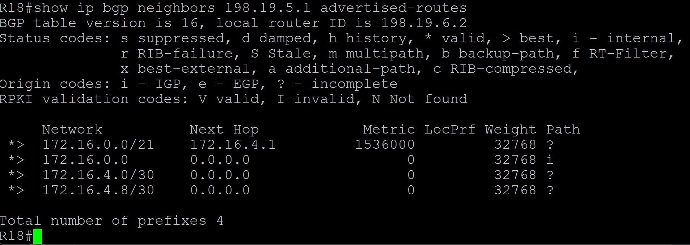
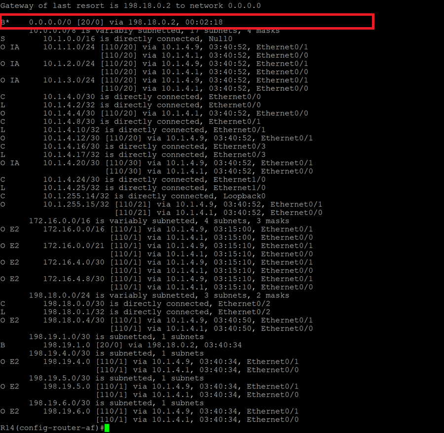
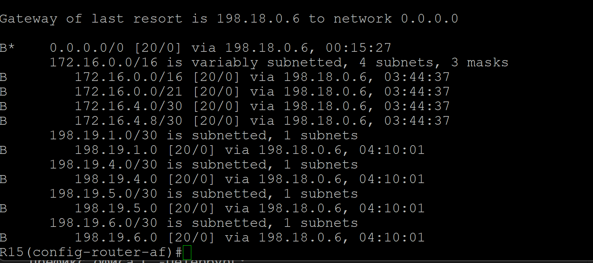

# Лабораторная работа. Фильтрация BGP

## Цель:
Настроить фильтрацию для офисе Москва
Настроить фильтрацию для офисе С.-Петербург

Описание/Пошаговая инструкция выполнения домашнего задания:

 1. Настроить фильтрацию в офисе Москва так, чтобы не появилось транзитного трафика(As-path).
 2. Настроить фильтрацию в офисе С.-Петербург так, чтобы не появилось транзитного трафика(Prefix-list).
 3. Настроить провайдера Киторн так, чтобы в офис Москва отдавался только маршрут по умолчанию.
 4. Настроить провайдера Ламас так, чтобы в офис Москва отдавался только маршрут по умолчанию и префикс офиса С.-Петербург.
 5. Все сети в лабораторной работе должны иметь IP связность.
 6. План работы и изменения зафиксированы в документации.


## Выполнение

 1. Настроим фильтрацию в Москве так, чтобы не было транзитного трафика (As-path).
    Создадим as-path access-list и route-map:

```
R14(config)#ip as-path access-list 1 permit ^$
R14(config)#route-map 1 permit 10
R14(config-route-map)#match as-path 1
```
```
R15(config)#ip as-path access-list 1 permit ^$
R15(config)#route-map 1 permit 10
R15(config-route-map)#match as-path 1
```

Применим route-map к соседям:
```
R14(config-route-map)#router bgp 1001
R14(config-router)#address-family ipv4 unicast
R14(config-router-af)#neighbor 198.18.0.2 route-map 1 out
```
```
R15(config-route-map)#router bgp 1001
R15(config-router)#address-family ipv4 unicast
R15(config-router-af)#nei
R15(config-router-af)#neighbor 198.18.0.6 route-map 1 out
R15(config-router-af)#do wr
```


 2. Настроим фильтрацию в офисе С.-Петербург так, чтобы не появилось транзитного трафика (Prefix-list):

 Создадим ip prefix-list и route-map:

```
R18(config)#ip prefix-list OUT permit 172.16.0.0/16 le 32
R18(config)#route-map 2 permit 10
R18(config-route-map)#match ip address prefix-list OUT
R18(config-route-map)#exit
```


Применим route-map к соседям:

```

R18(config-router)#address-family ipv4
R18(config-router-af)#neighbor 198.19.5.1 route-map 2 out
R18(config-router-af)#neighbor 198.19.6.1 route-map 2 out
```

Проверим, что нет транзитного трафика:



 3. Настроим провайдера Киторн так, чтобы в офис Москва отдавался только маршрут по умолчанию:

Сделаем статический маршрут по умолчанию из роутера Китор в офис Москва:

```
R22(config)#router bgp 101
R22(config-router)#address-family ipv4 unicast
R22(config-router-af)#neighbor 198.18.0.1 default-originate
```

Настроим роутер R14 в Москва так, чтобы приходил только маршрут по умолчанию:

```
R14(config)#ip prefix-list DEFAULT seq 10 permit 0.0.0.0/0 le 32
R14(config)#router bgp 1001
R14(config-router)#address-family ipv4 unicast
R14(config-router-af)#neighbor 198.18.0.2 prefix-list DEFAULT in
```

Видим, что R14 получает только маршрут по умолчанию по BGP:



 5. Настроим провайдера Ламас так, чтобы в офис Москва отдавался только маршрут по умолчанию и префикс офиса С.-Петербург:
 
Сделаем статический маршрут по умолчанию из роутера Китор в офис Москва:

```
R21(config)#router bgp 301
R21(config-router)#address-family ipv4 unicast
R21(config-router-af)#neighbor 198.18.0.5 default-originate
```
Настроим роутер R15 в Москва так, чтобы приходил маршрут умолчанию и префикс офиса С.-Петербург:

```
R15(config)#ip prefix-list DEFAULTandPITER seq 10 permit 0.0.0.0/0 le 32
R15(config)#ip prefix-list DEFAULTandPITER seq 20 permit 172.16.0.0/16 le 32
R15(config)#router bgp 1001
R15(config-router)#address-family ipv4 unicast
R15(config-router-af)#neighbor 198.18.0.6 prefix-list DEFAULTandPITER in
```


