# Лабораторная работа. Основные протоколы сети интернет

## Цель:
Настроить DHCP в офисе Москва
Настроить синхронизацию времени в офисе Москва
Настроить NAT в офисе Москва, C.-Перетбруг и Чокурдах

Описание/Пошаговая инструкция выполнения домашнего задания:

 1. Настроите NAT(PAT) на R14 и R15. Трансляция должна осуществляться в адрес автономной системы AS1001.
 2. Настроите NAT(PAT) на R18. Трансляция должна осуществляться в пул из 5 адресов автономной системы AS2042.
 3. Настроите статический NAT для R20.
 4. Настроите NAT так, чтобы R19 был доступен с любого узла для удаленного управления.
 5. *. Настроите статический NAT(PAT) для офиса Чокурдах.
 5. Настроите для IPv4 DHCP сервер в офисе Москва на маршрутизаторах R12 и R13. VPC1 и VPC7 должны получать сетевые настройки по DHCP.
 6. Настроите NTP сервер на R12 и R13. Все устройства в офисе Москва должны синхронизировать время с R12 и R13.
 7. Все офисы в лабораторной работе должны иметь IP связность.
План работы и изменения зафиксированы в документации.


## Выполнение
 1. Настроим NAT(PAT) на R14 и R15:

```
R15(config)#access-list 1 permit 10.1.0.0 0.0.255.255
R15(config)#ip nat inside source list 1 interface e0/2 overload
R15(config)#interface range e0/0-1
R15(config-if-range)#ip nat inside
R15(config-if-range)#interface e0/2
R15(config-if)#ip nat outside
```

```
R14(config)#access-list 1 permit 10.1.0.0 0.0.255.255
R14(config)#ip nat inside source list 1 interface e0/2 overload
R14(config)#interface range e0/0-1
R14(config-if-range)#ip nat inside
R14(config-if-range)#interface e0/2
R14(config-if)#ip nat outside
```
Проверим, что NAT работает, проверкой доступности VPC8 через VPC7 сделав ping:

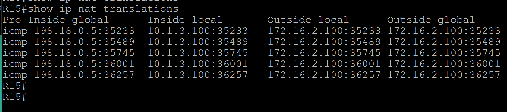


 2. Настроим NAT(PAT) на R18.

 Возьмём для NAT 5 адресов 172.16.100.100-172.16.100.4:

```
R18(config)#ip nat pool NAT_R18 172.16.100.100 172.16.100.104 netmask 255.255.255.0
R18(config)#access-list 1 permit 172.16.0.0 0.0.255.255
R18(config)#ip nat inside source list 1 pool NAT_R18 overload
R18(config)#interface range e0/0-1
R18(config-if-range)#ip nat inside
R18(config-if-range)#exit
R18(config)#interface range e0/2-3
R18(config-if-range)#ip nat outside
```

Сделаем несколько проверок доступности из С.-Петербург устройств вне его AS:

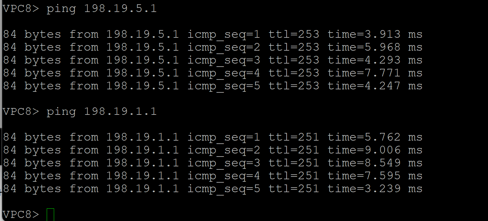

Проверим список NAT трансляций на R18:

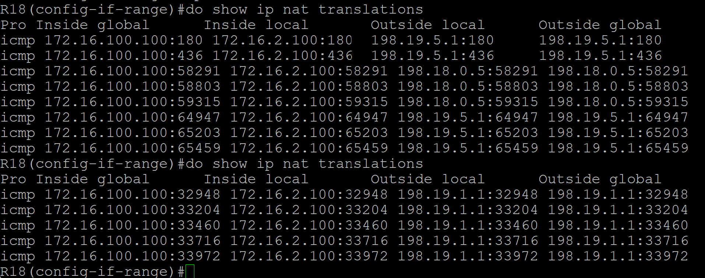

Видим, что необходимые трансляции выполнились.

 3. Настроите статический NAT для R20:

Для этого настроим статический NAT на R15 e0/3:

R15(config)#ip nat inside source static 10.1.4.21 198.18.0.5
R15(config)#interface e0/3

Проверим доступность R24 e0/3 с R20:

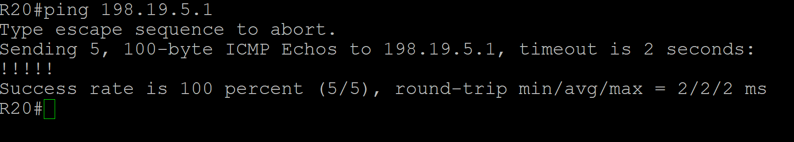

Проверим NAT трансляции на R15:

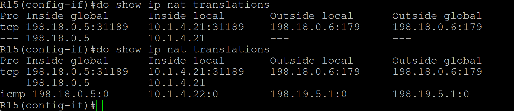

Видим, что всё работает.

 4. Настроим NAT так, чтобы R19 был доступен с любого узла для удаленного управления:

Для этого настроим NAT с проброской портов на R14:

```
ip nat inside source static tcp 10.1.4.17 22 198.18.0.1 22 extendable
ip nat inside source static tcp 10.1.4.17 23 198.18.0.1 23 extendable
interface Ethernet0/3
 ip nat inside
```

Проверим доступность телнетом с R18:

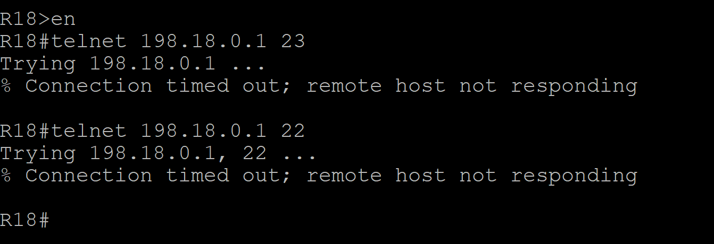

5. *. Настроите статический NAT(PAT) для офиса Чокурдах.


 5. Настроим для IPv4 DHCP сервер в офисе Москва на маршрутизаторах R12 и R13. VPC1 и VPC7 должны получать сетевые настройки по DHCP:

 R12:

 ```
 
R12(config)#ip dhcp excluded-address 10.1.1.1
R12(config)#ip dhcp excluded-address 10.1.2.1
R12(config)#ip dhcp excluded-address 10.1.3.1
R12(config)#ip dhcp excluded-address 10.1.2.254
R12(config)#ip dhcp excluded-address 10.1.3.254
R12(config)#ip dhcp pool VPC1
R12(dhcp-config)#network 10.1.2.0 255.255.255.0
R12(dhcp-config)#default-router 10.1.2.254
R12(config)#ip dhcp pool VPC7
R12(dhcp-config)#network 10.1.3.0 255.255.255.0
R12(dhcp-config)#default-router 10.1.3.254

```
Аналогичные настройки на R13:
```
R13(config)#ip dhcp excluded-address 10.1.1.1
R13(config)#ip dhcp excluded-address 10.1.2.1
R13(config)#ip dhcp excluded-address 10.1.3.1
R13(config)#ip dhcp excluded-address 10.1.2.254
R13(config)#ip dhcp excluded-address 10.1.3.254
R13(config)#ip dhcp pool VPC1
R13(dhcp-config)#network 10.1.2.0 255.255.255.0
R13(dhcp-config)#default-router 10.1.2.254
R13(config)#ip dhcp pool VPC7
R13(dhcp-config)#network 10.1.3.0 255.255.255.0
R13(dhcp-config)#default-router 10.1.3.254
```

Проверим, что DHCP работает:

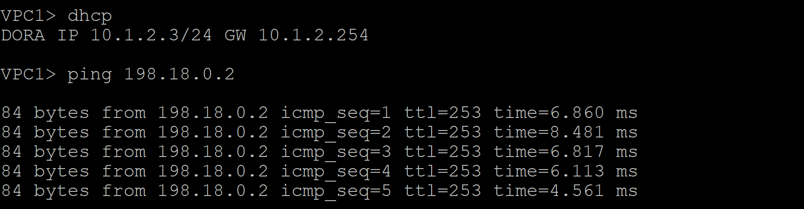

 6. Настроим NTP сервер на R12 и R13. Все устройства в офисе Москва должны синхронизировать время с R12 и R13:

 ```
R12#show run | sec ntp
ntp authentication-key 1 md5 072015797D 7
ntp authenticate
ntp trusted-key 1
ntp source Loopback0
ntp master
```
Проанонсируем L0 на R12:

```
interface Loopback0
 ip address 10.1.255.12 255.255.255.255
 ip ospf 1 area 0
end
```

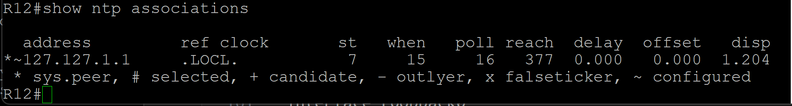

Произведём аналогичные действия на R13:

```
R13#show run | sec ntp
ntp authentication-key 1 md5 072015797D 7
ntp authenticate
ntp trusted-key 1
ntp source Loopback0
ntp master
```

```
interface Loopback0
 ip address 10.1.255.13 255.255.255.255
 ip ospf 1 area 0
end
```

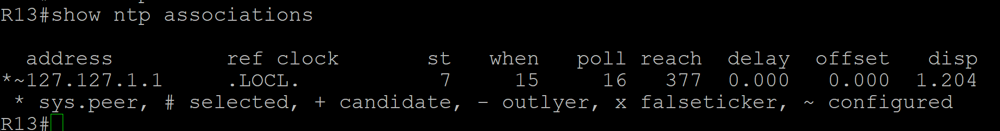

Настроим остальные устройства как NTP клиенты (R12 - основной сервер, R13 - запасной):

Приведём пример R14:

```
R14#show run | sec ntp
ntp authentication-key 1 md5 04743F333C 7
ntp authenticate
ntp trusted-key 1
ntp server 10.1.255.12 prefer
ntp server 10.1.255.13
```
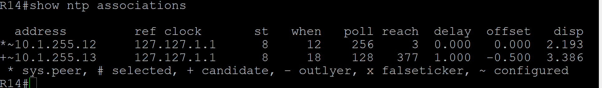

R19:

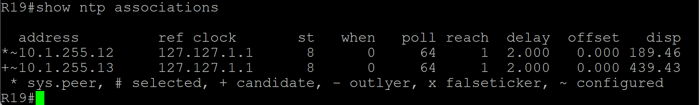

Такие же настройки на остальных L3 устройстах офиса Москва.

NTP настроено.


