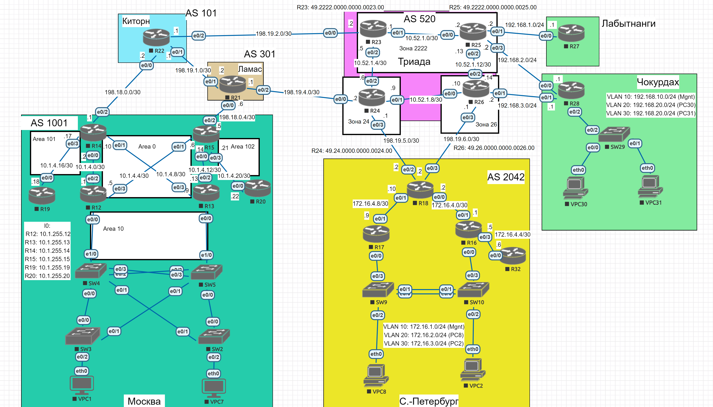
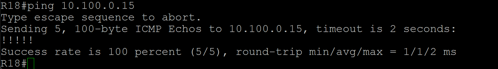
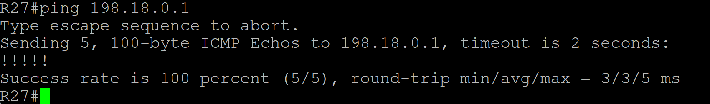
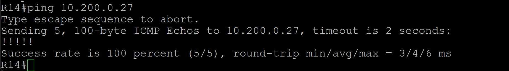
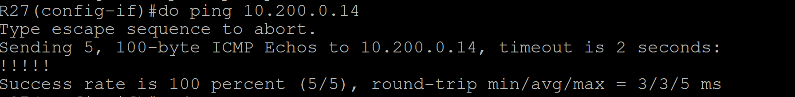
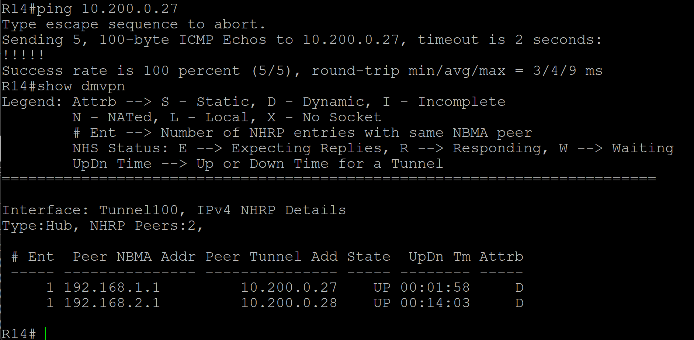
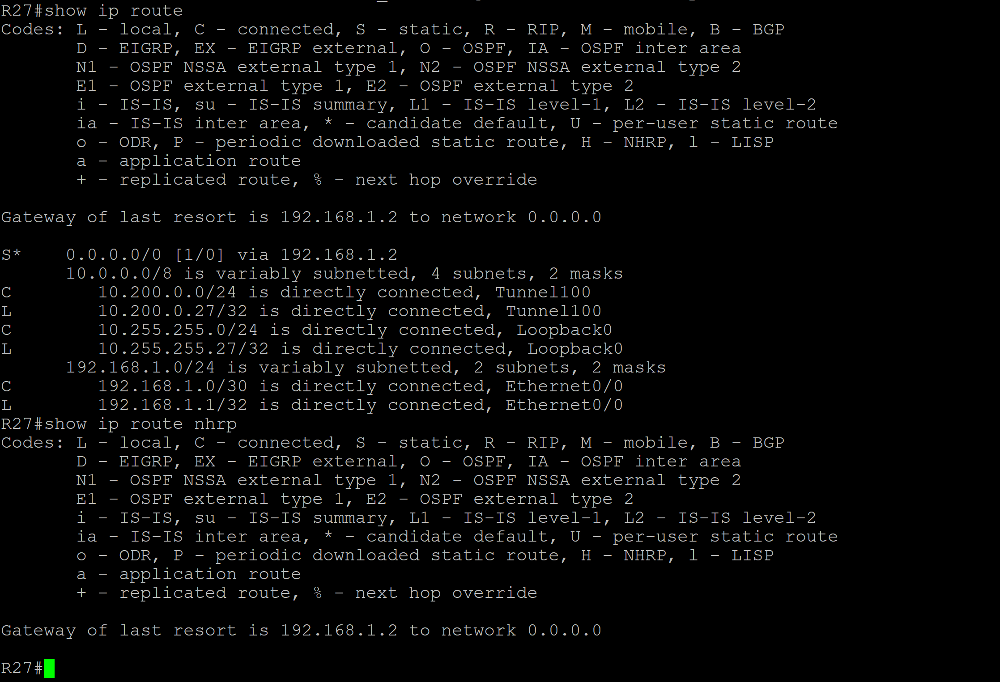
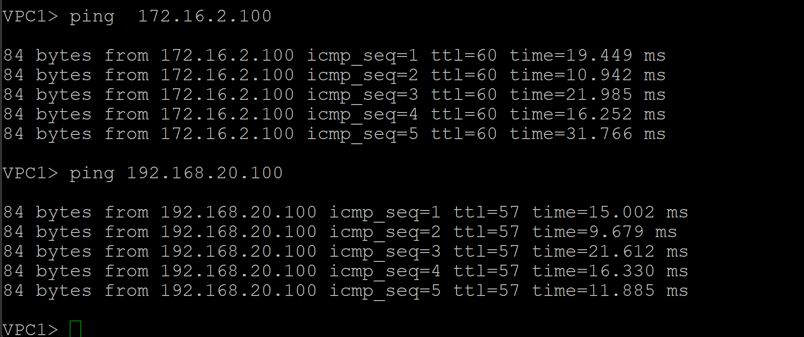

# Лабораторная работа. VPN. GRE. DmVPN

## Цель:
Настроить GRE между офисами Москва и С.-Петербург
Настроить DMVPN между офисами Москва и Чокурдах, Лабытнанги

Описание/Пошаговая инструкция выполнения домашнего задания:

 1. Настроите GRE между офисами Москва и С.-Петербург.
 2. Настроите DMVMN между Москва и Чокурдах, Лабытнанги.
 3. Все узлы в офисах в лабораторной работе должны иметь IP связность.

План работы и изменения зафиксированы в документации.



## Выполнение

1. Настроим GRE между офисами Москва и С.-Петербург:

Настроим GRE между роутером R15 Москва и R18 С.-Петербург.

Возьмём для GRE туннеля адрес 10.100.0.0 255.255.255.0.

```
R15#show run interface tunnel 100
Building configuration...

Current configuration : 159 bytes
!
interface Tunnel100
 ip address 10.100.0.15 255.255.255.0
 ip mtu 1400
 ip tcp adjust-mss 1360
 tunnel source 198.18.0.5
 tunnel destination 198.19.5.2
end
```
Изменим настройки NAT так, чтобы он не мешал GRE:

Старые:
```
R15(config)# ip nat inside source route-map NAT-BYPASS interface Ethernet0/2 overload
R15(config)# route-map NAT-BYPASS permit 10
R15(config-route-map)# match ip address 101
R15(config)# access-list 101 deny ip 10.100.0.0 0.0.0.255 any
R15(config)#access-list 101 permit ip 10.1.0.0 0.0.255.255 any
```
Новые:
```
access-list 101 deny gre any any
access-list 101 permit ip 10.1.0.0 0.0.255.255 any
ip nat inside source list 101 interface Ethernet0/2 overload
ip nat inside source route-map NAT-BYPASS interface Ethernet0/2 overload
route-map NAT-BYPASS permit 10
 match ip address 101

```

Создадим настройки на R18 для GRE:

```
R18#show run interface tunnel 100
Building configuration...

Current configuration : 159 bytes
!
interface Tunnel100
 ip address 10.100.0.18 255.255.255.0
 ip mtu 1400
 ip tcp adjust-mss 1360
 tunnel source 198.19.5.2
 tunnel destination 198.18.0.5
end
```

Проверим, что GRE туннель функционирует, проверкой доступности интерфейсов сети туннеля:



Туннель функционирует.

2. Настроим DMVMN между Москва и Чокурдах, Лабытнанги:

Настроим сначала полную связность между Москвой и Лабытнанги:

Для этого сделаем редистрибьюцию ISIS в BGP на роутере R24 Триада:

```
R24#conf t
R24(config)#router bgp 520
R24(config-router)#address-family ipv4 unicast
R24(config-router-af)#redistribute isis
R24(config-router-af)#end
```

Также сделаем редистрибьюцию присоединённых сетей на R25 в Триада, чтобы все знали о сети между R25 и Лабытнанги:

```
R25#conf t
R25(config)#router isis
R25(config-router)#redistribute connected
```
Проверим IP связность проверкой доступности с R27 Лабытнанги до R14 Москва:



Проверка успешна.

Теперь приступим к настройке DMVPN между Москва роутер R14 и Лабытнанги (роутер R27):

*Для удобства настройки и проверки настроек отключим пока интерфейс e0/2 R15 (Москва), так как R14 был настроен приоритетным роутером для трафик исходящего из Москвы в задании/ях с BGP.*

Настроим сначала GRE:

Выберем для внутренней сети туннеля сеть 10.200.0.0/24.

R14:
```
!
interface Tunnel100
 ip address 10.200.0.14 255.255.255.0
 ip mtu 1400
 ip tcp adjust-mss 1360
 tunnel source 198.18.0.1
 tunnel destination 192.168.1.1
end
```
R27:
```
!
interface Tunnel100
 ip address 10.200.0.27 255.255.255.0
 ip mtu 1400
 ip tcp adjust-mss 1360
 tunnel source 192.168.1.1
 tunnel destination 198.18.0.1
end
```

Теперь, сделаем так, чтобы NAT на R14 не мешал GRE:

```
access-list 101 deny gre any any
access-list 101 permit ip 10.1.0.0 0.0.255.255 any
ip nat inside source route-map NAT-BYPASS interface Ethernet0/2 overload
route-map NAT-BYPASS permit 10
 match ip address 101
```
Отключим лишние NATы и оставим этот для всего трафика.

Теперь проверим доступность интерфейсов туннеля:



Туннель работает.

Теперь настроим DMVPN:

```
R14#conf t
R14(config)#interface t100
R14(config-if)#tunnel mode gre multipoint
 Tunnel set mode failed. p2mp tunnels cannot have a tunnel destination.
R14(config-if)#no tunnel destination 192.168.1.1
Mar  8 05:22:16.106: %LINEPROTO-5-UPDOWN: Line protocol on Interface Tunnel100, changed state to down
R14(config-if)#tunnel mode gre multipoint
R14(config-if)#ip nhrp network-id 100
R14(config-if)#ip nhrp map multicast dynamic
```

Настроим теперь R27:

```
R27#conf t
R27(config)#interface Tunnel100
R27(config-if)#ip nhrp network-id 100
R27(config-if)#ip nhrp map multicast 198.18.0.1
R27(config-if)#ip nhrp nhs 10.200.0.14
R27(config-if)#ip nhrp map 10.200.0.14 198.18.0.1
```

Теперь проверим доступность туннельного интерфейса:



DMVPN туннель между Москва и Лабытнанги настроен!

Настроим теперь DMVPN между Москвой R14 и Чокурдах R28:

Для простоты, чтобы не усложнять, пока оставим R28 без NAT.

Проверим/настроим IP доступность от R28 до R14:

Доступность есть.

Настроим DVPN для R28:

Для интерфейса e0/0:

```
R28#conf t
R28(config)#interface Tunnel100
R28(config-if)# ip address 10.200.0.28 255.255.255.0
R28(config-if)# ip mtu 1400
R28(config-if)# ip tcp adjust-mss 1360
R28(config-if)# tunnel source Ethernet0/0
R28(config-if)# tunnel destination 198.18.0.1
R28(config-if)#end
R28#conf t
R28(config)#interface Tunnel100
R28(config-if)#ip nhrp network-id 100
R28(config-if)#ip nhrp map multicast 198.18.0.1
R28(config-if)#ip nhrp nhs 10.200.0.14
R28(config-if)#ip nhrp map 10.200.0.14 198.18.0.1
R28(config-if)ip nhrp registration no-unique
R28(config-if)#end
```

Проверим доутпность туннельных интерфейсов:

```
R28#ping 10.200.0.14
Type escape sequence to abort.
Sending 5, 100-byte ICMP Echos to 10.200.0.14, timeout is 2 seconds:
!!!!!
Success rate is 100 percent (5/5), round-trip min/avg/max = 2/3/4 ms
R28#ping 10.200.0.27
Type escape sequence to abort.
Sending 5, 100-byte ICMP Echos to 10.200.0.27, timeout is 2 seconds:
!!!!!
Success rate is 100 percent (5/5), round-trip min/avg/max = 5/5/6 ms
```

Туннель работает.

Для того, чтобы DMVPN работал с IP SLA, настроем EEM (Embedded Event Manager):

```
event manager applet WAN_FAILOVER_PRIMARY_DOWN
 event track 1 state down
 action 1.0 cli command "enable"
 action 2.0 cli command "configure terminal"
 action 3.0 cli command "interface Tunnel100"
 action 4.0 cli command "tunnel source Ethernet0/1"
 action 5.0 cli command "end"
 action 6.0 cli command "clear ip nhrp *"
 action 7.0 cli command "clear ip route *"
 action 8.0 syslog msg "Primary WAN DOWN, Tunnel switched to backup WAN"
```
```
event manager applet WAN_FAILOVER_PRIMARY_UP
 event track 1 state up
 action 1.0 cli command "enable"
 action 2.0 cli command "configure terminal"
 action 3.0 cli command "interface Tunnel100"
 action 4.0 cli command "tunnel source Ethernet0/0"
 action 5.0 cli command "end"
 action 6.0 cli command "clear ip nhrp *"
 action 7.0 cli command "clear ip route *"
 action 8.0 syslog msg "Primary WAN UP, Tunnel switched back to primary WAN"
```




DMVPN настроен.

Настроим 2 фазу DMVPN:

```
R27#conf t
R27(config-if)#no tunnel destination
R27(config-if)#tunnel mode gre multipoint
R27(config-if)#end

R27#ping 10.200.0.14
Type escape sequence to abort.
Sending 5, 100-byte ICMP Echos to 10.200.0.14, timeout is 2 seconds:
!!!!!
Success rate is 100 percent (5/5), round-trip min/avg/max = 4/6/8 ms
R27#
```

```
R28#conf t
R28(config)#interface Tunnel100
R28(config-if)#no tunnel destination 198.18.0.1
R28(config-if)#tunnel mode gre multipoint
```

Проверим SPOKEи трассировкой:

```
R28#trace 10.200.0.27
Type escape sequence to abort.
Tracing the route to 10.200.0.27
VRF info: (vrf in name/id, vrf out name/id)
  1 10.200.0.14 4 msec 4 msec 7 msec
  2 10.200.0.27 11 msec *  5 msec
R28#trace 10.200.0.27
Type escape sequence to abort.
Tracing the route to 10.200.0.27
VRF info: (vrf in name/id, vrf out name/id)
  1 10.200.0.27 3 msec *  3 msec
R28#
```

Видим, что пакеты идут напрямую со второй траcсировки.
Вторая фаза DMVPN настроена.

Настроим 3 фазу: 

Настроим маршрутизацию используя EIGRP:
```
R14(config)#conf t
R14(config)#router eigrp DMVPN
R14(config-router)#address-family ipv4 unicast autonomous-system 1
R14(config-router-af)#network 10.200.0.0 0.0.0.255
R14(config-router-af)#topology base
R14(config-router-af-topology)#redistribute ospf 1
R14(config-router-af-topology)#end
R14#conf t
R14(config)#router ospf 1
R14(config-router)#redistribute eigrp 1 metric 111 subnets
R14(config-router)#end
```

```
R27#conf t
Enter configuration commands, one per line.  End with CNTL/Z.
R27(config)#router eigrp DMVPN
R27(config-router)#address-family ipv4 unicast autonomous-system 1
R27(config-router-af)#network 10.200.0.0 0.0.0.255
R27(config-router-af)#
*Mar 12 00:14:18.826: %DUAL-5-NBRCHANGE: EIGRP-IPv4 1: Neighbor 10.200.0.14 (Tunnel100) is up: new adjacency
R27(config-router-af)#
```

```
R28#conf t
R28(config)#router eigrp DMVPN
R28(config-router)#address-family ipv4 unicast autonomous-system 1
R28(config-router-af)#network 10.200.0.0 0.0.0.255
*Mar 12 00:04:47.154: %DUAL-5-NBRCHANGE: EIGRP-IPv4 1: Neighbor 10.200.0.14 (Tunnel100) is up: new adjacency
```
Проанонсируем внутренние сетки на R28:

```
R28(config-router-af)#network 192.168.10.0 0.0.0.255
R28(config-router-af)#network 192.168.20.0 0.0.0.255
R28(config-router-af)#network 192.168.30.0 0.0.0.255
R28(config-router-af)#end
```

Настроим 3 фазу:

На R14 (Hub):
```
R14#conf t
R14(config)#interface tunnel 100
R14(config-if)#ip nhrp redirect
Mar 12 00:25:31.536: %DUAL-5-NBRCHANGE: EIGRP-IPv4 1: Neighbor 10.200.0.28 (Tunnel100) is down: Interface PEER-TERMINATION received
Mar 12 00:25:31.543: %DUAL-5-NBRCHANGE: EIGRP-IPv4 1: Neighbor 10.200.0.27 (Tunnel100) is down: Interface PEER-TERMINATION received
R14(config-if)#
Mar 12 00:25:36.408: %DUAL-5-NBRCHANGE: EIGRP-IPv4 1: Neighbor 10.200.0.28 (Tunnel100) is up: new adjacency
Mar 12 00:25:36.471: %DUAL-5-NBRCHANGE: EIGRP-IPv4 1: Neighbor 10.200.0.27 (Tunnel100) is up: new adjacency
R14(config-if)#
R14(config-if)#ip summary-address eigrp 1 0.0.0.0/0

```

```
R28(config)#interface tunnel 100
R28(config-if)#ip nhrp shortcut
```
На R27 аналогично R28.

```
R14(config)#router eigrp DMVPN
R14(config-router)#address-family ipv4 unicast autonomous-system 1
R14(config-router-af-interface)#summary-address 0.0.0.0/0
R14(config-router-af-interface)#
Mar 12 01:11:47.491: %DUAL-5-NBRCHANGE: EIGRP-IPv4 1: Neighbor 10.200.0.27 (Tunnel100) is resync: summary configured
Mar 12 01:11:47.491: %DUAL-5-NBRCHANGE: EIGRP-IPv4 1: Neighbor 10.200.0.28 (Tunnel100) is resync: summary configured
```
Видим, что мы получили все маршруты EIGRP и суммарный маршрут по DMVPN.



Фаза № 3 DMVPN полностью настроена.

Настроим полную связность через GRE между Москвой и C.-Петербург:

Для этого настроим OSPF через tunnel 100 GRE:
```
R15#conf t
Enter configuration commands, one per line.  End with CNTL/Z.
R15(config)#router ospf 1
R15(config-router)#network 10.100.0.0 255.255.255.0 area 0
R15(config-router)#
*Mar 12 03:33:12.127: %OSPF-5-ADJCHG: Process 1, Nbr 198.19.6.2 on Tunnel100 from LOADING to FULL, Loading Done
R15(config-router)#do show ip ospf nei
Neighbor ID     Pri   State           Dead Time   Address         Interface
198.19.6.2        0   FULL/  -        00:00:39    10.100.0.18     Tunnel100
10.1.255.13       1   FULL/DR         00:00:37    10.1.4.13       Ethernet0/0
10.1.255.12       1   FULL/DR         00:00:38    10.1.4.5        Ethernet0/1
10.1.255.20       1   FULL/DR         00:00:34    10.1.4.22       Ethernet0/3
R15(config-router)#
```
```
R18#show run interface t100
Building configuration...

Current configuration : 159 bytes
!
interface Tunnel100
 ip address 10.100.0.18 255.255.255.0
 ip mtu 1400
 ip tcp adjust-mss 1360
 tunnel source 198.19.5.2
 tunnel destination 198.18.0.5
end


R18#show ip ospf neighbor

Neighbor ID     Pri   State           Dead Time   Address         Interface
10.1.255.15       0   FULL/  -        00:00:34    10.100.0.15     Tunnel100
R18#conf t
R18(config)#router ospf 1
R18(config-router)#redistribute eigrp 1 metric 10 subnets
R18(config-router)#end
R18#conf t
R18(config)#router eigrp LAB
R18(config-router)#do show run | sec eigrp
router eigrp LAB
 !
 address-family ipv4 unicast autonomous-system 1
  !
  topology base
   redistribute bgp 2042 metric 10000 100 255 1 1500
  exit-af-topology
  network 10.100.0.0 0.0.0.255
  network 172.16.4.0 0.0.0.3
  network 172.16.4.8 0.0.0.3
 exit-address-family
 redistribute eigrp 1 metric 10 subnets
  redistribute eigrp 1
R18(config-router)#address-family ipv4 unicast autonomous-system 1
R18(config-router-af)#topology base
R18#show ip route 10.1.2.3
Routing entry for 10.1.2.0/24
  Known via "ospf 1", distance 110, metric 1020, type inter area
  Redistributing via eigrp 1
  Advertised by eigrp 1 metric 10000 100 255 1 1500
  Last update from 10.100.0.15 on Tunnel100, 00:16:12 ago
  Routing Descriptor Blocks:
  * 10.100.0.15, from 10.1.255.13, 00:16:12 ago, via Tunnel100
      Route metric is 1020, traffic share count is 1

```

Изменим списки доспупа, чтобы не мешало NAT:
```
R14#show run | sec access-l
ip as-path access-list 1 permit ^$
access-list 1 permit 10.1.0.0 0.0.255.255
access-list 101 deny   gre any any
access-list 101 permit ip 10.1.0.0 0.0.255.255 any
```




IP связность всех сетей полностью настроена.