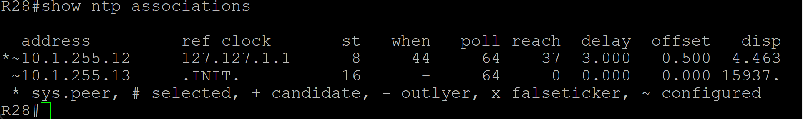
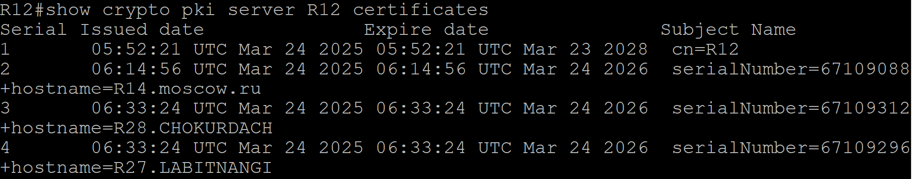
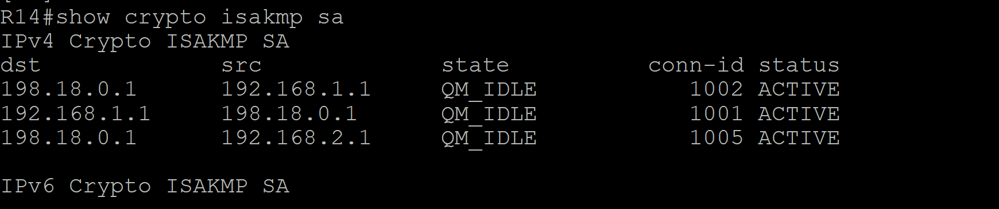
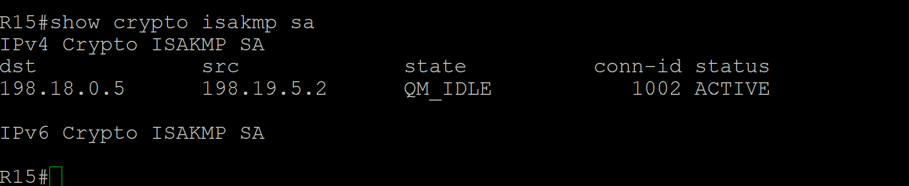
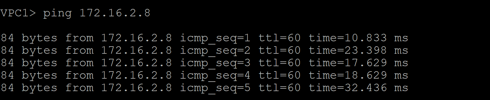

# Лабораторная работа. IPSec over DmVPN

## Цель:
Настроить GRE поверх IPSec между офисами Москва и С.-Петербург
Настроить DMVPN поверх IPSec между офисами Москва и Чокурдах, Лабытнанги

Описание/Пошаговая инструкция выполнения домашнего задания:

 1. Настроите GRE поверх IPSec между офисами Москва и С.-Петербург.
 2. Настроите DMVPN поверх IPSec между Москва и Чокурдах, Лабытнанги.
 3. Все узлы в офисах в лабораторной работе должны иметь IP связность.

 Дополнительно: Для IPSec использовать CA и сертификаты.

 

## Выполнение

 1. Настроим R14 Москва, как сервер для CA сертификатов для DMVPN:

```
R12(config)#ip domain name moscow.ru
R12(config)#ip http server
R12(config)#crypto key generate rsa general-keys label R12
The name for the keys will be: R12
Choose the size of the key modulus in the range of 360 to 4096 for your
  General Purpose Keys. Choosing a key modulus greater than 512 may take
  a few minutes.

How many bits in the modulus [512]: 2048
% Generating 2048 bit RSA keys, keys will be non-exportable...
[OK] (elapsed time was 3 seconds)


R12(config)#do show crypto key mypubkey all
% Key pair was generated at: 05:49:37 UTC Mar 24 2025
Key name: R12
Key type: RSA KEYS
 Storage Device: not specified
 Usage: General Purpose Key
 Key is not exportable.
 Key Data:
  30820122 300D0609 2A864886 F70D0101 01050003 82010F00 3082010A 02820101
  00A8CA81 3182BE91 A592284D DFD0A972 723B0185 B35130A1 1541131C 593A12D8
  94CE9318 3EDC308B FC5AA941 68DBD862 DDCB8B78 3EAE4A64 A145A3A3 F5C8B9B7
  762DAF4F C8AB5039 069B1857 37FF3E25 0B26C7A9 12AC0CC8 FE1F9B68 BA7137D1
  A52B1184 8DD58286 5051500B 58274A23 A9FE6698 142455DA 041DA9D6 1E642C53
  34EF106C 82B2CAD0 034A9220 32703BD0 BF0CB12F 1BCA8ABD A7B5999A 55B2C7EE
  CC22D5A9 9319368D B1E03CD6 4644788E 5A23EB2A 1868FF66 6944FBFB 9791991F
  FEB5AD4F B1C8B95C D4EC3A41 DD90727A 65D9D503 70386581 88A901E0 41040CCC
  7E380BE1 B14F7B53 9E955BE0 73C373CE 4278E685 9D4423E8 B1EA2A7E 7C3DDF76
  B1020301 0001
% Key pair was generated at: 05:49:39 UTC Mar 24 2025
Key name: R12.server
Key type: RSA KEYS
Temporary key
 Usage: Encryption Key
 Key is not exportable.
 Key Data:
  307C300D 06092A86 4886F70D 01010105 00036B00 30680261 00BC04A7 B6256F2E
  BD182747 BAC553DC 1BF08279 1CB72C47 07E008C2 E6F990C3 257E6380 5A4434C3
  91E79738 45EDCF4B 9A6FFF33 3B7CF083 4C368B7B F53B80F9 B5A0FEA8 6D5C3A0D
  7B1C32AC D6028D41 112544C0 F228E784 1E2E634E B9499D6B 3B020301 0001


R14(config)#crypto pki server R14
R15(cs-server)#no shutdown
%Some server settings cannot be changed after CA certificate generation.
% Please enter a passphrase to protect the private key
% or type Return to exit
Password:
admin123
Re-enter password:
% Generating 1024 bit RSA keys, keys will be non-exportable...
[OK] (elapsed time was 1 seconds)

% Certificate Server enabled.

R12(config)# crypto pki server R12
R12(cs-server)#lifetime crl 1 0
R12(cs-server)#database level complete
R12(cs-server)#no shut
%Some server settings cannot be changed after CA certificate generation.
% Please enter a passphrase to protect the private key
% or type Return to exit
Password:admin123

Re-enter password:

% Certificate Server enabled.
R12(cs-server)#
Mar 24 05:52:21.681: %PKI-6-CS_ENABLED: Certificate server now enabled.
R12(cs-server)#show
 serial-number 0x1
 database level complete
 no database archive
 issuer-name CN=R12
 lifetime crl 1
 lifetime certificate 365
 lifetime ca-certificate 1095
 lifetime enrollment-request 168
R12(cs-server)#

R12(config)#do show crypto pki server
Certificate Server R12:
    Status: enabled
    State: enabled
    Server's configuration is locked  (enter "shut" to unlock it)
    Issuer name: CN=R12
    CA cert fingerprint: 8434CA9A F98CC825 1A78844F 69FFFE42
    Granting mode is: manual
    Last certificate issued serial number (hex): 1
    CA certificate expiration timer: 05:52:21 UTC Mar 23 2028
    CRL NextUpdate timer: 06:52:21 UTC Mar 24 2025
    Current primary storage dir: nvram:
    Database Level: Complete - all issued certs written as <serialnum>.cer


R12(config)#do show crypto pki trustpoints
Trustpoint R12:
    Subject Name:
    cn=R12
          Serial Number (hex): 01
    Certificate configured.


```
Настроим R14 Москва:

```
R14(config)#ip host R12 10.1.255.12
R14(config)#crypto key generate rsa
R14(config)#crypto pki trustpoint R14
R14(ca-trustpoint)#enrollment url http://10.1.255.12:80
R14(ca-trustpoint)#exit

```
Изменим access-list на R15, чтобы трафик CA не натился через GRE:

```
R14#show run | sec acces
ip as-path access-list 1 permit ^$
access-list 1 permit 10.1.0.0 0.0.255.255
access-list 101 deny   gre any any
access-list 101 deny   ip 10.1.0.0 0.0.255.255 172.16.0.0 0.0.255.255
access-list 101 deny   ip host 10.1.255.14 any
access-list 101 permit ip 10.1.0.0 0.0.255.255 any

```
Вернёмся к R14:

```
R14(config)#crypto pki authenticate R14
Certificate has the following attributes:
       Fingerprint MD5: 8434CA9A F98CC825 1A78844F 69FFFE42
      Fingerprint SHA1: 99112103 5C358CB7 7975DE01 C2E74F0C FC409246

% Do you accept this certificate? [yes/no]: yes
Trustpoint CA certificate accepted.

R14(config)#do show crypto pki trustpoints
Trustpoint R14:
    Subject Name:
    cn=R12
          Serial Number (hex): 01
    Certificate configured.
    SCEP URL: http://10.1.255.12:80/cgi-bin


```
Мы видим, что получили сертификат R12, теперь запросим сертификат для R14:

```
R14(config)#crypto pki enroll R14
```

Проверим запросы на сервере R12:

```
R12#show crypto pki server R12 requests
Enrollment Request Database:

Subordinate CA certificate requests:
ReqID  State      Fingerprint                      SubjectName
--------------------------------------------------------------

RA certificate requests:
ReqID  State      Fingerprint                      SubjectName
--------------------------------------------------------------

Router certificates requests:
ReqID  State      Fingerprint                      SubjectName
--------------------------------------------------------------
1      pending    514364DAC61AD2423E7C29ACA7751F76 serialNumber=67109088+hostname=R14.moscow.ru


```

Подпишем запрос от R14:

```
R14#crypto pki server R14 grant 1

R12#show crypto pki server R12 certificates
Serial Issued date              Expire date               Subject Name
1       05:52:21 UTC Mar 24 2025 05:52:21 UTC Mar 23 2028  cn=R12
2       06:14:56 UTC Mar 24 2025 06:14:56 UTC Mar 24 2026  serialNumber=67109088+hostname=R14.moscow.ru

```
Проверим сертификат на R14:

```
R14#show crypto pki certificates
Certificate
  Status: Available
  Certificate Serial Number (hex): 02
  Certificate Usage: General Purpose
  Issuer:
    cn=R12
  Subject:
    Name: R14.moscow.ru
    Serial Number: 67109088
    serialNumber=67109088+hostname=R14.moscow.ru
  Validity Date:
    start date: 06:14:56 UTC Mar 24 2025
    end   date: 06:14:56 UTC Mar 24 2026
  Associated Trustpoints: R14

CA Certificate
  Status: Available
  Certificate Serial Number (hex): 01
  Certificate Usage: Signature
  Issuer:
    cn=R12
  Subject:
    cn=R12
  Validity Date:
    start date: 05:52:21 UTC Mar 24 2025
    end   date: 05:52:21 UTC Mar 23 2028
  Associated Trustpoints: R14


```

Настроим теперь сертификаты на R27 Лабытнанги и R28 Чокурдах по аналогии с R14.

Настроим так же их как клиенты NTP:

```
R28(config)#ntp authentication-key 1 md5 04743F333C 7
R28(config)#ntp authenticate
R28(config)#ntp trusted-key 1
R28(config)#ntp server 10.1.255.12 prefer
R28(config)#ntp server 10.1.255.13
R28(config)#end
```


Подтвердим сертификаты на R12:

```
R12#show crypto pki server R12 requests
Enrollment Request Database:

Subordinate CA certificate requests:
ReqID  State      Fingerprint                      SubjectName
--------------------------------------------------------------

RA certificate requests:
ReqID  State      Fingerprint                      SubjectName
--------------------------------------------------------------

Router certificates requests:
ReqID  State      Fingerprint                      SubjectName
--------------------------------------------------------------
3      pending    DCA83FF8BB8BF209C8CF0A933B4D7BAD serialNumber=67109312+hostname=R28.CHOKURDACH
2      pending    7E45F866CE223D17463622FC17DD0F6E serialNumber=67109296+hostname=R27.LABITNANGI

R12#crypto pki server R12 grant all

```

Подпишем сертификат на R12 и проверим список сертификатов:



Видим, что успешно подписали сертификаты R14, R28 и R27.

Настроим DMVPN over IPSec для аутентификации через сертификаты:

R14:

```
R14(config)#crypto isakmp policy 10
R14(config-isakmp)#encryption aes 128
R14(config-isakmp)#group 5
R14(config-isakmp)#hash sha256
R14(config-isakmp)#exit
R14(config)#crypto ipsec transform-set VTI esp-aes esp-sha-hmac
R14(cfg-crypto-trans)#mode transport
R14(cfg-crypto-trans)#exit
R14(config)#crypto ipsec profile DMVPN
R14(ipsec-profile)#set transform-set VTI
R14(ipsec-profile)#exit
R14(config)#interface t100
R14(config-if)#tunnel protection ipsec profile DMVPN
```

R27:

```
R27(config)#crypto isakmp policy 10
R27(config-isakmp)#encryption aes 128
R27(config-isakmp)#group 5
R27(config-isakmp)#hash sha256
R27(config-isakmp)#exit
R27(config)#crypto ipsec transform-set VTI esp-aes esp-sha-hmac
R27(cfg-crypto-trans)#mode transport
R27(cfg-crypto-trans)#exit
R27(config)#crypto ipsec profile DMVPN
R27(ipsec-profile)#set transform-set VTI
R27(ipsec-profile)#exit
R27(config)#interface t100
R27(config-if)#tunnel protection ipsec profile DMVPN
R27(config-if)#
```

Также включим IPSec на R28:

```
crypto isakmp policy 10
 encryption aes 128
 hash sha256
 group 5
exit

crypto ipsec transform-set VTI esp-aes esp-sha-hmac
 mode transport
exit

crypto ipsec profile DMVPN
 set transform-set VTI
exit

interface Tunnel100
 tunnel protection ipsec profile DMVPN
```
```
R14#show crypto ipsec sa

interface: Tunnel100
    Crypto map tag: Tunnel100-head-0, local addr 198.18.0.1

   protected vrf: (none)
   local  ident (addr/mask/prot/port): (198.18.0.1/255.255.255.255/47/0)
   remote ident (addr/mask/prot/port): (192.168.2.1/255.255.255.255/47/0)
   current_peer 192.168.2.1 port 500
     PERMIT, flags={origin_is_acl,}
    #pkts encaps: 44, #pkts encrypt: 44, #pkts digest: 44
    #pkts decaps: 2, #pkts decrypt: 2, #pkts verify: 2
    #pkts compressed: 0, #pkts decompressed: 0
    #pkts not compressed: 0, #pkts compr. failed: 0
    #pkts not decompressed: 0, #pkts decompress failed: 0
    #send errors 0, #recv errors 0

     local crypto endpt.: 198.18.0.1, remote crypto endpt.: 192.168.2.1
     plaintext mtu 1458, path mtu 1500, ip mtu 1500, ip mtu idb (none)
     current outbound spi: 0xE4364032(3828760626)
     PFS (Y/N): N, DH group: none

     inbound esp sas:
      spi: 0xFE1426FB(4262733563)
        transform: esp-aes esp-sha-hmac ,
        in use settings ={Transport, }
        conn id: 7, flow_id: SW:7, sibling_flags 80000000, crypto map: Tunnel100-head-0
        sa timing: remaining key lifetime (k/sec): (4608000/3400)
        IV size: 16 bytes
        replay detection support: Y
        Status: ACTIVE(ACTIVE)
      spi: 0x47AB6D2E(1202416942)
        transform: esp-aes esp-sha-hmac ,
        in use settings ={Transport, }
        conn id: 9, flow_id: SW:9, sibling_flags 80004000, crypto map: Tunnel100-head-0
        sa timing: remaining key lifetime (k/sec): (4370152/3400)
        IV size: 16 bytes
        replay detection support: Y
        Status: ACTIVE(ACTIVE)

     inbound ah sas:

     inbound pcp sas:

     outbound esp sas:
      spi: 0x69139CDA(1762893018)
        transform: esp-aes esp-sha-hmac ,
        in use settings ={Transport, }
        conn id: 8, flow_id: SW:8, sibling_flags 80000000, crypto map: Tunnel100-head-0
        sa timing: remaining key lifetime (k/sec): (4608000/3400)
        IV size: 16 bytes
        replay detection support: Y
        Status: ACTIVE(ACTIVE)
      spi: 0xE4364032(3828760626)
        transform: esp-aes esp-sha-hmac ,
        in use settings ={Transport, }
        conn id: 10, flow_id: SW:10, sibling_flags 80004000, crypto map: Tunnel100-head-0
        sa timing: remaining key lifetime (k/sec): (4370146/3400)
        IV size: 16 bytes
        replay detection support: Y
        Status: ACTIVE(ACTIVE)

     outbound ah sas:

     outbound pcp sas:

   protected vrf: (none)
   local  ident (addr/mask/prot/port): (198.18.0.1/255.255.255.255/47/0)
   remote ident (addr/mask/prot/port): (192.168.1.1/255.255.255.255/47/0)
   current_peer 192.168.1.1 port 500
     PERMIT, flags={origin_is_acl,}
    #pkts encaps: 242, #pkts encrypt: 242, #pkts digest: 242
    #pkts decaps: 243, #pkts decrypt: 243, #pkts verify: 243
    #pkts compressed: 0, #pkts decompressed: 0
    #pkts not compressed: 0, #pkts compr. failed: 0
    #pkts not decompressed: 0, #pkts decompress failed: 0
    #send errors 0, #recv errors 0

     local crypto endpt.: 198.18.0.1, remote crypto endpt.: 192.168.1.1
     plaintext mtu 1458, path mtu 1500, ip mtu 1500, ip mtu idb (none)
     current outbound spi: 0x83005F1A(2197839642)
     PFS (Y/N): N, DH group: none

     inbound esp sas:
      spi: 0xA1F50B93(2717191059)
        transform: esp-aes esp-sha-hmac ,
        in use settings ={Transport, }
        conn id: 1, flow_id: SW:1, sibling_flags 80004000, crypto map: Tunnel100-head-0
        sa timing: remaining key lifetime (k/sec): (4608000/2482)
        IV size: 16 bytes
        replay detection support: Y
        Status: ACTIVE(ACTIVE)
      spi: 0xDCE61E55(3706068565)
        transform: esp-aes esp-sha-hmac ,
        in use settings ={Transport, }
        conn id: 3, flow_id: SW:3, sibling_flags 80000000, crypto map: Tunnel100-head-0
        sa timing: remaining key lifetime (k/sec): (4346812/2486)
        IV size: 16 bytes
        replay detection support: Y
        Status: ACTIVE(ACTIVE)

     inbound ah sas:

     inbound pcp sas:

     outbound esp sas:
      spi: 0xED69DC33(3983137843)
        transform: esp-aes esp-sha-hmac ,
        in use settings ={Transport, }
        conn id: 2, flow_id: SW:2, sibling_flags 80004000, crypto map: Tunnel100-head-0
        sa timing: remaining key lifetime (k/sec): (4608000/2482)
        IV size: 16 bytes
        replay detection support: Y
        Status: ACTIVE(ACTIVE)
      spi: 0x83005F1A(2197839642)
        transform: esp-aes esp-sha-hmac ,
        in use settings ={Transport, }
        conn id: 4, flow_id: SW:4, sibling_flags 80000000, crypto map: Tunnel100-head-0
        sa timing: remaining key lifetime (k/sec): (4346812/2486)
        IV size: 16 bytes
        replay detection support: Y
        Status: ACTIVE(ACTIVE)

     outbound ah sas:

     outbound pcp sas:
```
DMVPN IPsec туннель по сертификатам настроен.




1. Настроим GRE поверх IPSec между офисами Москва и С.-Петербург:

```
R15#show run | s crypto
crypto isakmp policy 10
 encr aes
 hash sha256
 authentication pre-share
crypto isakmp key OTUS address 198.19.5.2
crypto ipsec transform-set TRANSORM esp-aes esp-sha-hmac
 mode transport
crypto map MAP 10 ipsec-isakmp
 set peer 198.19.5.2
 set transform-set TRANSORM
 match address 102
 crypto map MAP
```
access-list 102 permit gre any any
```

R15#show run interface e0/2
Building configuration...

Current configuration : 152 bytes
!
interface Ethernet0/2
 description TO_AS301_R21
 ip address 198.18.0.5 255.255.255.252
 ip nat outside
 ip virtual-reassembly in
 crypto map MAP
end

```
```
R18#show run | sec crypto
crypto isakmp policy 10
 encr aes
 hash sha256
 authentication pre-share
crypto isakmp key OTUS address 198.18.0.5
crypto ipsec transform-set TRANSORM esp-aes esp-sha-hmac
 mode transport
crypto map MAP local-address Ethernet0/2
crypto map MAP 10 ipsec-isakmp
 set peer 198.18.0.5
 set transform-set TRANSORM
 match address 102
 crypto map MAP
R18#

access-list 102 permit gre any any


R18#show  running-config interface e0/2
Building configuration...

Current configuration : 152 bytes
!
interface Ethernet0/2
 description TO_AS520_R24
 ip address 198.19.5.2 255.255.255.252
 ip nat outside
 ip virtual-reassembly in
 crypto map MAP
end
```



```
R15#show crypto ipsec sa

interface: Ethernet0/2
    Crypto map tag: MAP, local addr 198.18.0.5

   protected vrf: (none)
   local  ident (addr/mask/prot/port): (0.0.0.0/0.0.0.0/47/0)
   remote ident (addr/mask/prot/port): (0.0.0.0/0.0.0.0/47/0)
   current_peer 198.19.5.2 port 500
     PERMIT, flags={origin_is_acl,}
    #pkts encaps: 0, #pkts encrypt: 0, #pkts digest: 0
    #pkts decaps: 63, #pkts decrypt: 63, #pkts verify: 63
    #pkts compressed: 0, #pkts decompressed: 0
    #pkts not compressed: 0, #pkts compr. failed: 0
    #pkts not decompressed: 0, #pkts decompress failed: 0
    #send errors 0, #recv errors 0

     local crypto endpt.: 198.18.0.5, remote crypto endpt.: 198.19.5.2
     plaintext mtu 1438, path mtu 1500, ip mtu 1500, ip mtu idb Ethernet0/2
     current outbound spi: 0xFDAE58AD(4256061613)
     PFS (Y/N): N, DH group: none

     inbound esp sas:
      spi: 0xBBB03D87(3148889479)
        transform: esp-aes esp-sha-hmac ,
        in use settings ={Tunnel, }
        conn id: 5, flow_id: SW:5, sibling_flags 80000040, crypto map: MAP
        sa timing: remaining key lifetime (k/sec): (4311534/3448)
        IV size: 16 bytes
        replay detection support: Y
        Status: ACTIVE(ACTIVE)

     inbound ah sas:

     inbound pcp sas:

     outbound esp sas:
      spi: 0xFDAE58AD(4256061613)
        transform: esp-aes esp-sha-hmac ,
        in use settings ={Tunnel, }
        conn id: 6, flow_id: SW:6, sibling_flags 80000040, crypto map: MAP
        sa timing: remaining key lifetime (k/sec): (4311545/3448)
        IV size: 16 bytes
        replay detection support: Y
        Status: ACTIVE(ACTIVE)

     outbound ah sas:

     outbound pcp sas:
```



Задание выполнено.