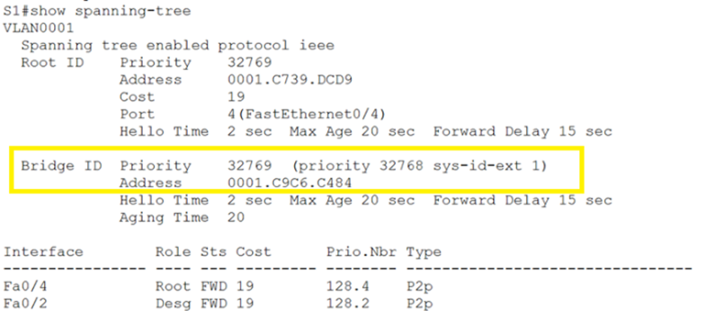

# Лабораторная работа. Развертывание коммутируемой сети с резервными каналами 
## Топология

## Таблица адресации

### Цели
**Часть 1. Создание сети и настройка основных параметров устройства**
**Часть 2. Выбор корневого моста**
**Часть 3. Наблюдение за процессом выбора протоколом STP порта, исходя из стоимости портов**
**Часть 4. Наблюдение за процессом выбора протоколом STP порта, исходя из приоритета портов**
### Общие сведения/сценарий
Избыточность позволяет увеличить доступность устройств в топологии сети за счёт устранения единой точки отказа. Избыточность в коммутируемой сети обеспечивается посредством использования нескольких коммутаторов или нескольких каналов между коммутаторами. Когда в проекте сети используется физическая избыточность, возможно возникновение петель и дублирование кадров.
Протокол spanning-tree (STP) был разработан как механизм предотвращения возникновения петель на 2-м уровне для избыточных каналов коммутируемой сети. Протокол STP обеспечивает наличие только одного логического пути между всеми узлами назначения в сети путем намеренного блокирования резервных путей, которые могли бы вызвать петлю.
В этой лабораторной работе команда show spanning-tree используется для наблюдения за процессом выбора протоколом STP корневого моста. Также вы будете наблюдать за процессом выбора портов с учетом стоимости и приоритета.
**Примечание**. Используются коммутаторы Cisco Catalyst 2960s с Cisco IOS версии 15.0(2) (образ lanbasek9). Допускается использование других моделей коммутаторов и других версий Cisco IOS. В зависимости от модели устройства и версии Cisco IOS доступные команды и результаты их выполнения могут отличаться от тех, которые показаны в лабораторных работах. 
**Примечание**. В данной лабораторной работе используется коммутаторы 2950-24.
**Примечание**. Убедитесь, что все настройки коммутатора удалены и загрузочная конфигурация отсутствует. Если вы не уверены, обратитесь к инструктору.
### Необходимые ресурсы
  •	3 коммутатора (Cisco 2960 с операционной системой Cisco IOS 15.0(2) (образ lanbasek9) или аналогичная модель)
  •	Консольные кабели для настройки устройств Cisco IOS через консольные порты
  •	Кабели Ethernet, расположенные в соответствии с топологией

## Часть 1:	Создание сети и настройка основных параметров устройства
В части 1 вам предстоит настроить топологию сети и основные параметры маршрутизаторов.
### Шаг 1:	Создайте сеть согласно топологии.
Подключите устройства, как показано в топологии, и подсоедините необходимые кабели.


### Шаг 2:	Выполните инициализацию и перезагрузку коммутаторов.
Сброс конфигурации:

`Switch#write erase`

Удаление файлов VLAN:

`Switch#delete flash:vlan.dat`

Перезагрузка коммутатора:

`Switch#reload`

### Шаг 3:	Настройте базовые параметры каждого коммутатора.
  a.	Отключите поиск DNS.

`Switch(config)#no ip domain-lookup`


  b.	Присвойте имена устройствам в соответствии с топологией.
```
Switch(config)#hostname S1
Switch(config)#hostname S2
Switch(config)#hostname S3
```
  c.	Назначьте **class** в качестве зашифрованного пароля доступа к привилегированному режиму.

`S1(config)#enable secret class`

`S2(config)#enable secret class`

`S3(config)#enable secret class`

  d.	Назначьте **cisco** в качестве паролей консоли и VTY и активируйте вход для консоли и VTY каналов.
```
S1(config)#line console 0
S1(config-line)#password cisco
S1(config-line)#login
S1(config-line)#exit
S1(config)#line vty 0 4
S1(config-line)#password cisco
S1(config-line)#exit
```

```
S2(config)#line console 0
S2(config-line)#password cisco
S2(config-line)#login
S2(config-line)#exit
S2(config)#line vty 0 4
S2(config-line)#password cisco
S2(config-line)#exit
```

```
S3(config)#line console 0
S3(config-line)#password cisco
S3(config-line)#login
S3(config-line)#exit
S3(config)#line vty 0 4
S3(config-line)#password cisco
S3(config-line)#exit
```

  e.	Настройте logging synchronous для консольного канала.
```
S1(config)#line console 0
S1(config-line)#logging synchronous 
S1(config-line)#exit
```

```
S2(config)#line console 0
S2(config-line)#logging synchronous 
S2(config-line)#exit
```

```
S3(config)#line console 0
S3(config-line)#logging synchronous 
S3(config-line)#exit
```

  f.	Настройте баннерное сообщение дня (MOTD) для предупреждения пользователей о запрете несанкционированного доступа.

`S1(config)#banner motd # WARNING! Unauthorized access to this device is prohibited. All activities may be monitored and reported to the security authorities. #`

`S2(config)#banner motd # WARNING! Unauthorized access to this device is prohibited. All activities may be monitored and reported to the security authorities. #`

`S3(config)#banner motd # WARNING! Unauthorized access to this device is prohibited. All activities may be monitored and reported to the security authorities. #`


  g.	Задайте IP-адрес, указанный в таблице адресации для VLAN 1 на всех коммутаторах.
```
S1(config)#interface vlan 1
S1(config-if)#ip address 192.168.1.1 255.255.255.0
S1(config-if)#no shut
S1(config-if)# exit
```

```
S2(config)#interface vlan 1
S2(config-if)#ip address 192.168.1.2 255.255.255.0
S2(config-if)#no shut
S2(config-if)#exit
```

```
S3(config)#interface vlan 1
S3(config-if)#ip address 192.168.1.3 255.255.255.0
S3(config-if)#no shut
S3(config-if)#exit
```

  h.	Скопируйте текущую конфигурацию в файл загрузочной конфигурации.

`S1(config)#do wr`

`S2(config)#do wr`

`S3(config)#do wr`

### Шаг 4:	Проверьте связь.
Проверьте способность компьютеров обмениваться эхо-запросами.
Успешно ли выполняется эхо-запрос от коммутатора S1 на коммутатор S2?	**Да**


Успешно ли выполняется эхо-запрос от коммутатора S1 на коммутатор S3?	**Да**
 
 

Успешно ли выполняется эхо-запрос от коммутатора S2 на коммутатор S3?	**Да**


 
Выполняйте отладку до тех пор, пока ответы на все вопросы не будут положительными.

## Часть 2:	Определение корневого моста
Для каждого экземпляра протокола spanning-tree (коммутируемая сеть LAN или широковещательный домен) существует коммутатор, выделенный в качестве корневого моста. Корневой мост служит точкой привязки для всех расчётов протокола spanning-tree, позволяя определить избыточные пути, которые следует заблокировать.
Процесс выбора определяет, какой из коммутаторов станет корневым мостом. Коммутатор с наименьшим значением идентификатора моста (BID) становится корневым мостом. Идентификатор BID состоит из значения приоритета моста, расширенного идентификатора системы и MAC-адреса коммутатора. Значение приоритета может находиться в диапазоне от 0 до 65535 с шагом 4096. По умолчанию используется значение 32768.

### Шаг 1:	Отключите все порты на коммутаторах.
```
S1(config)#interface range fastEthernet 0/1-24
S1(config-if-range)#shut
S1(config-if-range)#exit
```

```
S2(config)#interface range fastEthernet 0/1-24
S2(config-if-range)#shut
S2(config-if-range)#exit
```

```
S3(config)#interface range fastEthernet 0/1-24
S3(config-if-range)#shut
S3(config-if-range)#exit
```

### Шаг 2:	Настройте подключенные порты в качестве транковых.
```
S1(config)#interface range f0/1-4
S1(config-if-range)#switchport mode trunk
S1(config-if-range)#exit
```

```
S2(config)#interface range f0/1-4
S2(config-if-range)#switchport mode trunk
S2(config-if-range)#exit
```

```
S3(config)#interface range f0/1-4
S3(config-if-range)#switchport mode trunk
S3(config-if-range)#exit
```

### Шаг 3:	Включите порты F0/2 и F0/4 на всех коммутаторах.

```
S1(config)#interface range f0/2,f0/4
S1(config-if-range)#no shut
S1(config-if-range)#end
```

```
S2(config)#interface range f0/2,f0/4
S2(config-if-range)#no shut
S2(config-if-range)#end
```

```
S3(config)#interface range f0/2,f0/4
S3(config-if-range)#no shut
S3(config-if-range)#end
```

### Шаг 4:	Отобразите данные протокола spanning-tree.
Введите команду show spanning-tree на всех трех коммутаторах. Приоритет идентификатора моста рассчитывается путем сложения значений приоритета и расширенного идентификатора системы. Расширенным идентификатором системы всегда является номер сети VLAN. В примере ниже все три коммутатора имеют равные значения приоритета идентификатора моста (32769 = 32768 + 1, где приоритет по умолчанию = 32768, номер сети VLAN = 1); следовательно, коммутатор с самым низким значением MAC-адреса становится корневым мостом (в примере — S3).

`S1#show spanning-tree`



`S2#show spanning-tree`


`S3#show spanning-tree`


**Примечание**. Режим STP по умолчанию на коммутаторе 2950 — протокол STP для каждой сети VLAN (PVST).
В схему ниже запишите роль и состояние (Sts) активных портов на каждом коммутаторе в топологии.


С учетом выходных данных, поступающих с коммутаторов, ответьте на следующие вопросы.
Какой коммутатор является корневым мостом? __S3__
Почему этот коммутатор был выбран протоколом spanning-tree в качестве корневого моста?
__Так как все три коммутатора имеют равные значения приоритета идентификатора моста (32769 = 32768 + 1, где приоритет по умолчанию = 32768, номер сети VLAN = 1); следовательно, коммутатор с самым низким значением MAC-адреса становится корневым мостом.__
Какие порты на коммутаторе являются корневыми портами? 
__Никакие. Потому что на корневом мосту все порты являются назначенными портами.__
Какие порты на коммутаторе являются назначенными портами? 
__Fa0/2, Fa0/4.__
Какой порт отображается в качестве альтернативного и в настоящее время заблокирован? __Fa0/2  на коммутаторе S2.__
Почему протокол spanning-tree выбрал этот порт в качестве невыделенного (заблокированного) порта?
  1)	__Стоимость маршрута от порта F0/2 коммутатора S1 и стоимость маршрута от порта F0/2 коммутатора S2 до корневого моста S3 одинакова и составляет 19.__
  2)	__Так как стоимость до корневого моста одинакова, коммутатор с самым низким Bridge ID обозначит назначенным свой порт. У коммутатора S1 MAC адрес ниже. Следовательно порт F0/2 коммутатора S1  станет назначенным.__
  3)	__Другой коммутатор S2 назначит свой порт F0/2 невыделенным (заблокированным).__

## Часть 3:	Наблюдение за процессом выбора протоколом STP порта, исходя из стоимости портов
Алгоритм протокола spanning-tree (STA) использует корневой мост как точку привязки, после чего определяет, какие порты будут заблокированы, исходя из стоимости пути. Порт с более низкой стоимостью пути является предпочтительным. Если стоимости портов равны, процесс сравнивает BID. Если BID равны, для определения корневого моста используются приоритеты портов. Наиболее низкие значения являются предпочтительными. В части 3 вам предстоит изменить стоимость порта, чтобы определить, какой порт будет заблокирован протоколом spanning-tree.

### Шаг 1:	Определите коммутатор с заблокированным портом.
При текущей конфигурации только один коммутатор может содержать заблокированный протоколом STP порт. Выполните команду **show spanning-tree** на обоих коммутаторах некорневого моста. В примере ниже протокол spanning-tree блокирует порт F0/2 на коммутаторе с самым высоким идентификатором BID (S2).

`S2#show spanning-tree`


`S1#show spanning-tree`


**Примечание.** В конкретной топологии корневой мост может отличаться от выбора порта.

### Шаг 2:	Измените стоимость порта.
Помимо заблокированного порта, единственным активным портом на этом коммутаторе является порт, выделенный в качестве порта корневого моста. Уменьшите стоимость этого порта корневого моста до 18, выполнив команду spanning-tree cost 18 режима конфигурации интерфейса.

```
S2(config)#interface f0/4
S2(config-if)#spanning-tree vlan 1 cost 18
```
### Шаг 3:	Просмотрите изменения протокола spanning-tree.
Повторно выполните команду **show spanning-tree** на обоих коммутаторах некорневого моста. Обратите внимание, что ранее заблокированный порт (S2 – F0/2) теперь является назначенным портом, и протокол spanning-tree теперь блокирует порт на другом коммутаторе некорневого моста (S3 – F0/4).

`S2#show spanning-tree`


`S1#show spanning-tree`


Почему протокол spanning-tree заменяет ранее заблокированный порт на назначенный порт и блокирует порт, который был назначенным портом на другом коммутаторе?
  1)	__Стоимость маршрута от порта F0/2 коммутатора S1 до корневого моста равна 19, а стоимость маршрута от порта F0/2 до корневого моста S3 меньше и составляет 18. Следовательно порт F0/2 коммутатора S1 становится назначенным, а F0/2 коммутатора S1 становится заблокированным.__

### Шаг 4:	Удалите изменения стоимости порта.
  a.	Выполните команду no spanning-tree cost 18 режима конфигурации интерфейса, чтобы удалить запись стоимости, созданную ранее.
  ```
S2(config)#int f0/4
S2(config-if)#no spanning-tree vlan 1 cost 18
```

  b.	Повторно выполните команду show spanning-tree, чтобы подтвердить, что протокол STP сбросил порт на коммутаторе некорневого моста, вернув исходные настройки порта. Протоколу STP требуется примерно 30 секунд, чтобы завершить процесс перевода порта.


## Часть 4:	Наблюдение за процессом выбора протоколом STP порта, исходя из приоритета портов
Если стоимости портов равны, процесс сравнивает BID. Если BID равны, для определения корневого моста используются приоритеты портов. Значение приоритета по умолчанию — 128. STP объединяет приоритет порта с номером порта, чтобы разорвать связи. Наиболее низкие значения являются предпочтительными. В части 4 вам предстоит активировать избыточные пути до каждого из коммутаторов, чтобы просмотреть, каким образом протокол STP выбирает порт с учетом приоритета портов.
  a.	Включите порты F0/1 и F0/3 на всех коммутаторах.
```
S1(config)#interface range f0/1,f0/3
S1(config-if-range)#no shut
```

```
S2(config)#interface range f0/1,f0/3
S2(config-if-range)#no shut
```

```
S3(config)#interface range f0/1,f0/3
S3(config-if-range)#no shut
```


  b.	Подождите 30 секунд, чтобы протокол STP завершил процесс перевода порта, после чего выполните команду show spanning-tree на коммутаторах некорневого моста. Обратите внимание, что порт корневого моста переместился на порт с меньшим номером, связанный с коммутатором корневого моста, и заблокировал предыдущий порт корневого моста.


`S1#show spanning-tree`


`S2#show spanning-tree`


Какой порт выбран протоколом STP в качестве порта корневого моста на каждом коммутаторе некорневого моста?  __F0/3 на S1 и F0/3 на S2.__
Почему протокол STP выбрал эти порты в качестве портов корневого моста на этих коммутаторах?
__На каждом коммутаторе должен быть порт коневой порт.__
__На S1 - это F0/3:__
__1)	Самая низкая стоимость до коммутатора S3.__
__2)	Соседний коммутатор S1 с самым низким BID.__
__3)	Соседний к порту  F0/3 коммутатора S1 порт F0/3 коммутатора S3 имеет более низкий port ID, чем cоседний к порту  F0/4 коммутатора S1 порт F0/4 коммутатора S3.__
__На S2 – это F0/3:__
__1)	Самая низкая стоимость до коммутатора S3.__
__2)	Соседний коммутатор S1 с самым низким BID.__
__3)	Соседний к порту  F0/3 коммутатора S2 порт F0/1 коммутатора S3 имеет более низкий port ID, cоседний к порту  F0/4 коммутатора S1 порт F0/2 коммутатора S3.__


