# Lab - Implement DHCPv4
## Topology
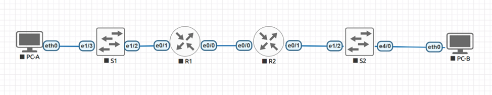
## Addressing Table
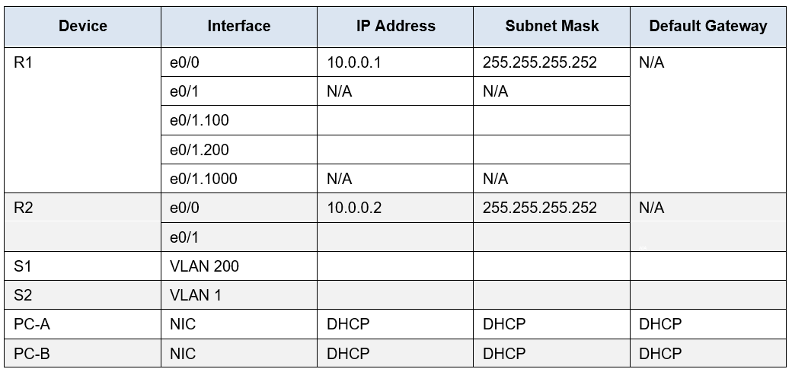
## VLAN Table
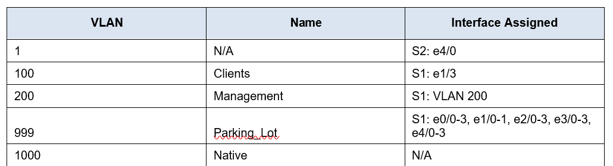
## Objectives
**Part 1: Build the Network and Configure Basic Device Settings**

**Part 2: Configure and verify two DHCPv4 Servers on R1**

**Part 3: Configure and verify a DHCP Relay on R2**

## Background / Scenario
The Dynamic Host Configuration Protocol (DHCP) is a network protocol that lets network administrators manage and automate the assignment of IP addresses. Without DHCP for IPv4, the administrator must manually assign and configure IP addresses, preferred DNS servers, and default gateways. As the network grows in size, this becomes an administrative problem when devices are moved from one internal network to another.

In this scenario, the company has grown in size, and the network administrators can no longer assign IP addresses to devices manually. Your job is to configure the R1 router to assign IPv4 addresses on two different subnets. 

**Note**: In this lab Template Cisco IOL Image L2-ADVENTERPRISEK9-M-15.2-20150703.bin is used for S1 and S2 switches and Template Cisco IOL L3-ADVENTERPRISEK9-M-15.4-2T.bin is used for R1 and R2 routers.

**Note**: Ensure that the routers and switches have been erased and have no startup configurations. If you are unsure contact your instructor.

## Required Resources
  •	2 Routers (Cisco 4221 with Cisco IOS XE Release 16.9.4 universal image or comparable)

  •	2 Switches (Cisco 2960 with Cisco IOS Release 15.2(2) lanbasek9 image or comparable)

  •	2 PCs (Windows with a terminal emulation program, such as Tera Term)

  •	Console cables to configure the Cisco IOS devices via the console ports

  •	Ethernet cables as shown in the topology

  ### Instructions

## Part 1: Build the Network and Configure Basic Device Settings
In Part 1, you will set up the network topology and configure basic settings on the PC hosts and switches.

### Step 1: Establish an addressing scheme
Subnet the network 192.168.1.0/24 to meet the following requirements:
a.	One subnet, “Subnet A”, supporting 58 hosts (the Clients VLAN at R1).
Subnet A:

__The least available Subnet A is 192.168.1.0/26 it is maximum 62 hosts.__

__255.255.255.192 – subnet mask.__

__192.168.1.0/26 – network.__

__192.168.1.63 – broadcast address.__

Record the first IP address in the Addressing Table for R1 e0/1.100. 

__192.168.1.1 - e0/1.100 R1 IP address Client VLAN.__

b.	One subnet, “Subnet B”, supporting 28 hosts (the Management VLAN at R1). 
Subnet B:

__The least available Subnet B 192.168.1.64/27 it is maximum 30 hosts.__

__255.255.255.224 - subnet mask.__

__192.168.1.64/27 – network.__

__192.168.1.95 – broadcast address.__

Record the first IP address in the Addressing Table for R1 e0/1.200. Record the second IP address in the Address Table for S1 VLAN 200 and enter the associated default gateway.

__192.168.1.65 - e0/1.200 R1 IP address Management VLAN.__

__192.168.1.66 – S1 VLAN 200 Management.__

c.	One subnet, “Subnet C”, supporting 12 hosts (the client network at R2).
Subnet C:

__The least available Subnet С 192.168.1.96/28 it is maximum 14 hosts.__

__255.255.255.240 - subnet mask.__

__192.168.1.96/28 – network.__

__192.168.1.111 – broadcast address.__
 
Record the first IP address in the Addressing Table for R2 e0/1.
__192.168.1.97/28.__

### Final Addressing Table
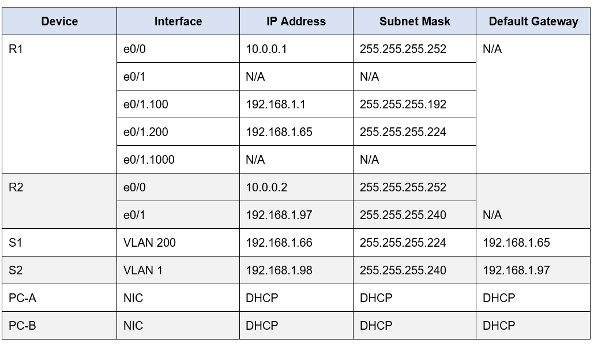

### Step 2: Cable the network as shown in the topology.
Attach the devices as shown in the topology diagram, and cable as necessary.


Step 3: Configure basic settings for each router.
a.	Assign a device name to the router.

`Router(config)#hostname R1`

`Router(config)#hostname R2`

b.	Disable DNS lookup to prevent the router from attempting to translate incorrectly entered commands as though they were host names.

`R1(config)#no ip domain lookup`

`R2(config)#no ip domain lookup`

c.	Assign **class** as the privileged EXEC encrypted password.

`R1(config)#enable secret class`

`R2(config)#enable secret class`

d.	Assign **cisco** as the console password and enable login.

```
R1(config)#line console 0
R1(config-line)#password cisco
R1(config-line)#login
R1(config-line)#end
```

```
R2(config)#line console 0
R2(config-line)#password cisco
R2(config-line)#login
R2(config-line)#end
```

e.	Assign **cisco** as the VTY password and enable login.
```
R1(config)#line vty 0 4
R1(config-line)#password cisco
R1(config-line)#exit
```

```
R2(config)#line vty 0 4
R2(config-line)#password cisco
R2(config-line)#exit
```

f.	Encrypt the plaintext passwords.

`R1(config)#service password-encryption`

`R2(config)#service password-encryption`

g.	Create a banner that warns anyone accessing the device that unauthorized access is prohibited.

`R1(config)#banner motd # WARNING! Unauthorized access to this device is prohibited. All activities may be monitored and reported to the security authorities. #`

`R2(config)#banner motd # WARNING! Unauthorized access to this device is prohibited. All activities may be monitored and reported to the security authorities. #`

h.	Save the running configuration to the startup configuration file.

`R1#wr`

`R2(config)#do wr`

i.	Set the clock on the router to today’s time and date.

`R1#clock set 01:05:00 23 Oct 2024`

`R2#clock set 01:05:00 23 Oct 2024`

**Note**: Use the question mark (?) to help with the correct sequence of parameters needed to execute this command.

### Step 4: Configure Inter-VLAN Routing on R1
a.	Activate interface e0/1 on the router.

```
R1(config)#interface e0/1
R1(config-if)#no shut
```

b.	Configure sub-interfaces for each VLAN as required by the IP addressing table. All sub-interfaces use 802.1Q encapsulation and are assigned the first usable address from the IP address pool you have calculated. Ensure the sub-interface for the native VLAN does not have an IP address assigned. Include a description for each sub-interface.

```
R1(config)#interface e0/1.100
R1(config-subif)#encapsulation dot1Q 100
R1(config-subif)#ip address 192.168.1.1 255.255.255.192
R1(config-subif)#description Clients
```

```
R1(config)#interface e0/1.200
R1(config-subif)#encapsulation dot1Q 200
R1(config-subif)#ip address 192.168.1.65 255.255.255.224
R1(config-subif)#description Management
```

```
R1(config)#int e0/1.1000
R1(config-subif)#encapsulation dot1Q 1000 native
R1(config-subif)#description Native
R1(config-subif)#exit
```

c.	Verify the sub-interfaces are operational.

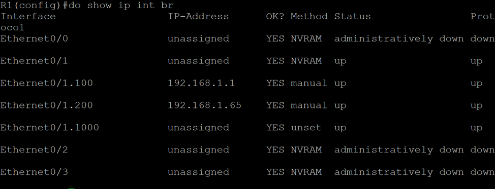

### Step 5: Configure e0/1 on R2, then e0/0 and static routing for both routers
a.	Configure e0/1 on R2 with the first IP address of Subnet C you calculated earlier.

```
R2(config)#interface e0/1
R2(config-if)#ip address 192.168.1.97 255.255.255.240
R2(config-if)#no shut
```

b.	Configure interface e0/0 for each router based on the IP Addressing table above.

```
R1(config)#interface e0/0
R1(config-if)#ip address 10.0.0.1 255.255.255.252
R1(config-if)#no shut
```

```
R2(config)#interface e0/0
R2(config-if)#ip address 10.0.0.2 255.255.255.252
R2(config-if)#no shut
```

c.	Configure a default route on each router pointed to the IP address of e0/0 on the other router.

`R1(config)#ip route 0.0.0.0 0.0.0.0 10.0.0.2`

`R2(config)#ip route 0.0.0.0 0.0.0.0 10.0.0.1`

d.	Verify static routing is working by pinging R2’s e0/1 address from R1.

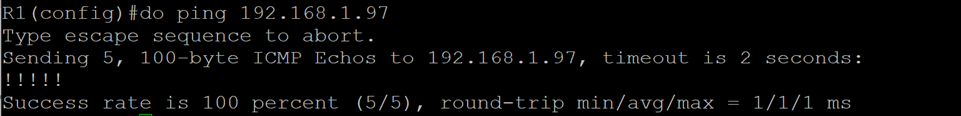

e.	Save the running configuration to the startup configuration file.

`R1#wr`

`R2(config)#do wr`

### Step 6: Configure basic settings for each switch.
a.	Assign a device name to the switch.

`Switch(config)#hostname S1`

`Switch(config)#hostname S2`

b.	Disable DNS lookup to prevent the router from attempting to translate incorrectly entered commands as though they were host names.

`S1(config)#no ip domain lookup`

`S2(config)#no ip domain lookup`

c.	Assign **class** as the privileged EXEC encrypted password.

`S1(config)#enable secret class`

`S2(config)#enable secret class`

d.	Assign cisco as the console password and enable login.

```
S1(config)#line console 0
S1(config-line)#password cisco
S1(config-line)#login
S1(config-line)#end
```

```
S2(config)#line console 0
S2(config-line)#password cisco
S2(config-line)#login
S2(config-line)#end
```

e.	Assign **cisco** as the VTY password and enable login.

```
S1(config)#line vty 0 4
S1(config-line)#password cisco
S1(config-line)#exit
```

```
S2(config)#line vty 0 4
S2(config-line)#password cisco
S2(config-line)#exit
```

f.	Encrypt the plaintext passwords.

`S1(config)#service password-encryption`

`S2(config)#service password-encryption`

g.	Create a banner that warns anyone accessing the device that unauthorized access is prohibited.

`S1(config)#banner motd # WARNING! Unauthorized access to this device is prohibited. All activities may be monitored and reported to the security authorities. #`

`S2(config)#banner motd # WARNING! Unauthorized access to this device is prohibited. All activities may be monitored and reported to the security authorities. #`


h.	Save the running configuration to the startup configuration file.

`S1#wr`

`S2(config)#do wr`

i.	Set the clock on the switch to today’s time and date.

`S1#clock set 01:05:00 23 Oct 2024`

`S2#clock set 01:05:00 23 Oct 2024`

**Note**: Use the question mark (?) to help with the correct sequence of parameters needed to execute this command.

j.	Copy the running configuration to the startup configuration.

`S1#wr`

`S2(config)#do wr`

### Step 7: Create VLANs on S1.
**Note**: S2 is only configured with basic settings.
a.	Create and name the required VLANs on switch 1 from the table above.

```
S1(config)#vlan 100
S1(config-vlan)#name Clients
S1(config)#vlan 200
S1(config-vlan)#name Management
S1(config)#vlan 999
S1(config-vlan)#name Parking_Lot
S1(config)#vlan 1000
S1(config-vlan)#name Native
S1(config-vlan)#exit
```

b.	Configure and activate the management interface on S1 (VLAN 200) using the second IP address from the subnet calculated earlier. Additionally, set the default gateway on S1.

```
S1(config)#interface vlan 200
S1(config-if)#ip address 192.168.1.66 255.255.255.224
S1(config-if)#no shut
S1(config-if)#exit
S1(config)#ip default-gateway 192.168.1.65
```

c.	Configure and activate the management interface on S2 (VLAN 1) using the second IP address from the subnet calculated earlier. Additionally, set the default gateway on S2

```
S2(config)#interface vlan 1
S2(config-if)#ip address 192.168.1.98 255.255.255.240
S2(config-if)#no shut
S2(config-if)#exit
S2(config)#ip default-gateway 192.168.1.97
```

d.	Assign all unused ports on S1 to the Parking_Lot VLAN, configure them for static access mode, and administratively deactivate them. On S2, administratively deactivate all the unused ports.

```
S1(config)#interface range e0/0-3, e1/0-1, e2/0-3, e3/0-3, e4/0-3
S1(config-if-range)#switchport mode access
S1(config-if-range)#switchport access vlan 999
S1(config-if-range)#shut
S1(config-if-range)#exit
```

```
S2(config)#interface range e0/0-3, e1/0-1, e1/3, e2/0-3, e3/0-3, e4/1-3
S2(config-if-range)#shut
S2(config-if-range)#exit
```

**Note**: The interface range command is helpful to accomplish this task with as few commands as necessary.

### Step 8: Assign VLANs to the correct switch interfaces.
a.	Assign used ports to the appropriate VLAN (specified in the VLAN table above) and configure them for static access mode.

```
S1(config)#interface e1/3
S1(config-if)#switchport mode access
S1(config-if)#switchport access vlan 100
S1(config-if)#exit
```

Open configuration window
b.	Verify that the VLANs are assigned to the correct interfaces.

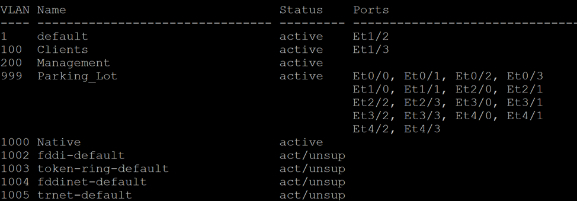

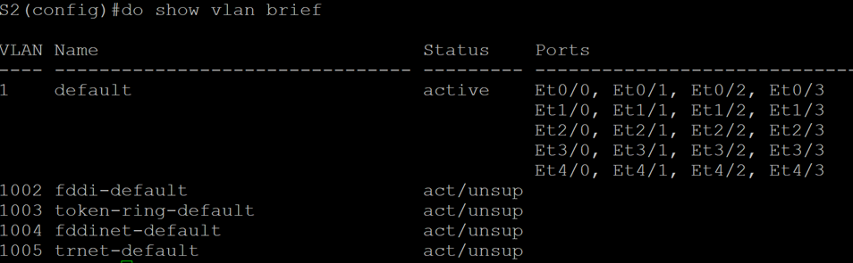

*__Question:__*
    Why is interface e1/2 listed under VLAN 1?
*__Answer:__*
	Because it is going to be a trunk interface.

### Step 9: Manually configure S1’s interface e1/2 as an 802.1Q trunk.
a.	Change the switchport mode on the interface to force trunking.

```
S1(config)#int e1/2
S1(config-if)#switchport trunk encapsulation dot1q
S1(config-if)#switchport mode trunk
```

b.	As a part of the trunk configuration, set the native VLAN to 1000.

`S1(config-if)#switchport trunk native vlan 1000`

c.	As another part of trunk configuration, specify that VLANs 100, 200, and 1000 are allowed to cross the trunk.

`S1(config-if)#switchport trunk allowed vlan 100,200,1000`

d.	Save the running configuration to the startup configuration file.

`S1(config-if)#do wr` 

e.	Verify trunking status.

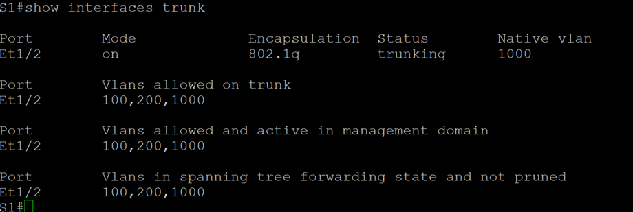

*__Question:__*
    At this point, what IP address would the PC’s have if they were connected to the network using DHCP?
*__Answer:__*
	It could be 192.168.1.2 for PC-A and 192.168.1.99 for PC-B.

## Part 2: Configure and verify two DHCPv4 Servers on R1
In Part 2, you will configure and verify a DHCPv4 Server on R1. The DHCPv4 server will service two subnets, Subnet A and Subnet C.
### Step 1: Configure R1 with DHCPv4 pools for the two supported subnets. Only the DHCP Pool for subnet A is given below
a.	Exclude the first five useable addresses from each address pool.

```
R1(config)#ip dhcp excluded-address 192.168.1.1 192.168.1.5
R1(config)#ip dhcp excluded-address 192.168.1.97 192.168.1.101
```


b.	Create the DHCP pool (Use a unique name for each pool).

`R1(config)#ip dhcp pool R1_Client_LAN`

c.	Specify the network that this DHCP server is supporting.

`R1(dhcp-config)#network 192.168.1.0 255.255.255.192`

d.	Configure the domain name as ccna-lab.com

`R1(dhcp-config)#domain-name ccna-lab.com`

e.	Configure the appropriate default gateway for each DHCP pool.

`R1(dhcp-config)#default-router 192.168.1.1`


f.	Configure the lease time for 2 days 12 hours and 30 minutes.

`R1(dhcp-config)#lease 2 12 30`

g.	Next, configure the second DHCPv4 Pool using the pool name R2_Client_LAN and the calculated network, default-router and use the same domain name and lease time from the previous DHCP pool.

```
R1(config)#ip dhcp pool R2_Client_LAN
R1(dhcp-config)#network 192.168.1.96 255.255.255.240
R1(dhcp-config)#domain-name ccna-lab.com
R1(dhcp-config)#default-router 192.168.1.97
R1(dhcp-config)#lease 2 12 30
```

### Step 2: Save your configuration
Save the running configuration to the startup configuration file.

`R1#wr`


### Step 3: Verify the DHCPv4 Server configuration
a.	Issue the command **show ip dhcp pool** to examine the pool details.

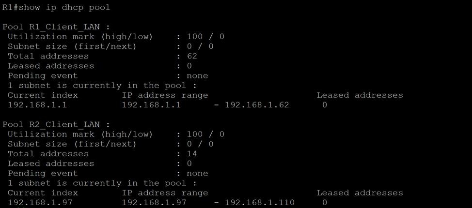

b.	Issue the command **show ip dhcp bindings** to examine established DHCP address assignments.

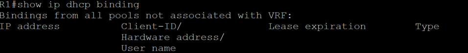

c.	Issue the command **show ip dhcp server statistics** to examine DHCP messages.

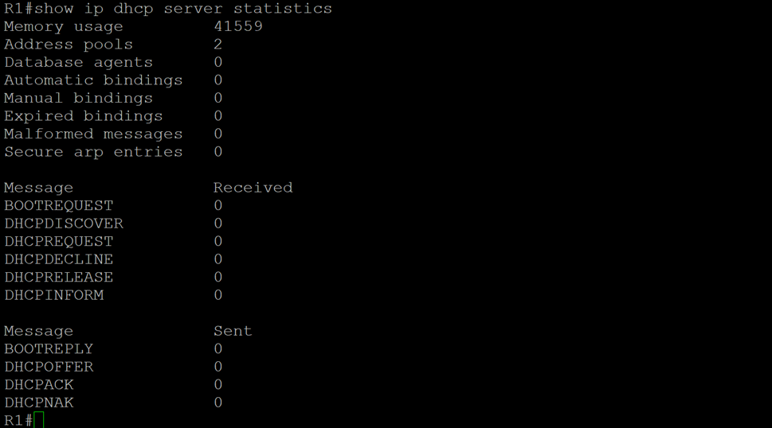

### Step 4: Attempt to acquire an IP address from DHCP on PC-A
a.	Receive IP address for PC-A via DHCP.

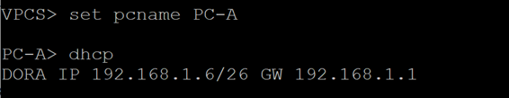

b.	Once the renewal process is complete, check the new IP information.

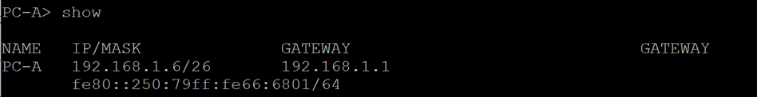

c.	Issue the command **show ip dhcp pool** to examine the pool details.

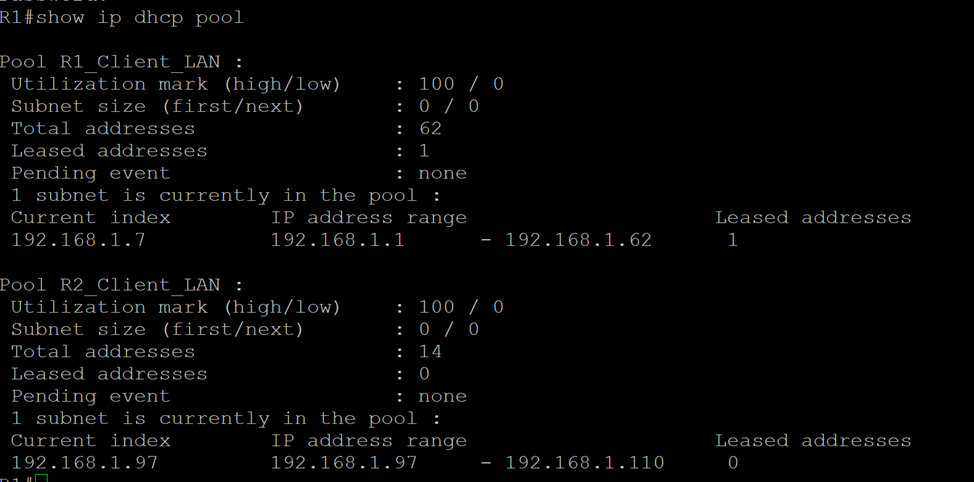

d.	Issue the command **show ip dhcp bindings** to examine established DHCP address assignments.

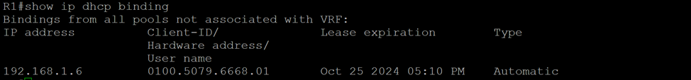

e.	Issue the command **show ip dhcp server statistics** to examine DHCP messages.

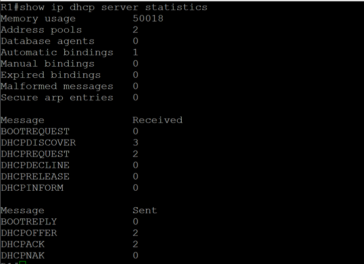

f.	Test connectivity by pinging R1’s e0/1.100 interface IP address.

## Part 3: Configure and verify a DHCP Relay on R2
In Part 3, you will configure R2 to relay DHCP requests from the local area network on interface e0/1 to the DHCP server (R1). 

### Step 1: Configure R2 as a DHCP relay agent for the LAN on e/0/1
a.	Configure the ip helper-address command on e0/1 specifying R1’s e0/0 IP address.

```
R2(config)#interface e0/1
R2(config-if)#ip helper-address 10.0.0.1
R2(config-if)#exit
```

b.	Save your configuration.

`R2(config)#do wr`


### Step 2: Attempt to acquire an IP address from DHCP on PC-B
a.	Receive IP address for PC-A via DHCP.

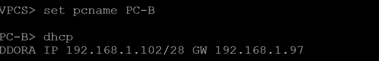

b.	Once the renewal process is complete, check the new IP information.

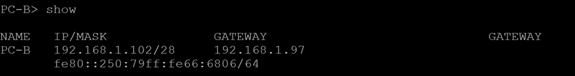

c.	Test connectivity by pinging R1’s e0/1.100 interface IP address.

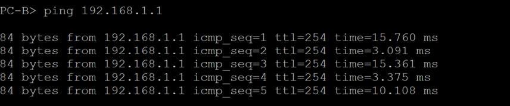

d.	Issue the **show ip dhcp binding** on R1 to verify DHCP bindings.

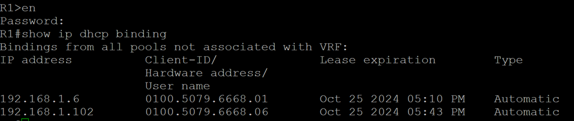

e.	Issue the **show ip dhcp server statistics** on R1 and R2 to verify DHCP messages.

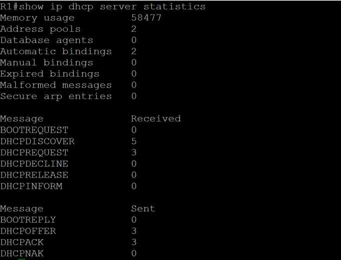

__It was being done 3 DHCP requests on PC-A и PC-B. So, we see 5 DHCP DISCOVER, 3 DHCP OFFER, 3 DHCP REQUESTS and 3 DHCP ACK messages on R1.__

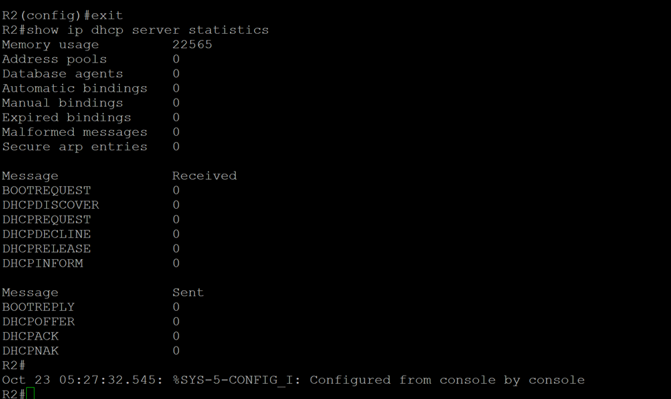

__No messages on R2.__


