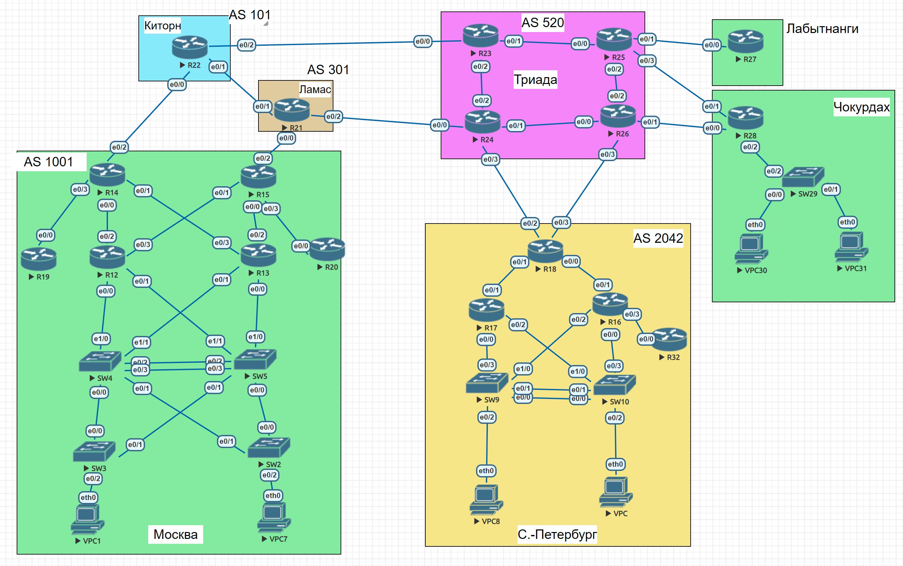

# Архитектура сети. Проектирование сети
## Цель
В данной самостоятельной работе необходимо распланировать адресное пространство Настроить IP на всех активных портах для дальнейшей работы над проектом Адресное пространство должно быть задокументировано.

 Описание/Пошаговая инструкция выполнения домашнего задания: 

В этой самостоятельной работе мы ожидаем, что вы самостоятельно:

  1)	Разработаете и задокументируете адресное пространство для лабораторного стенда. 
  2)	Настроите ip адреса на каждом активном порту 
  3)	Настроите каждый VPC в каждом офисе в своем VLAN.
  4)	Настроите VLAN/Loopbackup interface управления для сетевых устройств 
  5)	Настроите сети офисов так, чтобы не возникало broadcast штормов, а использование линков было максимально оптимизировано 
  6)	Используете IPv4. IPv6 по желанию

## Топология сети

## Сети Москвы (AS 1001)

### Таблица подсетей

| **Подсеть**     | **Маска**       | **Назначение**                            | **Пояснение**                                                             |
|------------------|-----------------|-------------------------------------------|---------------------------------------------------------------------------|
| `10.1.1.0/24`   | `255.255.255.0` | VLAN 10 — Управление                     | Используется для управления коммутаторами и маршрутизаторами.             |
| `10.1.2.0/24`   | `255.255.255.0` | VLAN 20 — Конечные устройства (VPC1)     | Сеть конечных устройств с отказоустойчивым шлюзом (VRRP).                 |
| `10.1.3.0/24`   | `255.255.255.0` | VLAN 30 — Конечные устройства (VPC7)     | Новая подсеть для конечных устройств с отказоустойчивым шлюзом (VRRP).    |
| `10.1.4.0/30`   | `255.255.255.252` | Соединение между R12 и R14              | Подсеть для точечного соединения между маршрутизаторами.                  |
| `10.1.4.4/30`   | `255.255.255.252` | Соединение между R12 и R15              | Аналогично другим соединениям.                                           |
| `10.1.4.8/30`   | `255.255.255.252` | Соединение между R13 и R14              | Подсеть для прямого соединения R13 ↔ R14.                                |
| `10.1.4.12/30`  | `255.255.255.252` | Соединение между R13 и R15              | Аналогично другим межмаршрутизаторным соединениям.                       |
| `10.1.4.16/30`  | `255.255.255.252` | Соединение между R14 и R19              | Точечное соединение для внутренней связи маршрутизаторов AS 1001.         |
| `10.1.4.20/30`  | `255.255.255.252` | Соединение между R15 и R20              | Аналогично соединению R15 ↔ R20.                                         |
| `10.1.5.0/24`   | `255.255.255.0` | Резервная сеть для новых VPC             | Подсеть зарезервирована для будущих конечных устройств или расширений.    |
| `10.1.255.0/24` | `255.255.255.0` | Loopback-интерфейсы маршрутизаторов      | Выделенные адреса для OSPF Router ID и BGP update-source.                |
| `198.18.0.0/30` | `255.255.255.252` | Соединение между R14 и AS 101 (R22)     | Зарезервированная сеть для тестирования взаимодействия между AS.          |
| `198.18.0.4/30` | `255.255.255.252` | Соединение между R15 и AS 301 (R21)     | Аналогично, для связи с AS 301.                                          |

---

### Пояснения

1. **VLAN 10:** Управление сетевыми устройствами, включая маршрутизаторы и коммутаторы.
2. **VLAN 20:** Сеть конечных устройств (например, VPC1) с отказоустойчивым шлюзом (VRRP).
3. **VLAN 30:** Сеть конечных устройств (например, VPC7) с отказоустойчивым шлюзом (VRRP). 
   - Шлюз по умолчанию: VIP-адрес `10.1.3.254`.
4. **Подсети `/30`:** Используются для точечных соединений между маршрутизаторами.
5. **Loopback:** Стабильные IP-адреса для идентификации маршрутизаторов в OSPF и BGP.
6. **Резервная сеть:** Подсеть `10.1.5.0/24` зарезервирована для возможных будущих устройств или расширений.

---

### Суммарная сеть

Все локальные подсети Москвы (AS 1001) объединяются в одну суммарную сеть:

- **Суммарная сеть:** `10.1.0.0/16`
- **Объединяет:**
  - VLAN 10: `10.1.1.0/24`.
  - VLAN 20: `10.1.2.0/24`.
  - VLAN 30: `10.1.3.0/24`.
  - Точечные соединения: `10.1.4.0/30`, `10.1.4.4/30`, `10.1.4.8/30`, и так далее.
  - Loopback-интерфейсы: `10.1.255.0/24`.

---

### Преимущества суммирования

- Упрощение таблицы маршрутизации: вместо передачи множества мелких маршрутов используется один суммарный префикс.
- Сокращение объёма маршрутов, передаваемых в другие автономные системы.
- Оптимизация поиска маршрутов внутри AS 1001, что повышает производительность сети.

## IP адресация Москвы (AS 1001)

- Управление через VLAN 10 (управляемые устройства и VRRP).
- Конечные устройства в VLAN 20 и VLAN 30 с отказоустойчивым шлюзом (VRRP).
- Точечные соединения между маршрутизаторами.
- Loopback-интерфейсы для маршрутизации и управления.
- Соединения с соседними автономными системами (AS 101 и AS 301) через NAT.

---

### Таблица IP адресов

| **Устройство** | **Интерфейс** | **IP-адрес**   | **Маска**       | **Назначение**                                |
|----------------|---------------|----------------|-----------------|----------------------------------------------|
| **R12**        | e0/0.10       | 10.1.1.1       | 255.255.255.0   | VLAN 10 — Управление (VRRP Master)           |
|                | e0/0.20       | 10.1.2.1       | 255.255.255.0   | VLAN 20 — Конечные устройства (VRRP Master)  |
|                | e0/0.30       | 10.1.3.1       | 255.255.255.0   | VLAN 30 — Конечные устройства (VRRP Master)  |
|                | e0/0.99       | -              | -               | Native VLAN                                   |
|                | e0/2          | 10.1.4.1       | 255.255.255.252 | Соединение с R14                             |
|                | e0/3          | 10.1.4.5       | 255.255.255.252 | Соединение с R15                             |
|                | Loopback0     | 10.1.255.1     | 255.255.255.255 | Loopback для управления и маршрутизации      |
| **R13**        | e0/0.10       | 10.1.1.2       | 255.255.255.0   | VLAN 10 — Управление (VRRP Backup)           |
|                | e0/0.20       | 10.1.2.2       | 255.255.255.0   | VLAN 20 — Конечные устройства (VRRP Backup)  |
|                | e0/0.30       | 10.1.3.2       | 255.255.255.0   | VLAN 30 — Конечные устройства (VRRP Backup)  |
|                | e0/0.99       | -              | -               | Native VLAN                                   |
|                | e0/2          | 10.1.4.9       | 255.255.255.252 | Соединение с R14                             |
|                | e0/3          | 10.1.4.13      | 255.255.255.252 | Соединение с R15                             |
|                | Loopback0     | 10.1.255.2     | 255.255.255.255 | Loopback для управления и маршрутизации      |
| **R14**        | e0/0          | 10.1.4.2       | 255.255.255.252 | Соединение с R12                             |
|                | e0/1          | 10.1.4.10      | 255.255.255.252 | Соединение с R13                             |
|                | e0/2          | 198.18.0.1     | 255.255.255.252 | Соединение с AS 101 (R22)                    |
|                | e0/3          | 10.1.4.17      | 255.255.255.252 | Соединение с R19                             |
|                | Loopback0     | 10.1.255.3     | 255.255.255.255 | Loopback для управления и маршрутизации      |
| **R15**        | e0/0          | 10.1.4.14      | 255.255.255.252 | Соединение с R13                             |
|                | e0/1          | 10.1.4.6       | 255.255.255.252 | Соединение с R12                             |
|                | e0/2          | 198.18.0.5     | 255.255.255.252 | Соединение с AS 301 (R21)                    |
|                | e0/3          | 10.1.4.21      | 255.255.255.252 | Соединение с R20                             |
|                | Loopback0     | 10.1.255.4     | 255.255.255.255 | Loopback для управления и маршрутизации      |
| **R19**        | e0/0          | 10.1.4.18      | 255.255.255.252 | Соединение с R14                             |
|                | Loopback0     | 10.1.255.5     | 255.255.255.255 | Loopback для управления и маршрутизации      |
| **R20**        | e0/0          | 10.1.4.22      | 255.255.255.252 | Соединение с R15                             |
|                | Loopback0     | 10.1.255.6     | 255.255.255.255 | Loopback для управления и маршрутизации      |
| **SW2**        | VLAN 10       | 10.1.1.3       | 255.255.255.0   | Управляемый IP для SW2                       |
| **SW3**        | VLAN 10       | 10.1.1.4       | 255.255.255.0   | Управляемый IP для SW3                       |
| **SW4**        | VLAN 10       | 10.1.1.5       | 255.255.255.0   | Управляемый IP для SW4                       |
| **SW5**        | VLAN 10       | 10.1.1.6       | 255.255.255.0   | Управляемый IP для SW5                       |
| **VPC1**       | eth0          | 10.1.2.100     | 255.255.255.0   | Конечное устройство в VLAN 20                |
| **VPC7**       | eth0          | 10.1.3.100     | 255.255.255.0   | Конечное устройство в VLAN 30                |

---

## Пояснения

### 1. VLAN 10 (10.1.1.0/24)
- Управление коммутаторами и маршрутизаторами.
- **VRRP:**
  - **Master:** R12 (`10.1.1.1`).
  - **Backup:** R13 (`10.1.1.2`).
  - **Виртуальный шлюз (VRRP):** `10.1.1.254`.

### 2. VLAN 20 (10.1.2.0/24)
- Подсеть для конечных устройств (VPC1).
- **VRRP:**
  - **Master:** R12 (`10.1.2.1`).
  - **Backup:** R13 (`10.1.2.2`).
  - **Виртуальный шлюз (VRRP):** `10.1.2.254`.

### 3. VLAN 30 (10.1.3.0/24)
- Подсеть для конечных устройств (VPC7).
- **VRRP:**
  - **Master:** R12 (`10.1.3.1`).
  - **Backup:** R13 (`10.1.3.2`).
  - **Виртуальный шлюз (VRRP):** `10.1.3.254`.

### 4. Точечные соединения (10.1.4.0/30 - 10.1.4.20/30)
- Соединяют маршрутизаторы внутри AS 1001.
- Маска `/30` минимизирует расход IP-адресов.

### 5. Loopback-интерфейсы (10.1.255.0/24)
- Выделены для стабильных IP-адресов маршрутизаторов, используемых в OSPF и BGP.

### 6. Меж-AS соединения (198.18.0.0/30 и 198.18.0.4/30)
- Используются для подключения к AS 101 и AS 301.
- Зарезервированный диапазон (RFC 2544) для тестирования и эмуляций.

## Таблица VIP-адресов VRRP

| **VLAN**         | **VIP-адрес**   | **Назначение**             | **Пояснение**                                  |
|-------------------|-----------------|----------------------------|-----------------------------------------------|
| VLAN 10           | `10.1.1.254`   | Управление                 | Виртуальный шлюз для управления сетевыми устройствами. |
| VLAN 20           | `10.1.2.254`   | Конечные устройства (VPC1) | Виртуальный шлюз для конечных устройств в отказоустойчивой сети. |
| VLAN 30           | `10.1.3.254`   | Конечные устройства (VPC7) | Виртуальный шлюз для конечных устройств в отказоустойчивой сети. |


### Настройка локальной сети для R12 и R13.

R12:
```
Router>en
Router#configure t
Router(config)#hostname R12
Router(config)#no ip domain-lookup
R12(config)#interface e0/0
R12(config-if)#no shut
R12(config-if)#exit
R12(config)#interface e0/0.10
R12(config-subif)#encapsulation dot1Q 10
R12(config-subif)#ip address 10.1.1.1 255.255.255.0
R12(config-subif)#description VLAN10_MANAGEMENT
R12(config-subif)#interface e0/0.20
R12(config-subif)#encapsulation dot1Q 20
R12(config-subif)#description VLAN20_SEGMENT
R12(config-subif)#ip address 10.1.2.1 255.255.255.0
R12(config-subif)#interface e0/0.30
R12(config-subif)#encapsulation dot1Q 30
R12(config-subif)#description VLAN30_SEGMENT
R12(config-subif)#ip address 10.1.3.1 255.255.255.0
R12(config)#interface e0/0.99
R12(config-subif)#encapsulation dot1Q 99 native
R12(config-subif)#description NATIVE
R12(config-subif)#interface e0/2
R12(config-if)#ip address 10.1.4.1 255.255.255.252
R12(config-if)#description TO_R14
R12(config-if)#no shut
R12(config-if)#interface e0/3
R12(config-if)#ip address 10.1.4.5 255.255.255.252
R12(config-if)#description TO_R15
R12(config-if)#no shut
R12(config-if)#interface l0
R12(config-if)#ip address 10.1.255.1 255.255.255.255
```
```
Настройка VRRP
R12(config-if)#interface e0/0.10
R12(config-subif)#vrrp 10 ip 10.1.1.254
R12(config-subif)#vrrp 10 priority 110
R12(config-subif)#vrrp 10 preempt
R12(config-subif)#vrrp 10 authentication md5 key-string PASSWORD_VLAN10_MANAGEMENT
R12(config-subif)#interface e0/0.20
R12(config-subif)#vrrp 20 ip 10.1.2.254
R12(config-subif)# vrrp 20 priority 110
R12(config-subif)#vrrp 20 preempt
R12(config-subif)#vrrp 20 authentication md5 key-string PASSWORD_VLAN20
R12(config-subif)#interface e0/0.30
R12(config-subif)#vrrp 30 ip 10.1.3.254
R12(config-subif)# vrrp 30 priority 110
R12(config-subif)#vrrp 30 preempt
R12(config-subif)#vrrp 30 authentication md5 key-string PASSWORD_VLAN30
R12(config-subif)#do wr
Building configuration...
[OK]

```

Настройка R13:
```
en
conf t
hostname R13
no ip domain-lookup
interface e0/0
no shut
exit
interface e0/0.10
encapsulation dot1Q 10
ip address 10.1.1.2  255.255.255.0
description LAN10_MANAGEMENT
interface e0/0.20
encapsulation dot1Q 20
description LAN20_SEGMENT
ip address 10.1.2.2 255.255.255.0
interface e0/0.30
encapsulation dot1Q 30
description LAN30_SEGMENT
ip address 10.1.3.2 255.255.255.0
interface e0/0.99
encapsulation dot1Q 99 native
description NATIVE
interface e0/2
ip address 10.1.4.9 255.255.255.252
description TO_R14
no shut
interface e0/3
ip address 10.1.4.13 255.255.255.252
description TO_R15
no shut
interface l0
ip address 10.1.255.2 255.255.255.255
```
```
Настройка VRRP
interface e0/0.10
vrrp 10 ip 10.1.1.254
vrrp 10 priority 100
vrrp 10 authentication md5 key-string PASSWORD_VLAN10_MANAGEMENT
interface e0/0.20
vrrp 20 ip 10.1.2.254
vrrp 20 priority 100
vrrp 20 authentication md5 key-string PASSWORD_VLAN20
interface e0/0.30
vrrp 30 ip 10.1.3.254
vrrp 30 priority 100
vrrp 30 authentication md5 key-string PASSWORD_VLAN30
do wr

```

Настройка SW4:
```
en
conf t
hostname SW4
no ip domain-lookup
spanning-tree mode rapid-pvst
spanning-tree vlan 10,20,30,99 root primary
interface range e1/2-3
shut
vlan 20
name VPC1
vlan 30
name VPC7
vlan 10
name MANAGEMENT
vlan 99
name NATIVE
interface range e0/2-3
channel-group 1 mode active
interface range e1/0-1,e0/0-3,po1
switchport trunk encapsulation dot1q
switchport mode trunk
switchport trunk native vlan 99
switchport trunk allowed vlan 10,20,30,99
switchport nonegotiate
interface vlan 10
ip address 10.1.1.5 255.255.255.0
no shut
exit
ip route 0.0.0.0 0.0.0.0 10.1.1.254

```

SW5:
```
en
conf t
hostname SW5
no ip domain-lookup
spanning-tree mode rapid-pvst
spanning-tree vlan 10,20,30,99 root secondary
interface range e1/2-3
shut
vlan 20
name VPC1
vlan 30
name VPC7
vlan 10
name MANAGEMENT
vlan 99
name NATIVE
interface range e0/2-3
channel-group 1 mode active
interface range e1/0-1,e0/0-3,po1
switchport trunk encapsulation dot1q
switchport mode trunk
switchport trunk native vlan 99
switchport trunk allowed vlan 10,20,30,99
switchport nonegotiate
interface vlan 10
ip address 10.1.1.6 255.255.255.0
no shut
exit
ip route 0.0.0.0 0.0.0.0 10.1.1.254
do wr
```

SW3:
```
en
conf t
hostname SW3
no ip domain-lookup
spanning-tree mode rapid-pvst
interface e0/2 
spanning-tree portfast
spanning-tree bpduguard enable
interface e0/3
shut
interface range e1/0-3
shut
vlan 20
name VPC1
vlan 30
name VPC7
vlan 10
name MANAGEMENT
vlan 99
name NATIVE
interface e0/2
switchport mode access
switchport access vlan 20
interface range e0/0-1
switchport trunk encapsulation dot1q
switchport mode trunk
switchport trunk native vlan 99
switchport trunk allowed vlan 10,20,30,99
switchport nonegotiate
interface vlan 10
ip address 10.1.1.4 255.255.255.0
no shut
exit
```
SW2:
```
en
conf t
hostname SW2
no ip domain-lookup
spanning-tree mode rapid-pvst
interface e0/2 
spanning-tree portfast
spanning-tree bpduguard enable
interface e0/3
shut
interface range e1/0-3
shut
vlan 20
name VPC1
vlan 30
name VPC7
vlan 10
name MANAGEMENT
vlan 99
name NATIVE
interface e0/2
switchport mode access
switchport access vlan 30
interface range e0/0-1
switchport trunk encapsulation dot1q
switchport mode trunk
switchport trunk native vlan 99
switchport trunk allowed vlan 10,20,30,99
switchport nonegotiate
interface vlan 10
ip address 10.1.1.3 255.255.255.0
no shut
exit
```
Вот пример оформления в Markdown формате:

# IP Адресация для AS 101 (Киторн)

## Подсети

| **Подсеть**      | **Маска**         | **Назначение**                                | **Пояснение**                                                                 |
|-------------------|-------------------|-----------------------------------------------|-------------------------------------------------------------------------------|
| `10.2.255.0/24`  | `255.255.255.0`   | Loopback-интерфейсы маршрутизаторов          | Стабильные IP для OSPF Router ID и BGP update-source.                       |
| `198.18.0.0/30`  | `255.255.255.252` | Соединение между R22 и AS 1001 (R14)         | Используется для связи между автономными системами.                         |
| `198.19.1.0/30`  | `255.255.255.252` | Соединение между R22 и AS 301 (R21)          | Аналогично.                                                                 |
| `198.19.2.0/30`  | `255.255.255.252` | Соединение между R22 и AS 520 (R23)          | Аналогично.                                                                 |    

## Таблица IP-адресов

| **Устройство** | **Интерфейс** | **IP-адрес**   | **Маска**       | **Назначение**                                |
|----------------|---------------|----------------|-----------------|----------------------------------------------|
| **R22**        | e0/0          | 198.18.0.2     | 255.255.255.252 | Соединение с AS 1001 (R14)                   |
|                | e0/1          | 198.19.1.2     | 255.255.255.252 | Соединение с AS 301 (R21)                    |
|                | e0/2          | 198.19.2.1     | 255.255.255.252 | Соединение с AS 520 (R23)                    |
|                | Loopback0     | 10.2.255.1     | 255.255.255.255 | Loopback для управления и маршрутизации      |

## Пояснения

1. **Loopback-интерфейсы (`10.2.255.0/24`)**:
   - Используются для идентификации маршрутизаторов в OSPF и BGP.
   - IP-адреса Loopback остаются стабильными, даже если физические интерфейсы недоступны.

2. **Точечные соединения (`/30`)**:
   - Минимизируют расход адресов и обеспечивают связь между автономными системами.

3. **Суммирование маршрутов**:
   - Подсети для Loopback и внутренних соединений AS 101 могут быть суммированы в `10.2.0.0/16` для оптимизации маршрутизации.

# IP Адресация для AS 301 (Ламас)

## Подсети

| **Подсеть**      | **Маска**         | **Назначение**                                | **Пояснение**                                                                 |
|-------------------|-------------------|-----------------------------------------------|-------------------------------------------------------------------------------|
| `10.3.255.0/24`  | `255.255.255.0`   | Loopback-интерфейсы маршрутизаторов          | Стабильные IP для OSPF Router ID и BGP update-source.                       |
| `198.18.0.4/30`  | `255.255.255.252` | Соединение между R21 и AS 1001 (R15)         | Точечное соединение с AS 1001.                                              |
| `198.19.1.0/30`  | `255.255.255.252` | Соединение между R21 и AS 101 (R22)          | Точечное соединение с AS 101.                                               |
| `198.19.4.0/30`  | `255.255.255.252` | Соединение между R21 и AS 520 (R24)          | Точечное соединение с AS 520.                                               |

## Таблица IP-адресов

| **Устройство** | **Интерфейс** | **IP-адрес**   | **Маска**       | **Назначение**                                |
|----------------|---------------|----------------|-----------------|----------------------------------------------|
| **R21**        | e0/0          | 198.18.0.6     | 255.255.255.252 | Соединение с AS 1001 (R15)                   |
|                | e0/1          | 198.19.1.1     | 255.255.255.252 | Соединение с AS 101 (R22)                    |
|                | e0/2          | 198.19.4.1     | 255.255.255.252 | Соединение с AS 520 (R24)                    |
|                | Loopback0     | 10.3.255.1     | 255.255.255.255 | Loopback для управления и маршрутизации      |

## Пояснения

1. **Loopback-интерфейсы (`10.3.255.0/24`)**:
   - Используются для идентификации маршрутизаторов в OSPF и BGP.
   - IP-адреса Loopback остаются стабильными, даже если физические интерфейсы недоступны.

2. **Точечные соединения (`/30`)**:
   - Используются для соединений между автономными системами (AS).
   - Например:
     - `198.18.0.4/30` — связь R15 (AS 1001) ↔ R21 (AS 301).
     - `198.19.1.0/30` — связь R22 (AS 101) ↔ R21 (AS 301).

3. **Суммирование маршрутов**:
   - Внутренние маршруты AS 301 могут быть суммированы в один префикс: `10.3.0.0/16`.

# IP Адресация для AS 2042 (Санкт-Петербург)

## Подсети

| **Подсеть**      | **Маска**         | **Назначение**                                | **Пояснение**                                                                 |
|-------------------|-------------------|-----------------------------------------------|-------------------------------------------------------------------------------|
| `172.16.1.0/24`  | `255.255.255.0`   | VLAN 10 — Управление                         | Для управления маршрутизаторами и коммутаторами.                             |
| `172.16.2.0/24`  | `255.255.255.0`   | VLAN 20 — Сеть VPC8                          | Подсеть для конечного устройства VPC8.                                       |
| `172.16.3.0/24`  | `255.255.255.0`   | VLAN 30 — Сеть VPC2                          | Подсеть для конечного устройства VPC2.                                       |
| `172.16.4.0/30`  | `255.255.255.252` | Соединение между R16 и R18                   | Точечное соединение между маршрутизаторами.                                  |
| `172.16.4.4/30`  | `255.255.255.252` | Соединение между R16 и R32                   | Аналогично другим соединениям.                                               |
| `172.16.4.8/30`  | `255.255.255.252` | Соединение между R17 и R18                   | Подсеть для прямого соединения R17 ↔ R18.                                    |
| `172.16.255.0/24`| `255.255.255.0`   | Loopback-интерфейсы маршрутизаторов          | Стабильные IP для OSPF Router ID и BGP update-source.                        |
| `198.19.5.0/30`  | `255.255.255.252` | Соединение между R18 и AS 520 (R24)          | Зарезервированный диапазон для тестирования.                                 |
| `198.19.6.0/30`  | `255.255.255.252` | Соединение между R18 и AS 520 (R26)          | Аналогично для связи с AS 520.                                               |

## Таблица IP-адресов

| **Устройство** | **Интерфейс** | **IP-адрес**   | **Маска**       | **Назначение**                                |
|----------------|---------------|----------------|-----------------|----------------------------------------------|
| **R16**        | e0/0.10       | 172.16.1.1     | 255.255.255.0   | VLAN 10 — Управление (VRRP Master)           |
|                | e0/0.20       | 172.16.2.1     | 255.255.255.0   | VLAN 20 — Сеть VPC8 (VRRP Master)            |
|                | e0/0.30       | 172.16.3.1     | 255.255.255.0   | VLAN 30 — Сеть VPC2 (VRRP Master)            |
|                | e0/0.99       | -              | -               | Native VLAN                                   |
|                | e0/1          | 172.16.4.1     | 255.255.255.252 | Соединение с R18                             |
|                | e0/3          | 172.16.4.5     | 255.255.255.252 | Соединение с R32                             |
|                | Loopback0     | 172.16.255.1   | 255.255.255.255 | Loopback для управления и маршрутизации      |
| **R17**        | e0/0.10       | 172.16.1.2     | 255.255.255.0   | VLAN 10 — Управление (VRRP Backup)           |
|                | e0/0.20       | 172.16.2.2     | 255.255.255.0   | VLAN 20 — Сеть VPC8 (VRRP Backup)            |
|                | e0/0.30       | 172.16.3.2     | 255.255.255.0   | VLAN 30 — Сеть VPC2 (VRRP Backup)            |
|                | e0/0.99       | -              | -               | Native VLAN                                   |
|                | e0/1          | 172.16.4.9     | 255.255.255.252 | Соединение с R18                             |
|                | Loopback0     | 172.16.255.2   | 255.255.255.255 | Loopback для управления и маршрутизации      |
| **R18**        | e0/0          | 172.16.4.2     | 255.255.255.252 | Соединение с R16                             |
|                | e0/1          | 172.16.4.10    | 255.255.255.252 | Соединение с R17                             |
|                | e0/2          | 198.19.5.1     | 255.255.255.252 | Соединение с AS 520 (R24)                    |
|                | e0/3          | 198.19.6.1     | 255.255.255.252 | Соединение с AS 520 (R26)                    |
|                | Loopback0     | 172.16.255.3   | 255.255.255.255 | Loopback для управления и маршрутизации      |
| **R32**        | e0/0          | 172.16.4.6     | 255.255.255.252 | Соединение с R16                             |
|                | Loopback0     | 172.16.255.4   | 255.255.255.255 | Loopback для управления и маршрутизации      |
| **SW9**        | VLAN 10       | 172.16.1.3     | 255.255.255.0   | Управляемый IP для SW9                       |
| **SW10**       | VLAN 10       | 172.16.1.4     | 255.255.255.0   | Управляемый IP для SW10                      |
| **VPC2**       | eth0          | 172.16.3.100   | 255.255.255.0   | Конечное устройство в VLAN 30                |
| **VPC8**       | eth0          | 172.16.2.100   | 255.255.255.0   | Конечное устройство в VLAN 20                |

## Пояснения

1. **VLAN 10 (Управление):**
   - Используется для управления маршрутизаторами и коммутаторами.
   - Для отказоустойчивости настроен VRRP между R16 и R17.

2. **VLAN 20 (VPC8):**
   - Сеть конечного устройства VPC8 с VRRP для отказоустойчивости.

3. **VLAN 30 (VPC2):**
   - Сеть конечного устройства VPC2 с VRRP для отказоустойчивости.

4. **Подсети `/30`:**
   - Используются для точечных соединений между маршрутизаторами.

5. **Loopback-интерфейсы:**
   - Обеспечивают стабильные IP-адреса для маршрутизации и управления.

6. **Меж-AS соединения:**
   - Используют диапазон `198.19.x.x`, чтобы эмулировать связь между автономными системами.

## Таблица VIP-адресов VRRP

| **VLAN**         | **VIP-адрес**    | **Назначение**             | **Пояснение**                                  |
|-------------------|------------------|----------------------------|-----------------------------------------------|
| VLAN 10           | `172.16.1.254`  | Управление                 | Виртуальный шлюз для управления сетевыми устройствами. |
| VLAN 20           | `172.16.2.254`  | Сеть VPC8                 | Виртуальный шлюз для конечных устройств в VLAN 20.      |
| VLAN 30           | `172.16.3.254`  | Сеть VPC2                 | Виртуальный шлюз для конечных устройств в VLAN 30.      |

# IP-адресация для Лабытнанги и Чокурдаха

## Подсети

| **Подсеть**       | **Маска**         | **Назначение**                          |
|--------------------|-------------------|-----------------------------------------|
| `192.168.1.0/30`  | `255.255.255.252` | Соединение R25 ↔ R27 (Лабытнанги)       |
| `192.168.2.0/30`  | `255.255.255.252` | Соединение R25 ↔ R28 (Чокурдах)         |
| `192.168.3.0/30`  | `255.255.255.252` | Соединение R26 ↔ R28 (Чокурдах)         |
| `192.168.10.0/24` | `255.255.255.0`   | VLAN 10 — Управление (Чокурдах)         |
| `192.168.20.0/24` | `255.255.255.0`   | VLAN 20 — VPC30 (Чокурдах)              |
| `192.168.30.0/24` | `255.255.255.0`   | VLAN 30 — VPC31 (Чокурдах)              |
| `10.52.255.0/24`  | `255.255.255.0`   | Loopback-интерфейсы                     |

---

## Таблица IP-адресов

| **Устройство** | **Интерфейс** | **IP-адрес**   | **Маска**         | **Назначение**                          |
|----------------|---------------|----------------|-------------------|-----------------------------------------|
| **R27 (Лабытнанги)** | e0/0      | 192.168.1.1    | 255.255.255.252   | Соединение с R25                       |
|                | Loopback0     | 10.52.1.1      | 255.255.255.255   | Loopback для управления и маршрутизации|
| **R28 (Чокурдах)** | e0/0       | 192.168.2.1    | 255.255.255.252   | Соединение с R25                       |
|                | e0/1          | 192.168.3.1    | 255.255.255.252   | Соединение с R26                       |
|                | e0/2.10       | 192.168.10.1   | 255.255.255.0     | VLAN 10 — Управление                   |
|                | e0/2.20       | 192.168.20.1   | 255.255.255.0     | VLAN 20 — VPC30                        |
|                | e0/2.30       | 192.168.30.1   | 255.255.255.0     | VLAN 30 — VPC31                        |
|                | Loopback0     | 10.52.2.1      | 255.255.255.255   | Loopback для управления и маршрутизации|
| **SW29 (Чокурдах)**| VLAN 10    | 192.168.10.2   | 255.255.255.0     | Управляемый IP для SW29                |
| **VPC30**      | eth0          | 192.168.20.100 | 255.255.255.0     | Конечное устройство в VLAN 20          |
| **VPC31**      | eth0          | 192.168.30.100 | 255.255.255.0     | Конечное устройство в VLAN 30          |

---

## Пояснения

1. **Лабытнанги (R27):**
   - Соединение с R25 через подсеть `192.168.1.0/30`.
   - Используется Loopback-интерфейс для стабильного идентификатора.

2. **Чокурдах (R28):**
   - **VLAN 10 (`192.168.10.0/24`)**: Подсеть для управления SW29.
   - **VLAN 20 (`192.168.20.0/24`)**: Подсеть для VPC30.
   - **VLAN 30 (`192.168.30.0/24`)**: Подсеть для VPC31.
   - Loopback-интерфейс используется для управления и маршрутизации.

3. **Точечные соединения:**
   - Между R28 и R25 (`192.168.2.0/30`).
   - Между R28 и R26 (`192.168.3.0/30`).

4. **SW29:**
   - Управляемый IP-адрес настроен для VLAN 10, используется для администрирования.

5. **Изоляция подсетей:**
   - VLAN для управления и конечных устройств изолированы, чтобы минимизировать broadcast-домены.

---

# IP-адресация для AS 520 (Триада)

## Таблица подсетей

| **Подсеть**       | **Маска**         | **Назначение**                          |
|--------------------|-------------------|-----------------------------------------|
| `10.52.255.0/24`  | `255.255.255.0`   | Loopback-интерфейсы                     |
| `10.52.1.0/30`    | `255.255.255.252` | Соединение R23 ↔ R25                    |
| `10.52.1.4/30`    | `255.255.255.252` | Соединение R23 ↔ R24                    |
| `10.52.1.8/30`    | `255.255.255.252` | Соединение R24 ↔ R26                    |
| `10.52.1.12/30`   | `255.255.255.252` | Соединение R25 ↔ R26                    |
| `192.168.2.0/30`  | `255.255.255.252` | Соединение R25 ↔ R28 (Чокурдах)         |
| `192.168.3.0/30`  | `255.255.255.252` | Соединение R26 ↔ R28 (Чокурдах)         |
| `198.19.5.0/30`   | `255.255.255.252` | Соединение R24 ↔ AS 2042 (R18)          |
| `198.19.6.0/30`   | `255.255.255.252` | Соединение R26 ↔ AS 2042 (R18)          |
| `198.19.2.0/30`   | `255.255.255.252` | Соединение R23 ↔ AS 101 (R22)           |
| `198.19.4.0/30`   | `255.255.255.252` | Соединение R24 ↔ AS 301 (R21)           |

---

## Таблица IP-адресов

| **Устройство** | **Интерфейс** | **IP-адрес**   | **Маска**         | **Назначение**                          |
|----------------|---------------|----------------|-------------------|-----------------------------------------|
| **R23**        | e0/0          | 198.19.2.2     | 255.255.255.252   | Соединение с AS 101 (R22)              |
|                | e0/1          | 10.52.1.1      | 255.255.255.252   | Соединение с R25                       |
|                | e0/2          | 10.52.1.5      | 255.255.255.252   | Соединение с R24                       |
|                | Loopback0     | 10.52.255.1    | 255.255.255.255   | Loopback для управления и маршрутизации|
| **R24**        | e0/0          | 198.19.4.2     | 255.255.255.252   | Соединение с AS 301 (R21)              |
|                | e0/1          | 10.52.1.9      | 255.255.255.252   | Соединение с R26                       |
|                | e0/2          | 10.52.1.6      | 255.255.255.252   | Соединение с R23                       |
|                | e0/3          | 198.19.5.1     | 255.255.255.252   | Соединение с AS 2042 (R18)             |
|                | Loopback0     | 10.52.255.2    | 255.255.255.255   | Loopback для управления и маршрутизации|
| **R25**        | e0/0          | 10.52.1.2      | 255.255.255.252   | Соединение с R23                       |
|                | e0/1          | 192.168.2.2    | 255.255.255.252   | Соединение с R28 (Чокурдах)            |
|                | e0/2          | 10.52.1.13     | 255.255.255.252   | Соединение с R26                       |
|                | Loopback0     | 10.52.255.3    | 255.255.255.255   | Loopback для управления и маршрутизации|
| **R26**        | e0/0          | 10.52.1.10     | 255.255.255.252   | Соединение с R24                       |
|                | e0/1          | 192.168.3.2    | 255.255.255.252   | Соединение с R28 (Чокурдах)            |
|                | e0/2          | 10.52.1.14     | 255.255.255.252   | Соединение с R25                       |
|                | e0/3          | 198.19.6.1     | 255.255.255.252   | Соединение с AS 2042 (R18)             |
|                | Loopback0     | 10.52.255.4    | 255.255.255.255   | Loopback для управления и маршрутизации|

---

## Пояснения

1. **Loopback-интерфейсы (`10.52.255.0/24`)**:
   - Уникальные IP-адреса для каждого маршрутизатора, используются для маршрутизации и идентификации.

2. **Внутренние соединения (`10.52.1.x/30`)**:
   - Подсети выделены для соединений между маршрутизаторами внутри AS 520.

3. **Меж-AS соединения (`198.19.x.x/30`)**:
   - Используются для связи с другими автономными системами:
     - AS 101 (Киторн)
     - AS 301 (Ламас)
     - AS 2042 (Санкт-Петербург)

4. **Чокурдах (`192.168.x.x/30`)**: