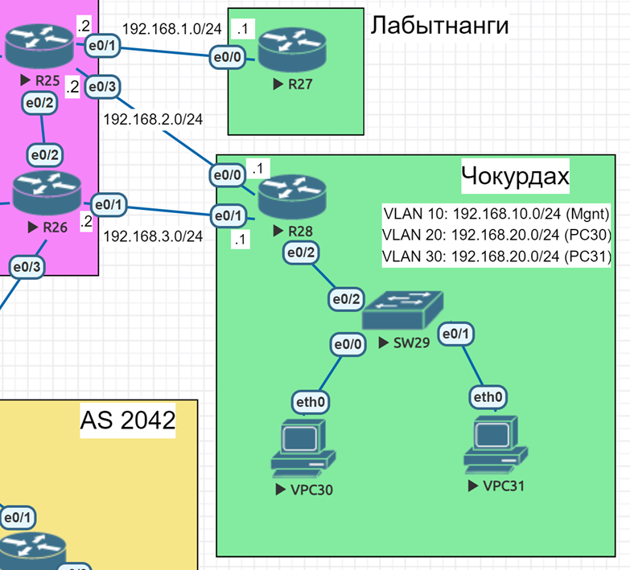

# Лабораторная работа. PBR + IP SLA

## Цель:
Настроить политику маршрутизации в офисе Чокурдах
Распределить трафик между 2 линками

Описание/Пошаговая инструкция выполнения домашнего задания:
В этой самостоятельной работе мы ожидаем, что вы самостоятельно:
 1.	Настроите политику маршрутизации для сетей офиса.
 2.	Распределите трафик между двумя линками с провайдером.
 3.	Настроите отслеживание линка через технологию IP SLA.(только для IPv4)
 4.	Настройте для офиса Лабытнанги маршрут по-умолчанию.

## Топология


## Выполнение

Настроить распределение трафика между двумя линками:

    Основной линк: `192.168.2.2` (R25 ↔ R28).
    Резервный линк: `192.168.3.2` (R26 ↔ R28).

Настройка IP SLA:
```
R28(config)#ip sla 1
R28(config-ip-sla)#icmp-echo 192.168.2.2 source-ip 192.168.2.1
R28(config-ip-sla-echo)#frequency 5
R28(config-ip-sla-echo)#exit
R28(config)#ip sla schedule 1 life forever start-time now
R28(config)#ip sla 2
R28(config-ip-sla)#icmp-echo 192.168.3.2 source-ip 192.168.3.1
R28(config-ip-sla-echo)#frequency 5
R28(config)#ip sla schedule 2 life forever start-time now
```
Настройка отслеживания:
```
R28(config)#track 1 ip sla 1 reachability
R28(config-track)#exit
R28(config)#track 2 ip sla 2 reachability
R28(config-track)#exit
```
Создание Access-List:
```
R28(config)#access-list 20 permit 192.168.20.0 0.0.0.255
R28(config)#access-list 30 permit 192.168.30.0 0.0.0.255
```
Создание Route-Map:
```
R28(config)#route-map PBR-VLAN20 permit 10
R28(config-route-map)#match ip address 20
R28(config-route-map)#set ip next-hop verify-availability 192.168.2.2 10 track 1
R28(config-route-map)#set ip next-hop 192.168.3.2
R28(config-route-map)#exit
R28(config)#route-map PBR-VLAN30 permit 10
R28(config-route-map)#match ip address 30
R28(config-route-map)#set ip next-hop verify-availability 192.168.3.2 10 track 2
R28(config-route-map)#set ip next-hop 192.168.2.2
R28(config-route-map)#exit
```
Применение PBR на интерфейсы VLAN:
```
R28(config)#interface e0/2.20

R28(config-subif)#ip policy route-map PBR-VLAN20
R28(config-subif)#exit
R28(config)#interface e0/2.30
R28(config-subif)#ip policy route-map PBR-VLAN30
R28(config-subif)#exit
R28(config)#do wr
Building configuration...
[OK]
```


