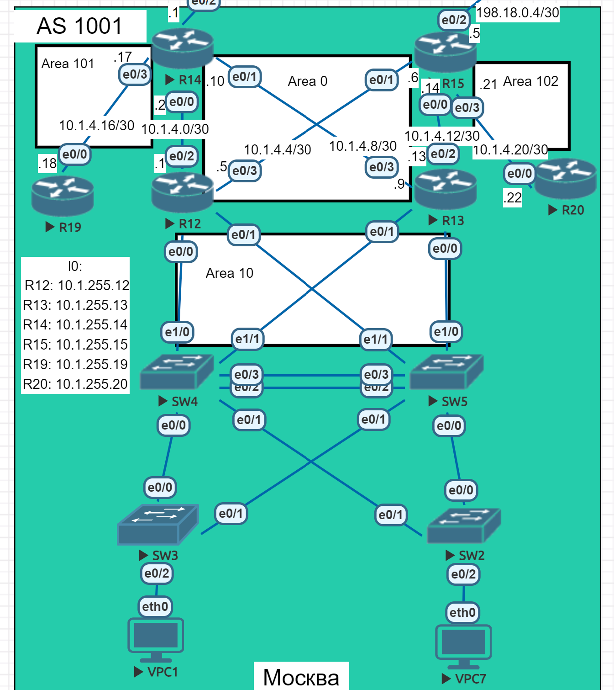
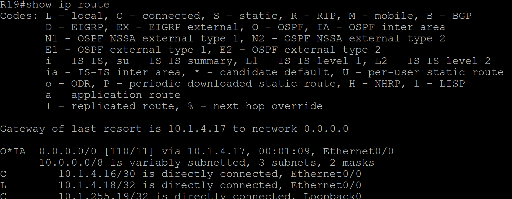
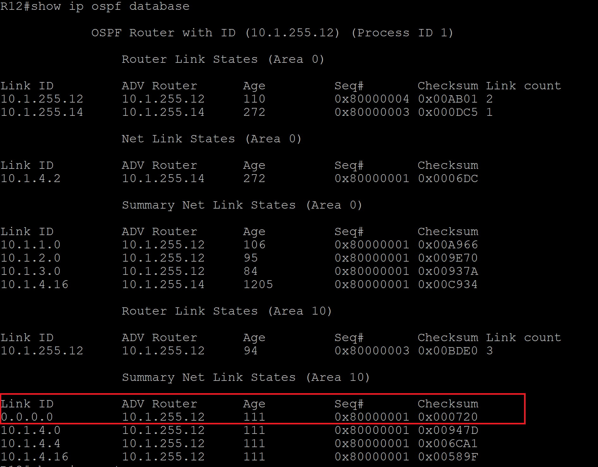
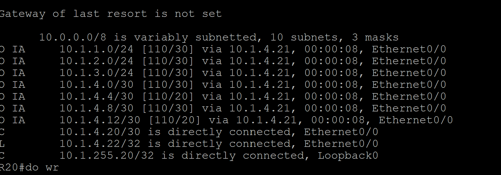

# Лабораторная работа. OSPF

## Цель:
Настроить OSPF офисе Москва
Разделить сеть на зоны
Настроить фильтрацию между зонами


Описание/Пошаговая инструкция выполнения домашнего задания:
 1. Маршрутизаторы R14-R15 находятся в зоне 0 - backbone.
 2. Маршрутизаторы R12-R13 находятся в зоне 10. Дополнительно к маршрутам должны получать маршрут по умолчанию.
 3. Маршрутизатор R19 находится в зоне 101 и получает только маршрут по умолчанию.
 4. Маршрутизатор R20 находится в зоне 102 и получает все маршруты, кроме маршрутов до сетей зоны 101.
 5. Настройка для IPv6 повторяет логику IPv4.
 6. План работы и изменения зафиксированы в документации.

## Топология


## Выполнение

Настроим backbone зону 0 на R12-15 согласно топологии:
```
R14(config)#router ospf 1
R14(config-router)#network 10.1.4.0 0.0.0.3 area 0
R14(config-router)#network 10.1.4.8 0.0.0.3 area 0
R14(config-router)#area 101 stub no-summary
R14(config-router)#network 10.1.4.16 0.0.0.3 area 101
```
```
R15(config)#router ospf 1
R15(config-router)#network 10.1.4.4 0.0.0.3 area 0
R15(config-router)#network 10.1.4.12 0.0.0.3 area 0
R15(config-router)#network 10.1.4.20 0.0.0.3 area 102
```
```
R19(config)#router ospf 1
R19(config-router)#area 101 stub
R19(config-router)#network 10.1.4.16 0.0.0.3 area 101
```


Маршрутизатор R19 находится в зоне 101 и получает только маршрут по умолчанию.
Значит зона 101 должна быть **Totally Stub**.

Видим, что R19 получает только маршрут по умолчанию:



Маршрутизаторы R12-R13 находятся в зоне 10. Дополнительно к маршрутам должны получать маршрут по умолчанию. 
Значит зона 10 должна быть **Stub**.

Настроим R12 и R13:

```
R12(config)#router ospf 1
R12(config-router)#area 10 stub
R12(config-router)#network 10.1.4.0 0.0.0.3 area 0
R12(config-router)#network 10.1.4.4 0.0.0.3 area 0
R12(config-router)#network 10.1.1.0 0.0.0.255 area 10
R12(config-router)#network 10.1.2.0 0.0.0.255 area 10
R12(config-router)#network 10.1.3.0 0.0.0.255 area 10
```
Видим, что R12 получил дефолтный маршрут от R12: 



Аналогично для R13:

```
R13(config)#router ospf 1
R13(config-router)#area 10 stub
R13(config-router)#network 10.1.4.8 0.0.0.3 area 0
R13(config-router)#network 10.1.4.12 0.0.0.3 area 0
R13(config-router)#network 10.1.1.0 0.0.0.255 area 10
R13(config-router)#network 10.1.2.0 0.0.0.255 area 10
R13(config-router)#network 10.1.3.0 0.0.0.255 area 10
```

Маршрутизатор R20 находится в зоне 102 и получает все маршруты, кроме маршрутов до сетей зоны 101.
Выполним фильтрацию на R15. Так как он является ABR для R20.
```
R15(config)#ip prefix-list area_102 seq 10 deny 10.1.4.16/30
R15(config-router)#area 102 filter-list prefix area_102 in
R15(config)#ip prefix-list area_102 seq 15 permit 0.0.0.0/0 le 32
```



Видим, что сеть 10.1.4.16/30 от Area 101 успешно отфильтровалась.