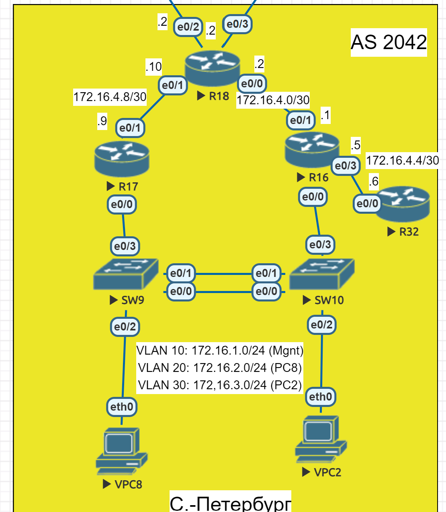
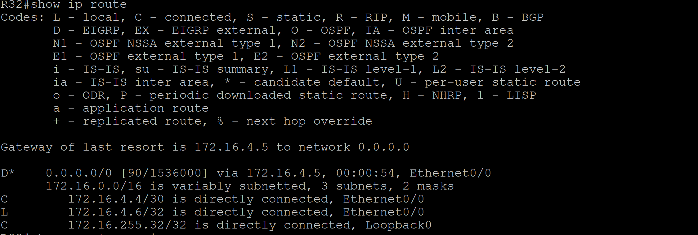
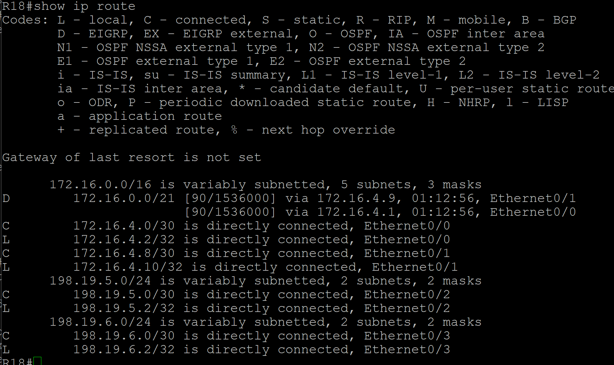

# Лабораторная работа. EIGRP

## Цель:
Настроить EIGRP в С.-Петербург;
Использовать named EIGRP

Описание/Пошаговая инструкция выполнения домашнего задания:

 1. В офисе С.-Петербург настроить EIGRP.
 2. R32 получает только маршрут по умолчанию.
 3. R16-17 анонсируют только суммарные префиксы.
 4. Использовать EIGRP named-mode для настройки сети.
 5. Настройка осуществляется одновременно для IPv4 и IPv6.

 ## Топология

 

 ## Выполнение

Произвёдём минимальную настройку на R18 согласно заданию.
```
R18(config)#router eigrp LAB
R18(config-router)#no shutdown
R18(config-router)#address-family ipv4 unicast autonomous-system 1
R18(config-router-af)#network 172.16.4.8 0.0.0.3
R18(config-router-af)#network 172.16.4.0 0.0.0.3
```
Суммарный маршрут на R17 для сетей 172.16.1.0/24, 172.16.2.0/24, 172.16.3.0/24 и 172.16.4.8/30 подключённых к нему является `172.16.0.0/21`.

```
R17(config)#router eigrp LAB
R17(config-router)#no shut
R17(config-router)#address-family ipv4 unicast autonomous-system 1
R17(config-router-af)#network 172.16.1.0 0.0.0.255
R17(config-router-af)#network 172.16.2.0 0.0.0.255
R17(config-router-af)#network 172.16.3.0 0.0.0.255
R17(config-router-af)network 172.16.4.8 0.0.0.3
R17(config-router-af)#af-interface e0/1
R17(config-router-af-interface)#summary-address 172.16.0.0 255.255.248.0
```
Аналогично для R16 для подключённых к нему сетей 172.16.1.0/24, 172.16.2.0/24, 172.16.3.0/24, 172.16.4.0/30, 172.16.4.4/30 является `172.16.0.0/21`.
```
R16(config)#router eigrp LAB
R16(config-router)#no shut
R16(config-router)#address-family ipv4 unicast autonomous-system 1
R16(config-router-af)#network 172.16.1.0 0.0.0.255
R16(config-router-af)#network 172.16.2.0 0.0.0.255
R16(config-router-af)#network 172.16.3.0 0.0.0.255
R16(config-router-af)#network 172.16.4.0 255.255.255.252
R16(config-router-af)#network 172.16.4.4 255.255.255.252
R16(config-router-af)#af-interface e0/1
R16(config-router-af-interface)#summary-address 172.16.0.0 255.255.248.0
```
Настроим EIGRP для R32:
```
R32(config)#router eigrp LAB
R32(config-router)#no shut
R32(config-router)#address-family ipv4 unicast autonomous-system 1
R32(config-router-af)#network 172.16.4.4 0.0.0.3
```
Создадим префикс-лист на R16, который будет анонсировать только маршрут по умолчанию на R32 и применим на интерфейсе:

```
R16(config)#ip prefix-list DEFAULT_ONLY seq 10 permit 0.0.0.0/0
R16(config)#router eigrp LAB
R16(config-router)#address-family ipv4 unicast autonomous-system 1
R16(config-router-af)#topology base
R16(config-router-af-topology)#distribute-list prefix DEFAULT_ONLY out e0/3
```
Обеспечим анонсирование маршрута по умолчанию на R16:

```
R16(config)#ip route 0.0.0.0 0.0.0.0 Null0
R16(config)#router eigrp LAB
R16(config-router)#address-family ipv4 unicast autonomous-system 1
R16(config-router-af)#af-interface e0/3
R16(config-router-af-interface)#summary-address 0.0.0.0 0.0.0.0
R16(config-router-af-interface)#end
```
Видим, что R32 получает только маршрут по умолчанию 


Рассмотрим маршруты на R18:



Видим, что он получает только два суммарных маршрута от R16 и R17.


