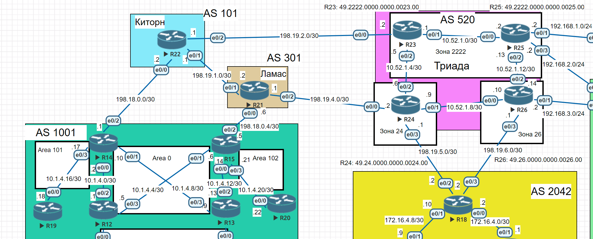
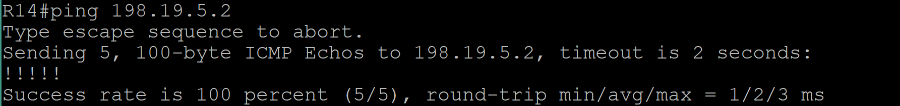
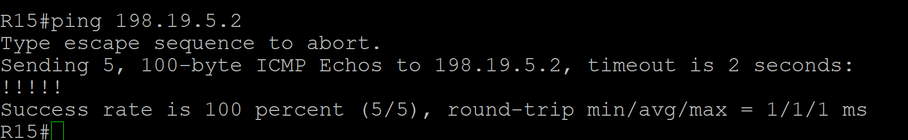

# Лабораторная работа. eBGP

## Цель:
Настроить BGP между автономными системами
Организовать доступность между офисами Москва и С.-Петербург

Описание/Пошаговая инструкция выполнения домашнего задания:

 1. Настроите eBGP между офисом Москва и двумя провайдерами - Киторн и Ламас.
 2. Настроите eBGP между провайдерами Киторн и Ламас.
 3. Настроите eBGP между Ламас и Триада.
 4. Настроите eBGP между офисом С.-Петербург и провайдером Триада.
 5. Организуете IP доступность между пограничным роутерами офисами Москва и С.-Петербург.
 6. План работы и изменения зафиксированы в документации.

 ## Топология

 

 ## Выполнение

 Настроим eBGP соседства на R14, R15, R21, R22, R24, R26, R18 согласно заданию. Будем использовать address-family.

 ```
 R14>en
R14#show run | sec bgp
router bgp 1001
 bgp log-neighbor-changes
 neighbor 198.18.0.2 remote-as 101
 !
 address-family ipv4
  network 198.18.0.0
  network 198.18.0.0 mask 255.255.255.252
  neighbor 198.18.0.2 activate
 exit-address-family
R14#
```

```
R15#show run | sec bgp
router bgp 1001
 bgp log-neighbor-changes
 neighbor 198.18.0.6 remote-as 301
 !
 address-family ipv4
  network 198.18.0.4 mask 255.255.255.252
  neighbor 198.18.0.6 activate
 exit-address-family
R15#
```

```

R21>en
R21#show run | sec bgp
router bgp 301
 bgp log-neighbor-changes
 neighbor 198.18.0.5 remote-as 1001
 neighbor 198.19.1.1 remote-as 101
 neighbor 198.19.4.2 remote-as 520
 !
 address-family ipv4
  network 198.18.0.4 mask 255.255.255.252
  network 198.19.1.0 mask 255.255.255.252
  network 198.19.4.0 mask 255.255.255.252
  neighbor 198.18.0.5 activate
  neighbor 198.19.1.1 activate
  neighbor 198.19.4.2 activate
 exit-address-family
R21#
```

```
R22(config-router-af)#do show run | sec bgp
router bgp 101
 bgp log-neighbor-changes
 neighbor 198.18.0.1 remote-as 1001
 neighbor 198.19.1.2 remote-as 301
 !
 address-family ipv4
  network 198.18.0.0 mask 255.255.255.252
  network 198.19.1.0 mask 255.255.255.252
  neighbor 198.18.0.1 activate
  neighbor 198.19.1.2 activate
 exit-address-family
R22(config-router-af)#
```

```
R24(config-router-af)#do show run | sec bgp
router bgp 520
 bgp log-neighbor-changes
 neighbor 198.19.4.1 remote-as 301
 neighbor 198.19.5.2 remote-as 2042
 !
 address-family ipv4
  network 198.19.4.0 mask 255.255.255.252
  network 198.19.5.0 mask 255.255.255.252
  neighbor 198.19.4.1 activate
  neighbor 198.19.5.2 activate
 exit-address-family
R24(config-router-af)#
```

```

R18(config-router-af)#do show run | sec bgp
router bgp 2042
 bgp log-neighbor-changes
 neighbor 198.19.5.1 remote-as 520
 neighbor 198.19.6.1 remote-as 520
 !
 address-family ipv4
  network 198.19.5.0 mask 255.255.255.252
  network 198.19.6.0 mask 255.255.255.252
  neighbor 198.19.5.1 activate
  neighbor 198.19.6.1 activate
 exit-address-family
R18(config-router-af)#do wr
Building configuration...
[OK]
```

```
R26#show run | sec bgp
router bgp 520
 bgp log-neighbor-changes
 neighbor 198.19.6.2 remote-as 2042
 !
 address-family ipv4
  network 198.19.6.0 mask 255.255.255.252
  neighbor 198.19.6.2 activate
 exit-address-family
```
Проверим IP доступность между граничными роутерами Москвы и Санкт-Петербурга:

1) Ping с R14 на R18



2) Ping c R15 до R18


